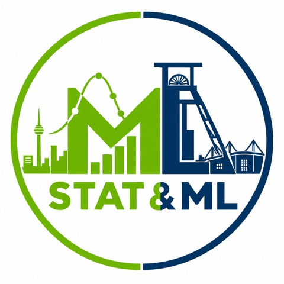

::: {.hero}
{.hero-logo fig-alt="Stat & ML course logo"}

::: {.hero-copy}
[Data Analysis Block Course · 21 Sep – 2 Oct 2026]{.hero-kicker}

# Statistics & Machine Learning {.hero-title}

A hands-on block course for master and PhD students at TU Dortmund and
Ruhr-Universität Bochum. Week 1 covers statistical inference;
week 2 covers machine learning, from automatic differentiation to transformers and agents.

::: {.hero-links}
[Timetable on Indico](https://indico.global/event/18022/){.btn-main}
[Moodle](https://moodle.ruhr-uni-bochum.de/course/view.php?id=71934){.chip}
[GitHub](https://github.com/RUB-EP1/Data-Analysis-Block-Course-2025){.chip}
:::
:::

```{=html}
<div class="hero-group">
  
  <span class="group-name">Mikhasenko group<br>Experimental Physics I · Ruhr-Universität Bochum</span>
</div>
```
:::

## Statistics {.section-title}

```{=html}
<article class="course-card stats-card">
  <a class="card-head" href="https://indico.global/event/18022/">
    <span class="card-tag">Week 1 · Mon 21 – Thu 24 Sep</span>
    <h3 class="card-title">Statistical Data Analysis</h3>
    <p class="card-meta"><span>Instructor: Michael Schmelling</span><span>Tutor: Lorenzo Nisi</span></p>
    <p class="card-text">Probability, error propagation, confidence intervals, least squares,
    maximum likelihood, bootstrap, MCMC, sWeights and unfolding, with exercises every day.
    Slides, exercises and the schedule are on Indico.</p>
  </a>
  <div class="card-actions">
    <a class="btn-main" href="https://indico.global/event/18022/">Materials on Indico →</a>
  </div>
</article>
```

## Lectures {.section-title}

::: {.section-note}
Week 2 · Machine learning, lectures by Prof. Dr. Mikhail Mikhasenko. The slides run in the
browser; press <kbd>F</kbd> for full screen and <kbd>Esc</kbd> for the slide overview.
Interactive panels load when their slide is reached.
:::

::: {#lectures}
:::

## Exercises {.section-title}

::: {.section-note}
Each attendance sheet is worked through in class right after its lecture; the homework
is a [marimo](https://marimo.io) notebook. **molab** opens a notebook in the browser
without installing anything; the **.py** link downloads it for `marimo edit`.
Teaching assistants: Hendric Jonas, Christoph Tönnis, Marian Stahl.
:::

::: {#exercises}
:::
