## Key notions in ML {#lecture-1b-title .l1b .l1b-title}

::: {.l1b-title-copy}

Introduction

Mikhail Mikhasenko, 29/07/2025
:::

::: {.notes}
Lecture 1B introduces the basic vocabulary of supervised learning, loss functions, evaluation, and optimization.
:::

## Plan for the course {#course-plan .l1b}

::: {.course-map}
::: {.course-node .done}
**AD**
:::
::: {.course-node .future}
**Decision**  
**Tree**
:::
::: {.course-node .future}
**Dense**  
**Nets**
:::
::: {.course-node .future}
**Transformers**
:::
::: {.course-node .current}
**ML**
:::
::: {.course-node .next}
**Gradient**  
**Boost**
:::
::: {.course-node .next}
**Convolutional NN**
:::
::: {.course-node .next}
**AI Workflow**  
:::
:::

## Supervised learning {#supervised-learning .l1b}

::: {.subtitle}
Labelled data
:::

::: {.l1b-two .wide-left}
::: {.l1b-copy}
Machine-learning language:

- $x$ is a **feature vector**, $x=(x^{f_1},x^{f_2},\ldots,x^{f_N})$
- $y$ is a **label**: a value, a vector, or a class such as cat/dog or signal/background
- The data are pairs: $\{(x_i,y_i)\}_{i=1}^{n}$
:::
::: {.function-panel}
$$f(x)=y$$

we want to learn
:::
:::

## Regression and classification {#regression-classification .l1b}

::: {.l1b-two}
::: {.l1b-copy .big-bullets}
- **Classification:** $y$ belongs to a discrete set of classes
- **Regression:** $y$ belongs to a continuous space
:::
::: {.function-panel}
$$f(x)=y$$
:::
:::

## Labels and features {.section-title}

::: {.subtitle}

:::

## Kaggle and ML datasets {#kaggle-datasets .l1b}

::: {.l1b-two .media-right}
::: {.l1b-copy .big-bullets}
- Large collection of datasets and machine-learning challenges
- Public notebooks, benchmarks, and competitions
:::
::: {.source-media .browser-shot}
[{alt="Kaggle home page advertising its datasets and ML community"}](https://www.kaggle.com/datasets)
:::
:::

## Example 1: Image classification {#image-classification .l1b}

::: {.example-lead}
- **Problem:** recognize the object in an image
- **Label:** class name
:::

::: {.image-examples}
::: {.image-example}
[CIFAR-10](https://www.cs.toronto.edu/~kriz/cifar.html)

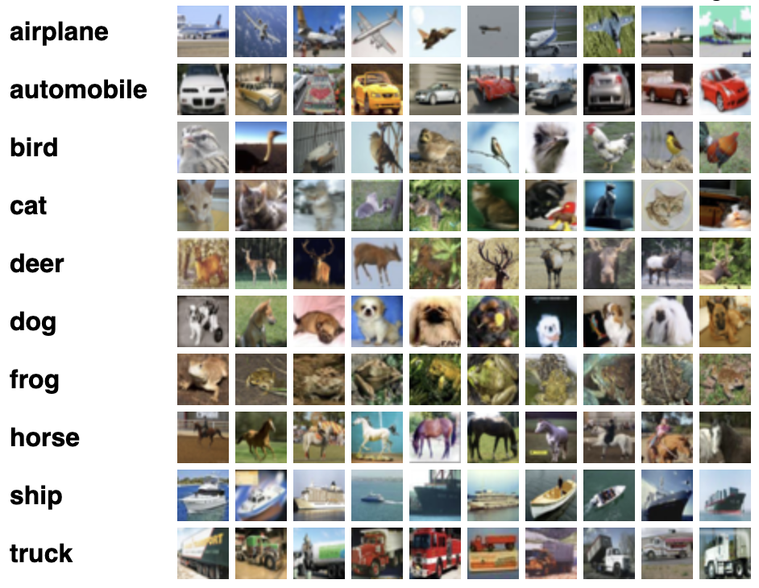{alt="Examples from the ten CIFAR-10 image classes"}
:::
::: {.image-example}
[Kaggle cats and dogs](https://www.kaggle.com/datasets/bhavikjikadara/dog-and-cat-classification-dataset)

::: {.pet-pair}
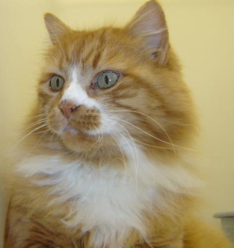{alt="Cat photograph"}
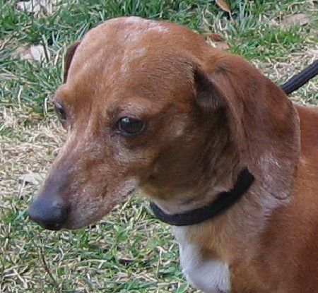{alt="Dog photograph"}
:::
:::
::: {.image-example}
[MNIST](https://yann.lecun.com/exdb/mnist/)

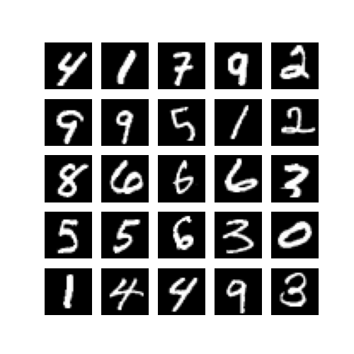{alt="Grid of handwritten digits"}
:::
:::

## Example 1: one MNIST image {#mnist-record .l1b}

::: {.mnist-record}

{alt="A handwritten seven drawn as a grayscale image"}

::: {.l1b-copy}
One training example is a **28 × 28** image: 784 grayscale pixel values.

The label is a single digit. MNIST has **10** classes, the digits 0 through 9.

[MNIST](https://yann.lecun.com/exdb/mnist/)
:::

:::

## Example 1: input and output {#mnist-io .l1b}

::: {.io-flow}
::: {.io-panel}

Input

{alt="Handwritten seven used as the model input" width="280"}

784 pixel values

:::
::: {.io-ml}
ML
:::
::: {.io-panel}

Output

::: {.digit-outs}
::: {.digit-out}
0
:::
::: {.digit-out}
1
:::
::: {.digit-out}
2
:::
::: {.digit-out}
3
:::
::: {.digit-out}
4
:::
::: {.digit-out}
5
:::
::: {.digit-out}
6
:::
::: {.digit-out .on}
7
:::
::: {.digit-out}
8
:::
::: {.digit-out}
9
:::
:::

10 class scores

:::
:::

## Example 2: Predicting housing prices {#housing-regression .l1b}

::: {.l1b-two .media-right}
::: {.l1b-copy .big-bullets}
- **Problem:** predict a house price from its features
- **Feature space:** rooms, location, area, condition, and similar descriptors
- **Label:** a real-valued price

[Kaggle House Prices competition](https://www.kaggle.com/competitions/house-prices-advanced-regression-techniques)
:::
::: {.source-media .house-photo}
{alt="Rows of houses with different roof and building features"}
:::
:::

## Example 2: the data fields {#house-fields .l1b}

::: {.field-count}
79 data fields in, one price out
:::

::: {.field-grid}
MSSubClass · MSZoning · LotFrontage · LotArea · Street · Alley · LotShape · LandContour · Utilities · LotConfig · LandSlope · Neighborhood · Condition1 · Condition2 · BldgType · HouseStyle · OverallQual · OverallCond · YearBuilt · YearRemodAdd · RoofStyle · RoofMatl · Exterior1st · Exterior2nd · MasVnrType · MasVnrArea · ExterQual · ExterCond · Foundation · BsmtQual · BsmtCond · BsmtExposure · BsmtFinType1 · BsmtFinSF1 · BsmtFinType2 · BsmtFinSF2 · BsmtUnfSF · TotalBsmtSF · Heating · HeatingQC · CentralAir · Electrical · 1stFlrSF · 2ndFlrSF · LowQualFinSF · GrLivArea · BsmtFullBath · BsmtHalfBath · FullBath · HalfBath · BedroomAbvGr · KitchenAbvGr · KitchenQual · TotRmsAbvGrd · Functional · Fireplaces · FireplaceQu · GarageType · GarageYrBlt · GarageFinish · GarageCars · GarageArea · GarageQual · GarageCond · PavedDrive · WoodDeckSF · OpenPorchSF · EnclosedPorch · 3SsnPorch · ScreenPorch · PoolArea · PoolQC · Fence · MiscFeature · MiscVal · MoSold · YrSold · SaleType · SaleCondition
:::

::: {.io-note}
`Id` is only an index. `SalePrice` is the label, not a feature. [Competition data](https://www.kaggle.com/competitions/house-prices-advanced-regression-techniques/data)
:::

## Example 2: input and output {#house-io .l1b}

::: {.io-flow}
::: {.io-panel}

Input · 79 fields

<table class="sample-table">
<tr><td>LotArealot size, square feet</td><td>8450</td></tr>
<tr><td>OverallQualmaterial and finish, 1–10</td><td>7</td></tr>
<tr><td>YearBuiltyear of construction</td><td>2003</td></tr>
<tr><td>GrLivAreaabove-ground living area, square feet</td><td>1710</td></tr>
<tr><td>GarageCarsgarage capacity, in cars</td><td>2</td></tr>
</table>

and 74 further fields

:::
::: {.io-ml}
ML
:::
::: {.io-panel}

Output

$208,500

SalePrice

:::
:::

## Example 3: Balancing a pole {#cart-pole .l1b}

::: {.l1b-two .media-right}
::: {.l1b-copy .big-bullets}
- **Problem:** keep a pole upright by moving a cart left or right
- **Feature space:** cart position and velocity, pole angle and angular velocity
- **Label:** push left or push right
- **Setting:** reinforcement learning

[Gymnasium Cart Pole](https://gymnasium.farama.org/environments/classic_control/cart_pole/)
:::
::: {.source-media .cart-pole-media}
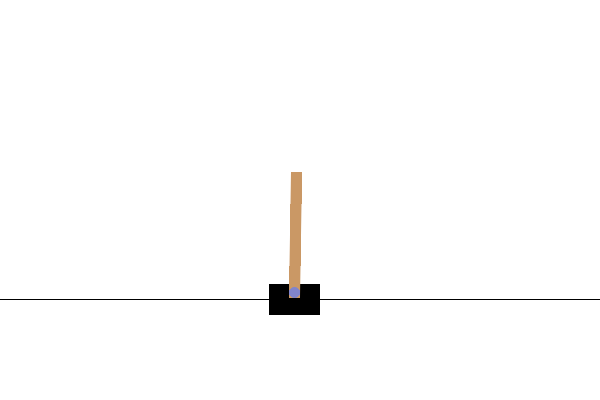{alt="Animated cart pole balancing a pole by moving the cart"}
:::
:::

## Example 3: input and output {#cart-io .l1b}

::: {.io-flow}
::: {.io-panel}

Input

Cart position 0.036

Cart velocity −0.089

Pole angle −0.056

Pole angular velocity −0.063

:::
::: {.io-ml}
ML
:::
::: {.io-panel}

Output

::: {.action-outs}
::: {.action-out}
0 · push left
:::
::: {.action-out .on}
1 · push right
:::
:::
:::
:::

## Learning the function {#learn-function .l1b}

::: {.l1b-two .media-right}
::: {.l1b-copy .big-bullets}
- A mathematical algorithm adjusts $f$ so that $f(x)$ predicts $y$ well on the data
- Learning resembles adaptation in a biological brain: many parameters change, even when their individual meaning remains obscure
:::
::: {.learn-visual}
$$f(x)=y$$

{alt="Stylized neural network with inputs x and outputs y"}
:::
:::

## Loss function {.section-title}

::: {.subtitle}
or score function
:::

{alt="Glass illustrated as half empty and half full" .half-glass}

## Loss function {#loss-function .l1b}

::: {.subtitle}
:::

::: {.loss-layout}
::: {.l1b-copy}
- The loss quantifies how well the learned function $f(x)$ describes the data
- Training searches parameter space for a small loss

:::
::: {.loss-landscape}
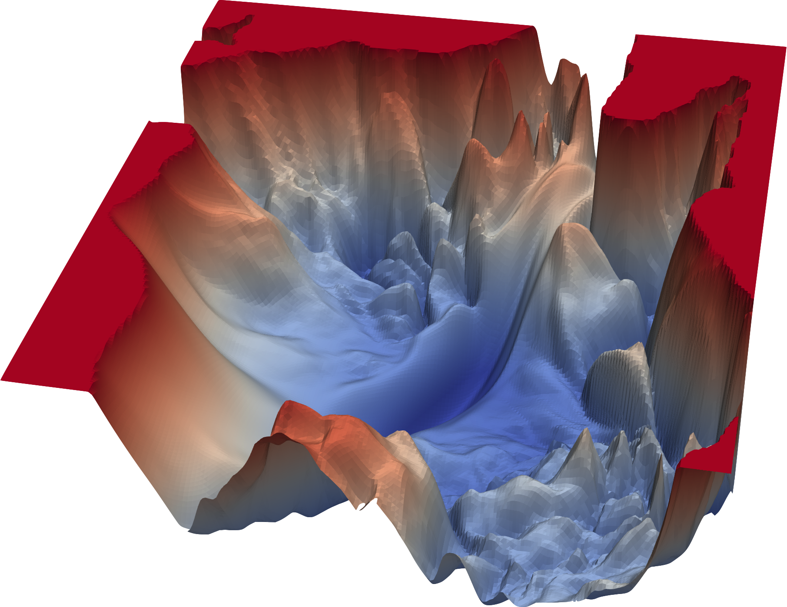{alt="Complex loss landscape over two model parameters"}

Complex loss landscape as a function of parameters $\tilde p_1$ and $\tilde p_2$
:::
:::

::: {.slide-refs}
[Li et al., Visualizing the Loss Landscape of Neural Nets](https://proceedings.neurips.cc/paper_files/paper/2018/file/a41b3bb3e6b050b6c9067c67f663b915-Paper.pdf)
:::

## Loss: Mean squared error {#mse-loss .l1b}

::: {.subtitle}
Hypothetical flat prices
:::

::: {.l1b-two .media-left}
::: {.source-media .mse-plot}
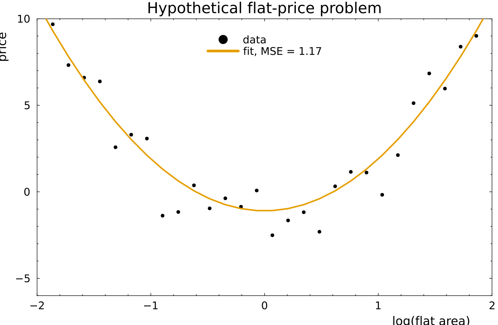{alt="Quadratic price curve fitted to noisy flat-area data, with MSE 1.17"}
:::
::: {.equation-focus}
$$
f(x)=3x^2-a,\qquad a=1.1
$$

$$
\operatorname{MSE}=\frac{1}{n}\sum_{i=1}^{n}\left(y_i-f(x_i)\right)^2=1.17
$$

Thirty noisy prices. The curve is one setting of $a$; training moves $a$ to make this loss small.
:::
:::

## Reinforcement learning loss {#reinforcement-learning-loss .l1b}

::: {.rl-loss-grid}
::: {.rl-general}

General policy-gradient loss

$$
L(\theta)=-\frac{1}{N}\sum_{i=1}^{N}\sum_{t=0}^{T_i-1}
G_{i,t}\log \pi_\theta(a_{i,t}\mid s_{i,t})
$$

$$
G_{i,t}=\sum_{k=t}^{T_i-1}\gamma^{k-t}r_{i,k}
$$

<strong>$L$</strong> loss minimized in training

<strong>$\theta$</strong> neural-network parameters

<strong>$N$</strong> episodes; <strong>$i$</strong> episode index

<strong>$T_i$</strong> number of frames in episode $i$

<strong>$t$</strong> current frame; <strong>$k$</strong> future frame

<strong>$s_{i,t}$</strong> state; <strong>$a_{i,t}$</strong> chosen action

<strong>$r_{i,k}$</strong> reward; <strong>$\gamma$</strong> discount factor

<strong>$G_{i,t}$</strong> future reward after the action

<strong>$\pi_\theta(a\mid s)$</strong> action probability from the network

:::
::: {.rl-cartpole}

CartPole: the pole stays up for 120 frames

Every frame gives $r_t=1$. Choose $\gamma=1$.

$$
G_t=\sum_{k=t}^{119}1=120-t
$$

Let $p_t=P(\text{right}\mid s_t)$ and define the probability of the action taken:

$$
q_t=\begin{cases}
p_t,& a_t=\text{right},\\
1-p_t,& a_t=\text{left}.
\end{cases}
$$

$$
\boxed{L_{\mathrm{episode}}=-\sum_{t=0}^{119}(120-t)\log q_t}
$$

Minimizing this loss makes actions from the observed 120-frame episode more probable.
:::
:::

::: {.notes}
The loss is the negative reward-weighted log probability of the sampled actions. The factor 1/N averages over episodes and stabilizes the gradient scale; it does not change the optimum. In CartPole-v1, the default reward is +1 at every step, including the termination step. Source: https://gymnasium.farama.org/environments/classic_control/cart_pole/
:::

## Loss: Binary cross entropy {#binary-cross-entropy .l1b}

::: {.subtitle}
Standard for binary classification
:::

::: {.bce-layout}
::: {.l1b-copy}
- Mean squared error can classify, but binary cross entropy better matches a probabilistic classifier
- Interpret $p(x)=f(x)$ as the probability of class $y=1$
- The probability of class $y=0$ is $1-p(x)$
:::
::: {.equation-focus}
$$
\operatorname{BCE}=-\sum_i\left[y_i\log p(x_i)+(1-y_i)\log\big(1-p(x_i)\big)\right]
$$

The loss grows rapidly when the model assigns low probability to the observed class.
:::
:::

## Shannon entropy {#shannon-entropy .l1b}

::: {.subtitle}
How broad, and how uncertain, a distribution is
:::

::: {.l1b-two}
::: {.equation-focus}
$$
S=-\sum_i q_i\log q_i
$$

$$
S=-\int q(x)\log q(x)\,dx
$$
:::
::: {.equation-focus}
Monte Carlo, with $x_i$ drawn from $q$:

$$
S\approx-\frac{1}{n}\sum_i\log q(x_i)
$$

The narrow density has $S_q=0.21$. A broader density is more uncertain, so its entropy is larger.
:::
:::

## Cross entropy of two distributions {#distribution-cross-entropy .l1b}

::: {.subtitle}
Likelihood of $q$, evaluated on a sample from $p$
:::

::: {.l1b-two .media-right}
::: {.l1b-copy}
$$
H(p,q)=-\sum_i p_i\log q_i
$$

- This is binary cross entropy for two densities
- It measures how different $p$ and $q$ are
- The minimum is $p=q$, and then $H(p,p)$ is the entropy of $p$
:::
::: {.source-media}
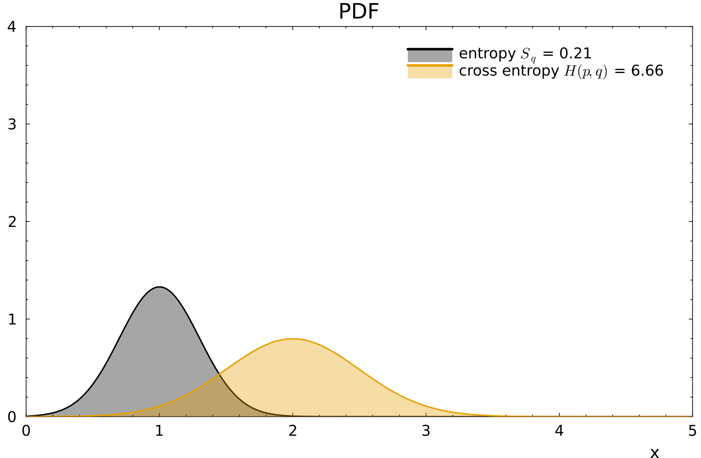{alt="Narrow density q and broader reference p, with entropy 0.21 and cross entropy 6.66"}

$q=\mathrm{Normal}(1,0.3)$, $p=\mathrm{Normal}(2,0.5)$

$H(p,q)=6.66$
:::
:::

## Relative entropy {#relative-entropy .l1b}

::: {.subtitle}
Kullback–Leibler divergence
:::

::: {.l1b-two .media-right}
::: {.l1b-copy}
$$
D_{\mathrm{KL}}(p\|q)=H(p,q)-S_p
$$

$$
D_{\mathrm{KL}}(p\|q)=-\sum_i p_i\log\frac{q_i}{p_i}
$$

Expected likelihood difference when the truth is $p$ and the model is $q$. The two directions are not equal.
:::
::: {.source-media}
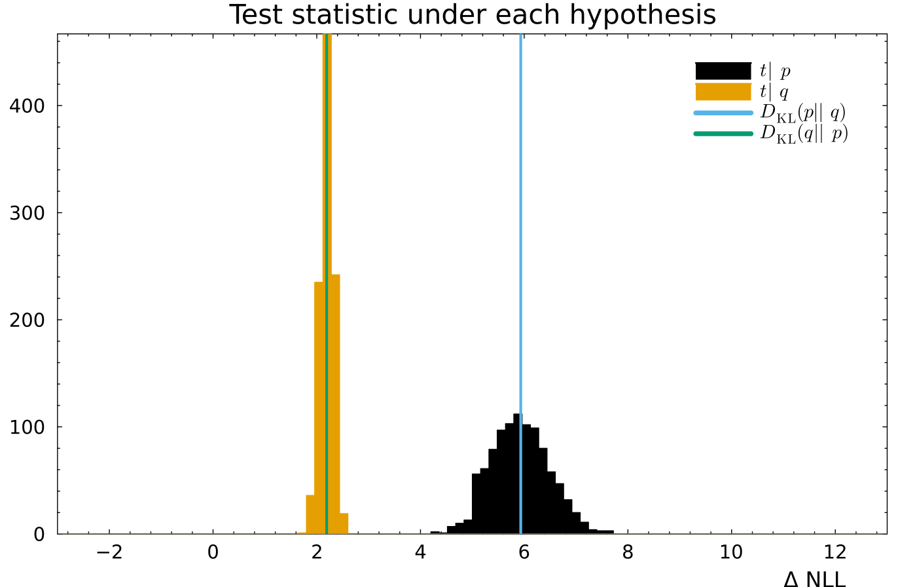{alt="Sampled test statistic under each hypothesis, with both KL divergences marked"}

$D_{\mathrm{KL}}(p\|q)=5.93$, $D_{\mathrm{KL}}(q\|p)=2.19$
:::
:::

## Training ML system {.section-title}

::: {.subtitle}
:::

## Training, validation, and test data {#data-splits .l1b}

::: {.l1b-two .media-right}
::: {.l1b-copy}

Minimal setup

- Train on the **training set**
- Evaluate once on the **test set**

Comparing architectures

- Use a **validation set** for model and hyperparameter choices
- Keep the **test set** independent until the final evaluation
:::
::: {.source-media .split-chart}
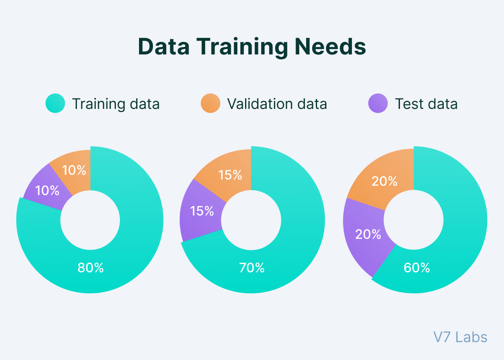{alt="Example training, validation, and test splits"}
:::
:::

## Classification decisions {#classification-decisions .l1b}

::: {.l1b-two .media-right}
::: {.l1b-copy .big-bullets}
- A classifier usually returns a continuous score or probability
- A threshold converts the score into a class decision
- The error rate depends on the chosen threshold
:::
::: {.source-media .classifier-score}
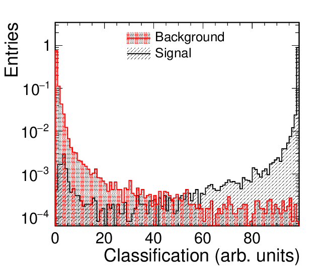{alt="Signal and background classifier-score distributions"}
:::
:::

## ROC curve {#roc-curve .l1b}

::: {.subtitle}
Receiver operating characteristic
:::

::: {.roc-layout}
::: {.l1b-copy}
- Sweep the classifier threshold
- Plot the true-positive rate against the false-positive rate
- Curves closer to the upper-left corner indicate stronger separation
- **AUC**, the area under the curve, summarizes the whole ROC: $1$ is perfect, $\tfrac12$ is chance
:::
::: {.roc-small}
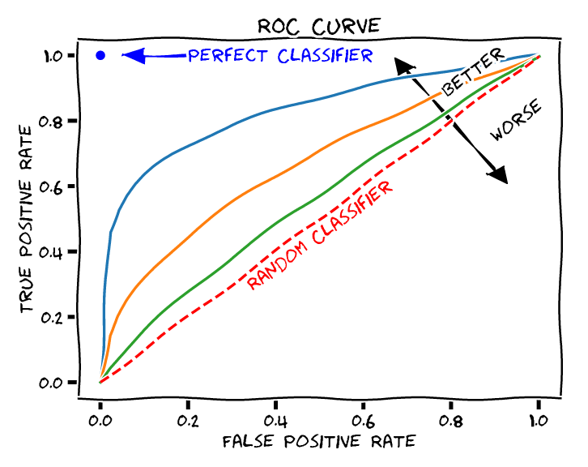{alt="Efficiency as a function of signal retained for one classifier threshold"}

The same threshold sweep in different variables
:::
::: {.roc-large}
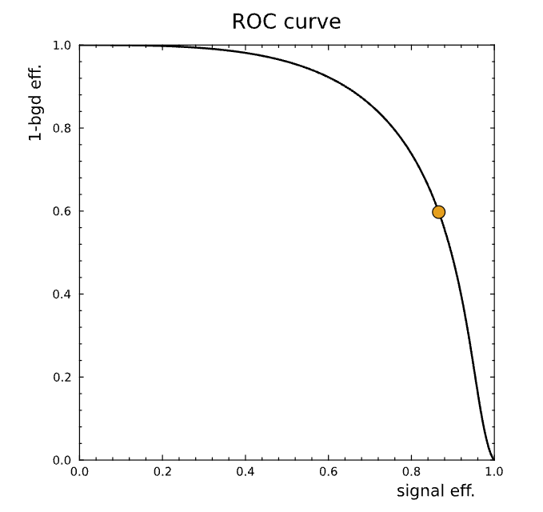{alt="Illustrated ROC curves comparing perfect, better, random, and worse classifiers"}
:::
:::

## Optimization and gradient descent {#gradient-descent .l1b}

::: {.l1b-two .media-right}
::: {.l1b-copy}
Training minimizes a loss $L(\theta)$ over model parameters $\theta$.

$$
\theta_{t+1}=\theta_t-\eta\,\nabla_{\theta}L(\theta_t)
$$

- **Learning rate** $\eta$: the size of each step along the gradient
- The gradient points toward the steepest local increase, so the update moves in the opposite direction
:::
::: {.loss-landscape .large-landscape}
{alt="Complex loss landscape used to illustrate gradient-based optimization"}
:::
:::
