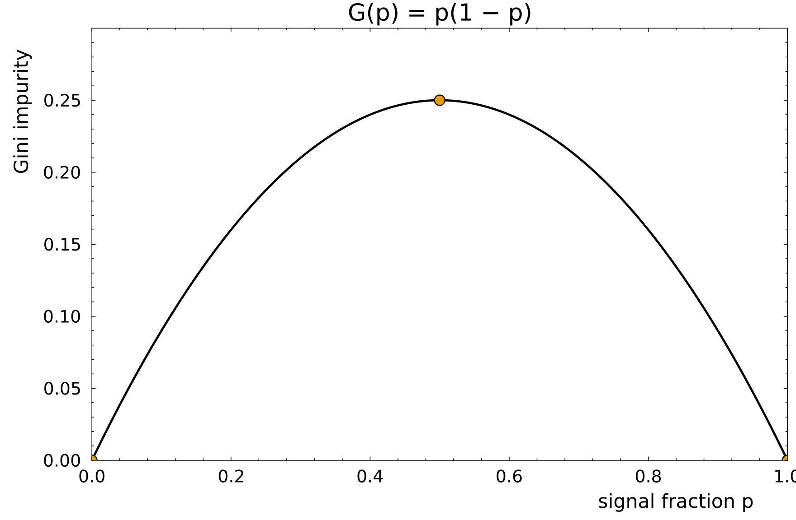

## Gini impurity {#gini-impurity .l1b}

::: {.subtitle}
How mixed a set of labeled events is
:::

::: {.l1b-two .media-right}
::: {.l1b-copy}
Let $p$ be the fraction of signal in the node.

$$
G(p)=p(1-p)
$$

- A pure node, all signal or all background, has $G=0$
- An even mixture, $p=\tfrac12$, is the most impure: $G=\tfrac14$
- A split is useful when it lowers this number
:::
::: {.source-media}
{alt="Gini impurity p times 1 minus p, zero at the pure ends and one quarter at p equals one half"}
:::
:::

## Computing the Gini impurity {#gini-compute .l1b}

::: {.subtitle}
From the class counts in one node
:::

::: {.l1b-two}
::: {.equation-focus}
$$
p=\frac{n_s}{n_s+n_b}
$$

$$
G=p(1-p)
$$

$n_s$ signal events and $n_b$ background events.
:::
::: {.equation-focus}
Forty signal and sixty background:

$$
p=0.4,\qquad G=0.4\times 0.6=0.24
$$

Fifty–fifty would give $G=0.25$. A node of one hundred signal events would give $G=0$.
:::
:::

## Scoring a split {#gini-split .l1b}

::: {.subtitle}
Keep the threshold that removes the most impurity
:::

::: {.equation-focus}
$$
\Delta G=G_0 N_0-G_L N_L-G_R N_R
$$

Parent: 50 signal and 50 background, so $G_0=0.25$ and $N_0=100$.

<table class="gini-table" style="border-collapse:collapse;font-size:34px;margin:18px auto 8px;">
<tr><th style="padding:10px 36px;text-align:left;border-bottom:2px solid #111418;"></th><th style="padding:10px 36px;text-align:right;border-bottom:2px solid #111418;">signal</th><th style="padding:10px 36px;text-align:right;border-bottom:2px solid #111418;">background</th><th style="padding:10px 36px;text-align:right;border-bottom:2px solid #111418;">p</th><th style="padding:10px 36px;text-align:right;border-bottom:2px solid #111418;">G</th><th style="padding:10px 36px;text-align:right;border-bottom:2px solid #111418;">N</th></tr>
<tr><td style="padding:10px 36px;text-align:left;">left</td><td style="padding:10px 36px;text-align:right;">40</td><td style="padding:10px 36px;text-align:right;">10</td><td style="padding:10px 36px;text-align:right;">0.8</td><td style="padding:10px 36px;text-align:right;">0.16</td><td style="padding:10px 36px;text-align:right;">50</td></tr>
<tr><td style="padding:10px 36px;text-align:left;">right</td><td style="padding:10px 36px;text-align:right;">10</td><td style="padding:10px 36px;text-align:right;">40</td><td style="padding:10px 36px;text-align:right;">0.2</td><td style="padding:10px 36px;text-align:right;">0.16</td><td style="padding:10px 36px;text-align:right;">50</td></tr>
</table>

$$
\Delta G=0.25\times 100-0.16\times 50-0.16\times 50=9
$$

The best cut is the one with the largest $\Delta G$.
:::
