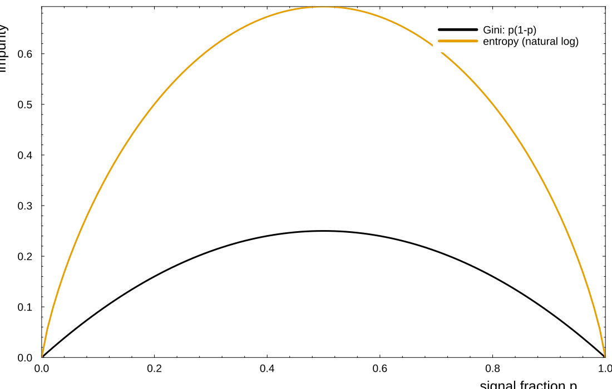
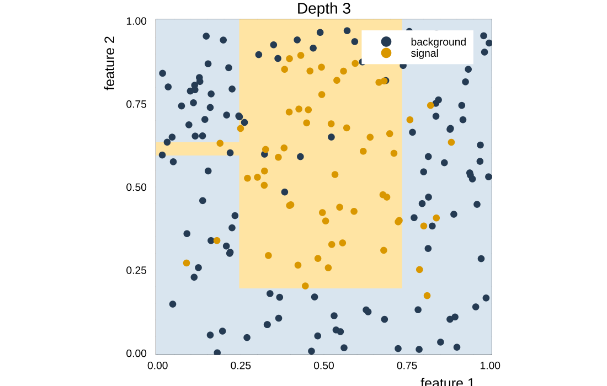
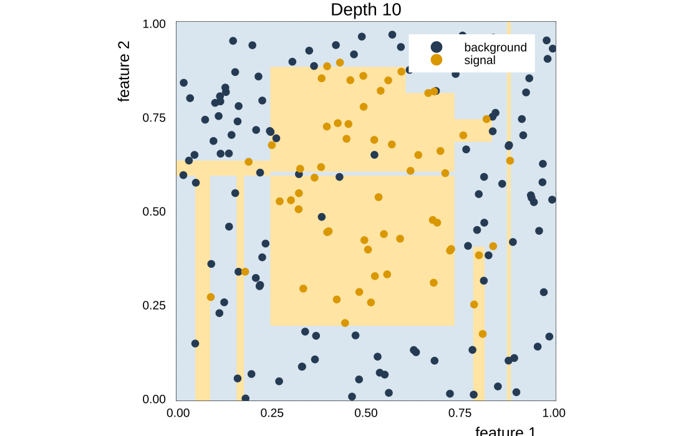
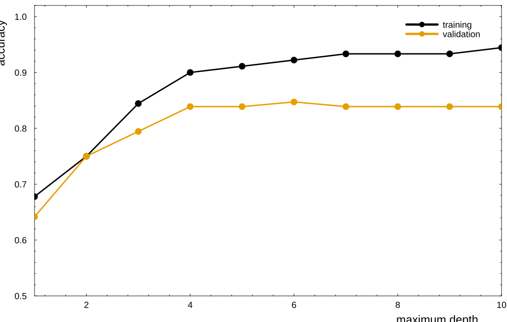
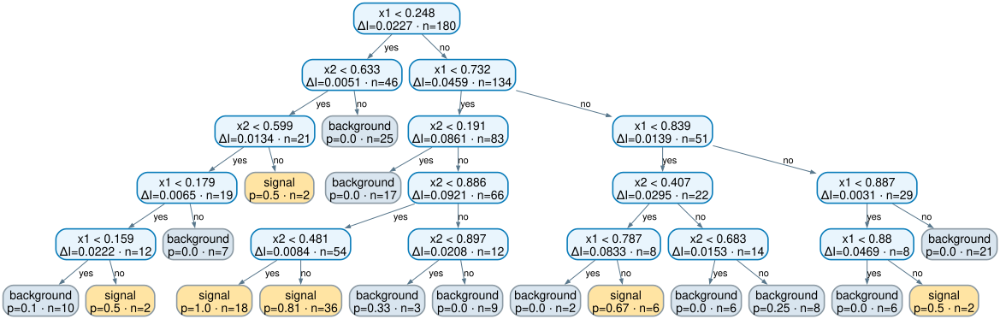
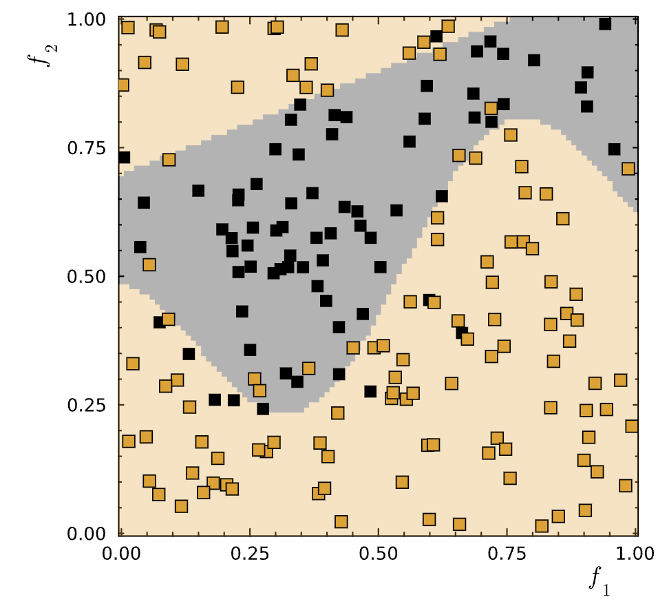
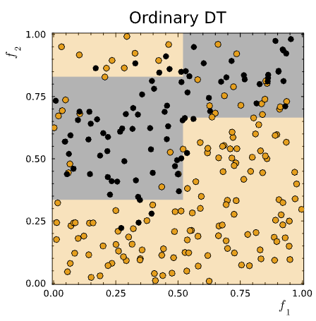

## Decision Trees {#lecture-2a-title .l1b .l1b-title}

::: {.l1b-title-copy}

Mikhail Mikhasenko · Lecture 2A
:::

::: {.notes}
Third lecture in the course. Native reconstruction of Lecture-2A.key, with the original examples and quiz and four interactive demonstrations. The following lecture develops boosting further.
:::

## Decision trees {#decision-trees .l1b}

::: {.l1b-two}
::: {.l1b-copy}
A sequence of simple questions partitions feature space.

- At each node, choose a **feature** and a **cut**.
- Send each event to the left or right child.
- A leaf returns a class, a class fraction, or a regression value.
:::
::: {.tree-diagram}
<div class="tree-root">$f_1 < c_1$?</div>
<div class="tree-branches"><div><span>yes</span><div class="tree-node">$f_2 < c_2$?</div><div class="tree-leaves"><b>signal</b><b class="bkg">background</b></div></div><div><span>no</span><div class="tree-node">$f_2 < c_3$?</div><div class="tree-leaves"><b class="bkg">background</b><b>signal</b></div></div></div>
:::
:::

::: {.notes}
Schematic tree, not a fitted model. The cuts are axis-aligned. The original lecture points to the R2D3 visual introduction: http://www.r2d3.us/visual-intro-to-machine-learning-part-1/
:::

## Reminder: cutting distributions {#cutting-distributions .l1b}

::: {.l1b-two}
::: {.l1b-copy}
For a selection $x<c$:

$$\epsilon_S=\frac{S_{\mathrm{pass}}}{S_{\mathrm{all}}},\qquad
r_B=1-\frac{B_{\mathrm{pass}}}{B_{\mathrm{all}}}$$

$$p=\frac{S_{\mathrm{pass}}}{S_{\mathrm{pass}}+B_{\mathrm{pass}}}$$

**Efficiency** and **purity** answer different questions.
:::
::: {.l1b-copy}
The ROC curve traces the operating points as the threshold moves.

Here the vertical axis is **background rejection**, $1-\epsilon_B$.

Purity also depends on the signal fraction **before** selection.
:::
:::

## One cut, three competing goals {#widget-cuts .addition}

::: {.widget data-src="widgets/cuts.html" data-poster="widgets/cuts-poster.png" data-alt="Interactive cut, efficiency, purity, and ROC demonstration"}
:::

::: {.notes}
Widget 1. Move the cut from 0 to 1. Then keep the cut fixed and change the signal fraction. Efficiency and rejection stay fixed; purity changes. Data are generated by cuts-and-impurity.jl: signal Beta(2,5), background Beta(5,2), 1000 samples per class, fixed independent seeds. The density curves are analytical, while ROC and metrics use the finite samples.
:::

## Splitting index {#splitting-index .l1b}

A useful cut depends on the objective.

| Objective | Example | What it measures |
|---|---|---|
| Select a sample | Purity $S/(S+B)$ | Composition after selection |
| Retain signal | Efficiency $S/S_{\mathrm{all}}$ | Signal survival |
| Estimate sensitivity | $S/\sqrt{S+B}$ | A simple counting proxy |
| Grow a tree | Gini or entropy gain | Improvement in **both** children |

::: {.notes}
The significance proxy assumes a simple counting setting and is not a general discovery significance. The original slide lists purity times significance as another possible selection objective. Purity, efficiency, their products, and impurity gain can prefer different cuts.
:::

## Gini impurity {#gini .l1b}

::: {.l1b-two}
::: {.l1b-copy}
If $p$ is the weighted signal fraction,

$$p=\frac{\sum_{i\in S}w_i}{\sum_i w_i},\qquad I_G=p(1-p).$$

A pure node has $I_G=0$. A balanced node has $I_G=1/4$.

The standard binary Gini impurity is $2p(1-p)$. The factor of two does not change the best split.
:::
::: {.source-media}
{alt="Gini and entropy as functions of class fraction"}
:::
:::

::: {.notes}
The deck keeps the original lecture's half-Gini convention. The probability of disagreeing with an independently sampled class label is 2p(1-p), not p(1-p). Entropy uses natural logarithms; its units and numerical scale differ from Gini.
:::

## Making a single split {#single-split .l1b}

| 1. Unweighted events | 2. Weighted events |
|---|---|
| For node $R$, use event counts: <br><br> $\displaystyle N_R=|R|,\quad p_R=\frac{N_{S,R}}{N_R}$ | Replace counts by sums of weights: <br><br> $\displaystyle W_R=\sum_{i\in R}w_i,\quad p_R=\frac{\sum_{i\in R,\,y_i=1}w_i}{W_R}$ |
| Score the cut with total impurity decrease: <br><br> $\displaystyle G=N_0I(p_0)-N_LI(p_L)-N_RI(p_R)$ | Use the normalized weighted decrease: <br><br> $\displaystyle \Delta I=I(p_0)-\frac{W_L}{W_0}I(p_L)-\frac{W_R}{W_0}I(p_R)$ |

Search all allowed features and thresholds, then choose the largest positive gain. Multiplying $\Delta I$ by $W_0$ recovers $G$.

::: {.notes}
Search thresholds between consecutive distinct sorted feature values. Enforce a minimum leaf size. Empty children are invalid. All weights in this lecture are nonnegative.
:::

## Where should the tree split? {#widget-split .addition}

::: {.widget data-src="widgets/split.html" data-poster="widgets/split-poster.png" data-alt="Interactive weighted Gini and entropy split gain"}
:::

::: {.notes}
Widget 2. Ask for a predicted optimum before clicking Find best cut. Switch between Gini and entropy. The button searches a 0.005 threshold grid; the Julia CART implementation searches all distinct data midpoints. At either endpoint the empty-child split has zero gain in the display.
:::

## Growing a tree {#growing .l1b}

:::: {.l1b-two .sampling-model}
::: {.l1b-copy}
<div class="l1b-subhead">Sampling model used here</div>

The two features are independent:

$$X_1,X_2\overset{\mathrm{iid}}{\sim}\operatorname{Uniform}(0,1).$$

The noiseless label is signal inside an ellipse:

$$y^*=+1\iff
\frac{(X_1-0.50)^2}{0.075}+\frac{(X_2-0.55)^2}{0.13}<1.$$

Each label flips independently with probability $0.08$. The training sample contains $N=180$ events generated with seed 21.
:::
::: {.source-media}
{alt="Julia-trained depth-three tree and its axis-aligned decision regions"}

Both features are searched at every node. Candidate cuts are midpoints between consecutive observed values; leaves contain at least two events.
:::
::::

::: {.notes}
The displayed tree has maximum depth 3. Recursion stops earlier if a node is pure, fewer than four events remain, or no allowed split improves the criterion. Validation uses 360 independently generated events with seed 22.
:::

## How well does it do? {#evaluation .l1b}

::: {.l1b-two}
::: {.l1b-copy}
$$\mathrm{accuracy}=\frac{N_{\mathrm{correct}}}{N_{\mathrm{events}}}$$

**Training:** fit the splits and leaf predictions.

**Validation:** choose depth and other settings.

**Test:** assess the chosen model once.
:::
::: {.l1b-copy}
A model can improve on training data while getting worse on new data.

Keep the data split fixed while comparing settings.

For imbalanced classes, inspect class efficiencies and ROC curves as well as accuracy.
:::
:::

## Overtraining {#overtraining .l1b}

::: {.l1b-two}
::: {.source-media}
{alt="A deeper tree introduces small regions around noisy training events"}
:::
::: {.source-media}
{alt="Training and validation accuracy versus maximum tree depth, calculated in Julia"}
:::
:::

::: {.notes}
Both figures come from export_material.jl. Fixed seeds make depth comparisons meaningful. Each depth is trained on the same sample; validation has 360 independent events. Do not interpret an individual validation curve as a universal monotonic law.
:::

## A fitted tree at depth 5 {#depth-five-tree .l1b}

::: {.tree-full}
{alt="Complete fitted depth-five decision tree showing the feature and threshold at each split and the class probability at every leaf"}
:::

Each internal node shows the selected feature, cut, and impurity gain. Each leaf shows its prediction, signal fraction $p$, and number of training events $n$.

::: {.notes}
This is the exact depth-5 tree fitted to the sampling model on the preceding slides, with minimum leaf size two. Left branches satisfy the printed cut; right branches fail it. Small leaves created around flipped labels illustrate why deeper trees can overfit.
:::

## Bagging as random event reweighting {#bagging-reweighting .l1b}

Start from $D=\{(x_i,y_i)\}_{i=1}^{N}$. For tree $b$, draw $N$ indices with replacement. The multiplicities obey

$$
(K_1^{(b)},\ldots,K_N^{(b)})
\sim\operatorname{Multinomial}\!\left(N;\frac1N,\ldots,\frac1N\right).
$$

The bootstrap sample is the original sample with random integer weights

$$w_i^{(b)}=K_i^{(b)},\qquad W_R^{(b)}=\sum_{i\in R}K_i^{(b)}.$$

| Mean multiplicity | Omitted events | Repeated events |
|---|---|---|
| $\mathbb E[K_i^{(b)}]=1$ | $P(K_i^{(b)}=0)=(1-1/N)^N\approx e^{-1}$ | $P(K_i^{(b)}\ge2)\approx1-2e^{-1}$ |
| Average weight is unchanged | About $63.2\%$ appear at least once | About $26.4\%$ appear more than once |

::: {.notes}
This is a precise reweighting view of bootstrap sampling. Some events receive weight zero, some one, and some larger integer weights. Each tree uses a different draw. The tree-building impurity formulas on slide 7 apply directly with these weights.
:::

## Combining the bagged trees {#bagging-combination .l1b}

Tree $b$ sends a new event $x$ to a leaf $L_b(x)$. Its signal probability is the weighted signal fraction in that leaf:

$$
\hat p_b(x)=
\frac{\sum_{i:\,x_i\in L_b(x)}K_i^{(b)}y_i}
     {\sum_{i:\,x_i\in L_b(x)}K_i^{(b)}}.
$$

Ordinary bagging gives every trained tree the same prediction weight:

$$
\hat p_{\mathrm{bag}}(x)=\frac1B\sum_{b=1}^{B}\hat p_b(x),
\qquad
\hat y_{\mathrm{bag}}(x)=\mathbf 1\!\left[\hat p_{\mathrm{bag}}(x)>\tfrac12\right].
$$

For hard tree labels $\hat y_b(x)\in\{0,1\}$, majority voting uses
$\mathbf 1[\sum_b\hat y_b(x)>B/2]$. For regression, average the numerical tree predictions.

::: {.notes}
The bootstrap multiplicities affect how each tree is fitted. They do not reweight the trees when predictions are combined. Standard bagging assigns coefficient one over B to every tree. Probability averaging and majority voting can disagree because a leaf probability contains confidence information while a hard label does not.
:::

## Options for a bagged tree ensemble {#bagging-options .l1b}

Useful ensembles reduce shared errors between trees while controlling how each tree grows.

| What changes for tree $b$? | Construction | Common name |
|---|---|---|
| Training events | Draw events with replacement, or use a random subsample | Bagging |
| Available features | At each node, search only $m_{\mathrm{try}}<p$ randomly selected features | Random forest |
| Candidate cuts | Test random thresholds instead of every possible threshold | Extremely randomized trees |
| Growth rule | Control maximum depth, minimum leaf size, or pruning | Regularized trees |

Removing features temporarily can force trees to discover alternative predictors. The aim is to reduce correlation $\rho$ between trees while keeping each tree useful:

$$
\operatorname{Var}\!\left(\frac1B\sum_{b=1}^{B}h_b\right)
\approx \sigma^2\!\left[\rho+\frac{1-\rho}{B}\right].
$$

::: {.notes}
Only the first row is required for classical bagging. Random forests add node-level feature subsampling. Feature removal should be temporary and independently redrawn; permanently deleting a useful variable from every tree discards information. Growth constraints mainly control individual-tree variance and overfitting. Extremely randomized trees add randomness through the candidate cuts. The variance expression assumes equal marginal variance sigma squared and a common pairwise correlation rho, so present it as intuition rather than an exact law for arbitrary forests.
:::

## Depth and bagging {#widget-depth .addition}

::: {.widget data-src="widgets/depth.html" data-poster="widgets/depth-poster.png" data-alt="Interactive tree-depth and bagging comparison using Julia-trained models"}
:::

::: {.notes}
Widget 3. Increase single-tree depth and switch the displayed points to validation. Then vary the number of bagged trees. Every bagged tree has maximum depth 6 and trains on a bootstrap sample of 180 events drawn with replacement. Both features are available at each split. This isolates bagging from feature subsampling.
:::

## Bagging {#bagging .l1b}

::: {.l1b-two}
::: {.l1b-copy}
**Bootstrap aggregating**

1. Draw a training sample with replacement.
2. Train a tree on that sample.
3. Repeat, then average predictions or vote.

Different samples produce different trees. Averaging can reduce variance.
:::
::: {.l1b-copy}
Example ensemble settings:

```julia
n_trees = 30
max_depth = 6
partial_sampling = 0.7
n_subfeatures = 2
```

A **random forest** also samples the candidate features at each split. Using both of two features adds no feature randomness.
:::
:::

::: {.notes}
The code block illustrates settings, not a stand-alone training call. The widget instead uses full-size bootstrap samples to make classical bagging explicit. Correlated trees do not behave like independent measurements; averaging does not eliminate shared bias.
:::

## Julia: regression trees {#julia-regression .l1b}

::: {.l1b-two}
::: {.l1b-copy}
The same partitioning idea works for continuous targets.

Each leaf predicts its training mean:

$$\hat y_R=\frac{1}{N_R}\sum_{i\in R}y_i.$$

Squared-error splits prefer regions with less target variation.
:::
::: {.l1b-copy}
```julia
using DecisionTree
X = reshape(x_train, :, 1)
model = DecisionTreeRegressor(
    max_depth=5, rng=123)
fit!(model, X, y_train)
yhat = predict(model, X_validation)
```

[Open the regression notebook](notebooks/exports/regression-trees.html) · [Julia source](notebooks/regression-trees.jl)
:::
:::

::: {.notes}
Adapted from the user's 3_decision_trees.jl solution, preserving the one- and two-dimensional regression and forest exercises. The local notebook uses a persistent environment, valid slider bounds, seeded data, Pluto-aware model fitting cells, and a full two-dimensional evaluation grid. DecisionTree.jl expects rows as samples and columns as features. https://github.com/JuliaAI/DecisionTree.jl
:::

## Julia notebooks {#julia-workflow .l1b}

| Notebook | Experiment | Lecture connection |
|---|---|---|
| [Cuts and impurity](notebooks/exports/cuts-and-impurity.html) | Move the cut and vary the mixture | ROC, purity, split gain |
| [Classification trees](notebooks/exports/classification-trees.html) | Change depth, tree count, boosting rounds | Boundaries, overtraining, ensembles |
| [Regression trees](notebooks/exports/regression-trees.html) | Fit 1D and 2D functions | Piecewise predictions, forests, losses |

The slide figures and widget models come from the same seeded Julia calculations.

::: {.notes}
The links open static Pluto exports. For live sliders, start Pluto with notebooks/launch.jl and open the .jl sources. All three notebooks also execute as Julia scripts with their default controls. No ROOT data download is needed for these lecture examples.
:::

## Boosting {#boosting .l1b}

::: {.l1b-two}
::: {.l1b-copy}
**AdaBoost** trains weak classifiers in sequence.

1. Start with equal event weights.
2. Fit a classifier using the current weights.
3. Increase the relative weight of mistakes.
4. Add the classifier to a weighted vote.
:::
::: {.l1b-copy}
**Bagging:** different resampled datasets, independently trained trees.

**Boosting:** each fit depends on earlier mistakes.

A weak learner needs an error below $1/2$ in the binary setting.
:::
:::

## AdaBoost: weights and votes {#adaboost-equations .l1b}

For labels and predictions $y_i,h_m(x_i)\in\{-1,+1\}$:

$$\epsilon_m=\frac{\sum_i w_i^{(m)}\,\mathbf{1}[h_m(x_i)\ne y_i]}{\sum_i w_i^{(m)}},
\qquad \alpha_m=\frac12\log\frac{1-\epsilon_m}{\epsilon_m}$$

$$w_i^{(m+1)}\propto w_i^{(m)}e^{-\alpha_m y_i h_m(x_i)},
\qquad H(x)=\operatorname{sign}\!\left(\sum_{m=1}^M\alpha_m h_m(x)\right)$$

Normalize the event weights after each round.

::: {.notes}
This is the symmetric ±1 convention. The original deck used alpha=log((1-error)/error) and only increased mistakes, an equivalent relative-weight convention with twice this alpha. Do not mix those two weight-update conventions. A perfect stump stops the procedure; a stump no better than chance cannot provide a useful positive vote. The Julia implementation clips logarithm arguments to avoid infinities. The weighted vote is a score, not automatically a calibrated probability.
:::

## AdaBoost pays attention to mistakes {#widget-boost .addition}

::: {.widget data-src="widgets/boost.html" data-poster="widgets/boost-poster.png" data-alt="Interactive AdaBoost rounds with event weights, stump error, and cumulative decision boundary"}
:::

::: {.notes}
Widget 4. Point area on the left shows incoming weights before fitting the displayed stump. Move to the next round to see previous mistakes gain weight. The right plot uses all stumps through the selected round. Weights, alphas, and stumps are computed in Julia and exported together. Small stumps need not reduce unweighted accuracy at every round; compare the weighted objective and the ensemble.
:::

## Original sample {#original-sample .l1b}

::: {.l1b-two}
::: {.l1b-copy}
Two measured features, overlapping classes.

A tree approximates the separating boundary with axis-aligned regions.

Noise and class overlap limit what any fitted boundary can achieve.
:::
::: {.source-media}
{alt="Original lecture's two-feature signal and background sample"}
:::
:::

::: {.notes}
Original scientific plot extracted losslessly from slide 12 of Lecture-2A.key. The image is a plot asset, not a full-slide screenshot. This original sample differs from the new seeded notebook dataset.
:::

## Quiz {#quiz .l1b}

::: {.l1b-two}
::: {.l1b-copy}
Looking at this classification, **draw a possible tree**.

- Which feature could the first split use?
- Which later cuts apply only inside one region?
- Can different trees produce the same partition?
:::
::: {.source-media}
{alt="Original decision-tree partition for students to reconstruct"}
:::
:::

::: {.notes}
Original quiz plot from slide 13. Accept any valid tree whose leaf regions reproduce the shown partition; the boundary alone need not uniquely determine the training sequence. Have students label both branches and each leaf prediction.
:::

## End {.section-title}

::: {.subtitle}
Thank you for the attention
:::
