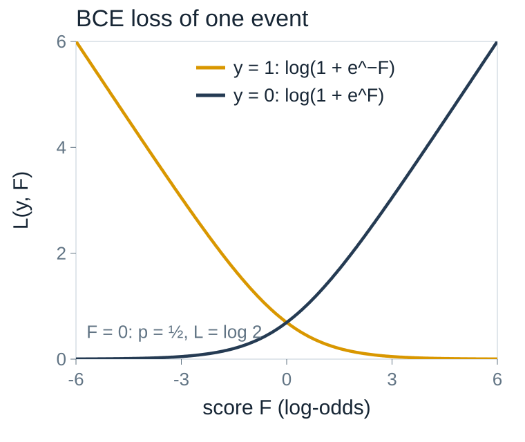
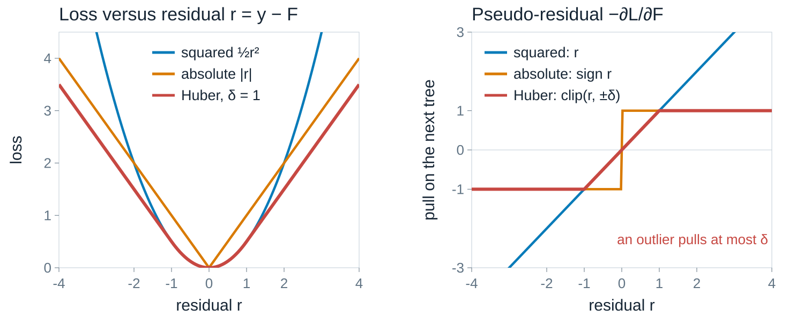

## Gradient Boosting {#lecture-2b-title .l1b .l1b-title}

::: {.l1b-title-copy}
<h3>Decision trees, one correction at a time</h3>

Mikhail Mikhasenko · Lecture 2B
:::

::: {.notes}
Continues Lecture 2A, which introduced trees, bagging and AdaBoost. This lecture builds gradient-boosted decision trees (BDTs) for regression with MSE and for classification with binary cross-entropy. Three questions guide the lecture: how a split is chosen, how leaf values are computed, and how the trees are combined.
:::

## AdaBoost recap {#adaboost-recap .l1b}

::: {.l1b-two}
::: {.l1b-copy}
**Iterative error correction** with weak learners.

- Each new tree sees the **same events**, reweighted.
- Misclassified events get **larger weights**.
- The final model is a **weighted vote** of all trees.
- Sensitive to outliers and label noise: they keep growing in weight.

Famous use: the Viola–Jones face detector (2001).
:::
::: {.l1b-copy}
<div class="l1b-subhead">Today: gradient boosting</div>

Instead of reweighting events, each new tree is trained on **what is still missing**:

$$\text{new target}=\text{residual}=y-\text{current prediction}.$$

The same idea works for **any differentiable loss**, which covers regression and classification.
:::
:::

::: {.notes}
AdaBoost changes the event weights; gradient boosting changes the targets. Later we show that gradient boosting with the exponential loss reproduces AdaBoost's weights, so the two are members of one family. Viola–Jones: https://en.wikipedia.org/wiki/Viola%E2%80%93Jones_object_detection_framework
:::

## A gradual approach: crocodile and turtle {#turtle .l1b}

:::: {.l1b-two .media-right}
::: {.l1b-copy}
A turtle visits a crocodile. Every day she covers only $\eta=5\%$ of the **remaining** distance.

After $d$ days the remaining fraction is $(1-\eta)^d$, so the covered fraction is

$$1-(1-\eta)^d\;\approx\;1-e^{-\eta d}.$$

- She never arrives exactly, but gets arbitrarily close.
- 95% covered when $(0.95)^d\le0.05$, i.e. after $d=59$ days.
- Only for $\eta d\ll1$ is the covered fraction $\approx\eta d$.

**Boosting does the same:** each tree covers a fraction $\eta$ of the remaining residual.
:::
::: {.source-media}
{alt="Illustration of a crocodile in an armchair and a turtle arriving at the window"}
:::
::::

::: {.notes}
Ask the two questions before revealing the answers. ln(0.05)/ln(0.95) = 58.4, so 59 days. The linear approximation eta*d would give 19 days and is wrong here because eta*d is not small. If a tree fitted the residual perfectly, the residual after m rounds would be (1-eta)^m times the initial one. Illustration from the original Lecture 2B slides.
:::

## Notation {#notation .l1b}

| Symbol | Meaning |
|---|---|
| $i=1,\ldots,N$ | training events, with features $x_i=(x_{i1},\ldots,x_{in})\in\mathbb R^n$ and label $y_i$ |
| $F(x)$ | model output (“score”) for an event with features $x$ |
| $L(y,F)$ | loss of one event; training minimizes $\sum_{i=1}^N L\big(y_i,F(x_i)\big)$ |
| $m=1,\ldots,M$ | boosting round; $F_m$ is the model after $m$ trees, $F_0$ a constant |
| $\gamma_m(x)$ | output of tree $m$; its leaves are regions $R_{mj}$, $j=1,\ldots,J_m$, with values $\gamma_{mj}$ |
| $\eta\in(0,1]$ | learning rate (“shrinkage”): the fraction of each tree that is added |

::: {.notes}
Keep this slide visible when deriving formulas later. Leaves are called terminal regions in Friedman's paper. Every event falls into exactly one leaf of each tree.
:::

## Start with regression {#regression-setup .l1b}

::: {.l1b-two}
::: {.l1b-copy}
Features $x\in\mathbb R^n$, label $y\in\mathbb R$.

Squared-error loss per event:

$$L(y,F)=\tfrac12\,\big(y-F\big)^2 .$$

Its average over events is (half) the **MSE**. The factor $\tfrac12$ only simplifies derivatives.
:::
::: {.l1b-copy}
The **residual** of event $i$ is what the model still misses:

$$r_i=y_i-F(x_i).$$

It is also minus the slope of the loss:

$$r_i=-\frac{\partial L(y_i,F)}{\partial F}\bigg|_{F=F(x_i)}.$$

This second form generalizes to other losses.
:::
:::

::: {.notes}
Regression first because residuals have an obvious meaning: a distance to the target. The derivative identity is the bridge to gradient boosting for arbitrary losses.
:::

## Reaching the target in steps {#target-in-steps .l1b}

Each tree is a **function** of $x$. The model is their sum:

::: {.boost-sum}
<div class="bs-term"><div class="bs-const"></div><span>$F_0$ constant</span></div>
<div class="bs-op">$+\,\eta$</div>
<div class="bs-term"><svg viewBox="0 0 160 110"><g class="edges"><path d="M80 18 L40 55 M80 18 L120 55 M40 55 L18 95 M40 55 L62 95 M120 55 L98 95 M120 55 L142 95"/></g><rect class="n" x="68" y="6" width="24" height="24"/><rect class="n" x="28" y="43" width="24" height="24"/><rect class="n" x="108" y="43" width="24" height="24"/><rect class="l" x="6" y="83" width="24" height="24"/><rect class="l" x="50" y="83" width="24" height="24"/><rect class="l" x="86" y="83" width="24" height="24"/><rect class="l" x="130" y="83" width="24" height="24"/></svg><span>$\gamma_1(x)$: fit to $y-F_0$</span></div>
<div class="bs-op">$+\,\eta$</div>
<div class="bs-term"><svg viewBox="0 0 160 110"><g class="edges"><path d="M80 18 L40 55 M80 18 L120 55 M40 55 L18 95 M40 55 L62 95"/></g><rect class="n" x="68" y="6" width="24" height="24"/><rect class="n" x="28" y="43" width="24" height="24"/><rect class="l" x="108" y="43" width="24" height="24"/><rect class="l" x="6" y="83" width="24" height="24"/><rect class="l" x="50" y="83" width="24" height="24"/></svg><span>$\gamma_2(x)$: fit to $y-F_1$</span></div>
<div class="bs-op">$+\;\cdots$</div>
:::

$$F_M(x)=F_0+\eta\sum_{m=1}^{M}\gamma_m(x),\qquad F_m(x)=F_{m-1}(x)+\eta\,\gamma_m(x).$$

Tree $m$ is trained on the residuals **left over** by the previous $m-1$ trees.

::: {.notes}
Blue squares are internal nodes (a feature and a cut), orange squares are leaves (a number). Trees are small and different: each one corrects a different remaining pattern. Unlike bagging, the trees are not interchangeable; their order matters.
:::

## Algorithm for squared error {#algorithm-mse .l1b}

::: {.l1b-two .wide-left}
::: {.l1b-copy}
1. **Start** with a constant: $F_0=\bar y=\frac1N\sum_i y_i$.
2. **For** $m=1,\ldots,M$:
    a. residuals $r_{i}=y_i-F_{m-1}(x_i)$ for every event;
    b. grow a regression tree $\gamma_m$ that predicts $r_i$ from $x_i$;
    c. update $F_m(x)=F_{m-1}(x)+\eta\,\gamma_m(x)$.
3. **Predict** $\hat y(x)=F_M(x)$.

Step 2b hides the two technical questions: **which regions** $R_{mj}$ (splitting) and **which values** $\gamma_{mj}$ (leaves).
:::
::: {.l1b-copy .small-note}
Why a constant $\bar y$? It is the best single number:

$$\frac{\partial}{\partial c}\sum_i\tfrac12(y_i-c)^2=0\;\Rightarrow\;c=\bar y.$$

Why $\eta<1$? Small steps average over many trees and fit the noise more slowly.
:::
:::

::: {.slide-refs}
J. H. Friedman, “Greedy Function Approximation: A Gradient Boosting Machine”, Ann. Stat. 29 (2001) 1189.
:::

::: {.notes}
The algorithm is literally "fit the residual, add a fraction of the fit, repeat". The next slides open step 2b.
:::

## A tree is a piecewise-constant function {#tree-function .l1b}

::: {.l1b-two}
::: {.l1b-copy}
Tree $m$ cuts feature space into $J_m$ disjoint leaves $R_{m1},\ldots,R_{mJ_m}$. In each leaf it returns a constant $\gamma_{mj}$:

$$\gamma_m(x)=\sum_{j=1}^{J_m}\gamma_{mj}\,\mathbf 1\big[x\in R_{mj}\big],$$

where $\mathbf 1[\cdot]=1$ if the condition holds and $0$ otherwise.

So the update reads

$$F_m(x)=F_{m-1}(x)+\eta\sum_{j=1}^{J_m}\gamma_{mj}\,\mathbf 1\big[x\in R_{mj}\big].$$
:::
::: {.tree-diagram}
<div class="tree-cap">tree $m=4$, $J_4=4$ leaves</div>
<div class="tree-root">$x_1<0.4$?</div>
<div class="tree-branches"><div><span>yes</span><div class="tree-node">$x_2<0.7$?</div><div class="tree-leaves"><b>$R_{41}$<br>$\gamma_{41}=2.9$</b><b>$R_{42}$<br>$\gamma_{42}=-1.9$</b></div></div><div><span>no</span><div class="tree-node">$x_1<0.8$?</div><div class="tree-leaves"><b>$R_{43}$<br>$\gamma_{43}=0.3$</b><b>$R_{44}$<br>$\gamma_{44}=0.7$</b></div></div></div>
:::
:::

::: {.notes}
Leaf values from the original slide. The cuts are illustrative. Every event lands in exactly one leaf, so exactly one indicator is 1 for each x.
:::

## How leaf values are computed {#leaf-values .l1b}

::: {.l1b-two}
::: {.l1b-copy}
Take the regions $R_{mj}$ as given. Choose each leaf value to **minimize the loss of the events in that leaf**:

$$\gamma_{mj}=\arg\min_{\gamma}\sum_{i:\,x_i\in R_{mj}}L\big(y_i,\,F_{m-1}(x_i)+\gamma\big).$$

Leaves do not interact: every leaf is a separate one-number problem.
:::
::: {.l1b-copy}
For $L=\tfrac12(y-F)^2$, with $N_{j}$ events in the leaf:

$$\frac{\partial}{\partial\gamma}\sum_{i\in R_{mj}}\tfrac12\big(r_i-\gamma\big)^2=0
\;\Rightarrow\;
\gamma_{mj}=\frac1{N_{j}}\sum_{i\in R_{mj}}r_i .$$

**The leaf value is the mean residual in the leaf.**

Example: residuals $1.2,\,0.8,\,1.0$ give $\gamma=1.0$; with $\eta=0.3$ these events move up by $0.3$.
:::
:::

::: {.notes}
Here r_i = y_i - F_{m-1}(x_i) is fixed during round m. For MSE the argmin is a sample mean, the same leaf rule as the regression trees of Lecture 2A, now applied to residuals. For other losses the argmin is not a mean; we will approximate it with one Newton step.
:::

## How a split is chosen {#split-mse .l1b}

A node holds events $I$. A candidate split uses **feature** $k$ and **cut** $c$:
$I_L=\{i\in I:\,x_{ik}<c\}$, $I_R=I\setminus I_L$.

With the optimal leaf value (the mean), a node's loss is
$\;\sum_{i\in I}\tfrac12(r_i-\bar r_I)^2=\tfrac12\sum_{i\in I}r_i^2-\tfrac12\frac{(\sum_{i\in I}r_i)^2}{N_I}.$
The $\sum r_i^2$ terms cancel in the loss reduction:

$$\text{Gain}(k,c)=\frac12\left[\frac{\big(\sum_{i\in I_L}r_i\big)^2}{N_L}+\frac{\big(\sum_{i\in I_R}r_i\big)^2}{N_R}-\frac{\big(\sum_{i\in I}r_i\big)^2}{N_I}\right]\;\ge 0 .$$

::: {.steps}
1. For each feature $k$, **sort** the events by $x_{ik}$; candidate cuts are midpoints between neighbouring distinct values.
2. Scan left to right, updating $\sum_{I_L}r_i$ and $N_L$ with running sums: all cuts in $\mathcal O(N)$ after sorting.
3. Take the $(k,c)$ with the largest gain; recurse into both children until the depth limit, a minimum leaf size, or no positive gain.
:::

::: {.notes}
This is exactly variance reduction, the regression-tree criterion from Lecture 2A, applied to residuals. The gain is non-negative because splitting can never increase the training loss. That is why a stopping rule (depth, min leaf size, minimum gain) is needed. Real libraries often bin features into histograms (e.g. 256 bins) instead of sorting all values.
:::

## Where does the first tree cut? {#widget-split .addition}

::: {.widget data-src="widgets/split.html" data-poster="widgets/split-poster.png" data-alt="Interactive split search on boosting residuals, with leaf values and gain versus cut position"}
:::

::: {.notes}
Widget 1. Round 1 of MSE boosting on the 1D sample used in the next widget (50 events, y = sin(2 pi x) + 0.6 x + Gaussian noise with sigma 0.25, seed 11). Ask the audience to predict the best cut, then press Find best cut. Point out that the gain curve is a step function: it only changes when the cut passes an event. Grey vertical segments show the remaining residuals after the split. The lambda slider previews the leaf penalty of the XGBoost formulation: gamma = sum r / (N + lambda).
:::

## Boosting a regression, one tree at a time {#widget-regression .addition}

::: {.widget data-src="widgets/regression.html" data-poster="widgets/regression-poster.png" data-alt="Interactive gradient boosting for 1D regression showing the model, the residuals with the new tree, and train and validation MSE"}
:::

::: {.notes}
Widget 2. Left: data, truth (dashed grey), model before (light dashed) and after (solid) tree m. Middle: the residuals that tree m is fitted to, the tree itself (solid red step function) and the fraction actually added (dashed). Right: training and validation MSE; the horizontal line is the noise variance 0.0625, the best achievable expected MSE. Suggested sequence: m=1..5 with eta=1, then eta=0.3; then depth 4 and m=100 to show overfitting, and depth 1 with eta 0.1 for a slow, stable fit. All fitting runs in the browser with the same learner as the classification widget.
:::

## Other losses: pseudo-residuals {#pseudo-residuals .l1b}

::: {.l1b-two}
::: {.l1b-copy}
For MSE the residual is minus the gradient. For **any** differentiable loss define the **pseudo-residual**

$$r_{im}=-\left[\frac{\partial L(y_i,F)}{\partial F}\right]_{F=F_{m-1}(x_i)} .$$

Treat the $N$ values $F(x_1),\ldots,F(x_N)$ as parameters. $-\partial L/\partial F$ is the direction of steepest descent. The tree **generalizes** that direction to all $x$.

**Gradient boosting = gradient descent in function space.**
:::
::: {.l1b-copy}
| Loss $L(y,F)$ | Pseudo-residual $r$ |
|---|---|
| $\tfrac12(y-F)^2$ | $y-F$ |
| $\lvert y-F\rvert$ | $\operatorname{sign}(y-F)$ |
| Huber, width $\delta$ | $y-F$, clipped to $[-\delta,\delta]$ |
| BCE, $y\in\{0,1\}$ | $y-\sigma(F)$ |

$\sigma(F)=1/(1+e^{-F})$ is defined on the classification slides.
:::
:::

::: {.notes}
Friedman's recipe: fit a least-squares regression tree to the pseudo-residuals, then set each leaf value by the leaf-wise argmin of the true loss (a line search). The next slide replaces this line search with a second-order Taylor expansion, as in XGBoost, which also gives a split criterion for any loss.
:::

## Leaf values for any loss {#newton-leaf .l1b}

Expand each event's loss around the current prediction, to second order in the small update $\gamma$:

$$L\big(y_i,F_{m-1}(x_i)+\gamma\big)\approx L\big(y_i,F_{m-1}(x_i)\big)+g_i\,\gamma+\tfrac12 h_i\,\gamma^2,
\qquad
g_i=\frac{\partial L}{\partial F}\bigg|_{F_{m-1}(x_i)},\;\;
h_i=\frac{\partial^2 L}{\partial F^2}\bigg|_{F_{m-1}(x_i)} .$$

In leaf $j$ sum the derivatives: $G_j=\sum_{i\in R_{mj}}g_i$, $\;H_j=\sum_{i\in R_{mj}}h_i$. Add a penalty $\tfrac12\lambda\gamma^2$ ($\lambda\ge0$) against large leaf values:

$$\text{leaf objective}\;=\;G_j\gamma+\tfrac12\big(H_j+\lambda\big)\gamma^2
\quad\xrightarrow{\;\partial/\partial\gamma=0\;}\quad
\gamma_{mj}^{*}=-\frac{G_j}{H_j+\lambda},
\qquad\text{loss change}=-\frac12\,\frac{G_j^2}{H_j+\lambda}.$$

This is **one Newton step** per leaf. Check with MSE: $g_i=F-y_i=-r_i$, $h_i=1$, so $\gamma^*_{mj}=\sum r_i/(N_j+\lambda)$, the mean residual for $\lambda=0$.

::: {.slide-refs}
T. Chen, C. Guestrin, “XGBoost: A Scalable Tree Boosting System”, KDD 2016, arXiv:1603.02754.
:::

::: {.notes}
g is the gradient and h the curvature (Hessian) of the per-event loss with respect to the model output. For MSE the expansion is exact. Large curvature means a confident, well-determined leaf; small curvature allows a larger step. lambda shrinks leaf values toward zero, most strongly in leaves with small H.
:::

## Split gain for any loss {#general-gain .l1b}

Insert the best leaf values into the objective. Splitting node $I$ into $I_L$ and $I_R$ reduces the loss by

$$\text{Gain}=\frac12\left[\frac{G_L^2}{H_L+\lambda}+\frac{G_R^2}{H_R+\lambda}-\frac{G_I^2}{H_I+\lambda}\right]-\tau ,$$

with $G_L=\sum_{i\in I_L}g_i$, $H_L=\sum_{i\in I_L}h_i$, and likewise for $I_R$ and the parent $I$.

| Term | Meaning |
|---|---|
| $\dfrac{G^2}{H+\lambda}$ | how much a node could lower the loss with its best single value |
| $\lambda\ge0$ | leaf-value penalty: shrinks $\gamma^*$, disfavours leaves with little curvature $H$ |
| $\tau\ge0$ | cost of one extra leaf: split only if the improvement exceeds $\tau$ (`gamma` in XGBoost) |

Same search as before: sort, scan cuts with running sums $G_L,H_L$, keep the best. For MSE with $\lambda=\tau=0$ this is the gain of the regression slide.

::: {.notes}
The original slide used the same letter gamma for the split cost and for the leaf values. Here the split cost is called tau to avoid the clash; XGBoost calls it gamma and calls leaf values w. With lambda = 0 and MSE, G = -sum r and H = N, so G^2/H = (sum r)^2 / N.
:::

## The general algorithm {#general-algorithm .l1b}

::: {.l1b-two .wide-left}
::: {.l1b-copy}
1. $F_0=\arg\min_c\sum_i L(y_i,c)$.
2. **For** $m=1,\ldots,M$:
    a. compute $g_i$ and $h_i$ at $F_{m-1}(x_i)$ for every event;
    b. **grow** a tree: at each node choose the $(k,c)$ with the largest $\text{Gain}$; stop at the depth limit or if no gain is positive;
    c. **leaf values** $\gamma_{mj}=-G_j/(H_j+\lambda)$;
    d. **update** $F_m(x)=F_{m-1}(x)+\eta\sum_j\gamma_{mj}\mathbf 1[x\in R_{mj}]$.
3. Output $F_M(x)$, or $p(x)=\sigma\big(F_M(x)\big)$ for classification.
:::
::: {.l1b-copy .small-note}
Only $g_i$ and $h_i$ depend on the loss.

Changing the task means changing **two derivatives**, not the tree code.

The trees in round $m$ never see the labels directly, only $g_i$ and $h_i$.
:::
:::

::: {.notes}
This is the loop implemented in widgets/gb.js (about 40 lines) and in the Pluto notebook. Newton mode uses h from the loss; gradient mode sets h_i = 1, which fits the pseudo-residuals by least squares and uses their mean as the leaf value.
:::

## Classification: the score is a log-odds {#classification .l1b}

:::: {.l1b-two .media-right}
::: {.l1b-copy}
Labels $y\in\{0,1\}$. Trees add up to an unbounded score $F(x)\in\mathbb R$; map it to a probability with the **logistic function**

$$p(x)=\sigma\big(F(x)\big)=\frac1{1+e^{-F(x)}},\qquad F=\log\frac{p}{1-p}.$$

Loss: **binary cross-entropy** (negative log-likelihood)

$$L(y,F)=-\big[y\log p+(1-y)\log(1-p)\big]$$
$$\phantom{L(y,F)}=\log\!\big(1+e^{F}\big)-yF .$$
:::
::: {.source-media}
{alt="BCE loss as a function of the score F for y equals 1 and y equals 0"}
:::
::::

::: {.notes}
The original slide showed the log-likelihood y F - log(1 + e^F), which is maximized; the loss is its negative. Boosting p directly would be awkward because a sum of trees can leave [0, 1]. A wrong but confident prediction is penalized roughly linearly in |F|, a correct one costs almost nothing.
:::

## BCE: gradients and leaf values {#bce-derivatives .l1b}

::: {.l1b-two}
::: {.l1b-copy}
With $p_i=\sigma\big(F_{m-1}(x_i)\big)$, using $\frac{d\sigma}{dF}=\sigma(1-\sigma)$:

$$g_i=\frac{\partial L}{\partial F}=p_i-y_i,\qquad h_i=\frac{\partial^2 L}{\partial F^2}=p_i(1-p_i).$$

Pseudo-residual: $r_i=y_i-p_i$, the **probability still missing**.

Newton leaf value:

$$\gamma_{mj}=\frac{\sum_{i\in R_{mj}}(y_i-p_i)}{\sum_{i\in R_{mj}}p_i(1-p_i)+\lambda}.$$
:::
::: {.l1b-copy}
Start: $F_0=\log\dfrac{\bar y}{1-\bar y}$, the log-odds of the signal fraction $\bar y$.

**Worked example.** Balanced sample, so $F_0=0$ and all $p_i=\tfrac12$. One leaf holds $y=1,1,1,0$:

- $g=-\tfrac12,-\tfrac12,-\tfrac12,+\tfrac12\Rightarrow G=-1$
- $h=\tfrac14$ each $\Rightarrow H=1$
- $\lambda=0$: $\gamma=1$ (leaf log-odds $\log3=1.10$)
- $\eta=0.3$: $F=0.3$, $p=\sigma(0.3)=0.57$
:::
:::

::: {.notes}
Derivation: d/dF log(1+e^F) = e^F/(1+e^F) = p, so g = p - y; h = dp/dF = p(1-p). One Newton step lands close to the leaf's own log-odds. With gradient-mode leaves (h = 1) the same leaf would get gamma = mean(y - p) = 0.25, a much smaller step. Near-pure leaves have tiny H; lambda (and XGBoost's min_child_weight, a minimum H) keeps their values finite.
:::

## One algorithm, two losses {#mse-vs-bce .l1b}

| | Regression: MSE | Classification: BCE |
|---|---|---|
| Label and output | $y\in\mathbb R$, prediction $F$ | $y\in\{0,1\}$, log-odds $F$, $p=\sigma(F)$ |
| Loss $L(y,F)$ | $\tfrac12(y-F)^2$ | $\log(1+e^{F})-yF$ |
| Start $F_0$ | $\bar y$ | $\log\big(\bar y/(1-\bar y)\big)$ |
| Gradient $g_i$ | $F_{m-1}(x_i)-y_i$ | $p_i-y_i$ |
| Curvature $h_i$ | $1$ | $p_i(1-p_i)$ |
| Leaf value $\gamma_{mj}$ | $\dfrac{\sum(y_i-F_{m-1}(x_i))}{N_j+\lambda}$ | $\dfrac{\sum(y_i-p_i)}{\sum p_i(1-p_i)+\lambda}$ |
| Split gain | $\tfrac12\big[G_L^2/(H_L{+}\lambda)+G_R^2/(H_R{+}\lambda)-G_I^2/(H_I{+}\lambda)\big]-\tau$ | same formula |
| Prediction | $F_M(x)$ | $p(x)=\sigma\big(F_M(x)\big)$, cut on $p$ |

::: {.notes}
The summary slide students should be able to reconstruct. Sums in the leaf-value row run over events in leaf j. The classifier output is a probability-like score; choose the working point on p with the ROC curve from Lecture 2A.
:::

## Boosting a classifier {#widget-classification .addition}

::: {.widget data-src="widgets/classification.html" data-poster="widgets/classification-poster.png" data-alt="Interactive gradient-boosted classifier with BCE: probability map, contribution of the current tree, and loss curves"}
:::

::: {.notes}
Widget 3. Left: p(x) after m trees; point area is |y - p|, the pseudo-residual magnitude, so points that are already well classified shrink. Middle: the contribution eta * gamma_m(x) of the current tree, drawn over the residuals it was fitted to; gold regions push toward signal, blue toward background. Right: mean BCE on training and validation samples. Suggestions: step through m = 1..5 on the disk; switch to xor with depth 1 (stumps cannot find a first useful cut, since each single cut has zero expected gain) then depth 2; compare Newton and gradient leaves; set eta = 1, depth 4 and watch the validation BCE rise. Leaf penalty lambda = 1 throughout. Labels have 6% random flips.
:::

## Regularization {#regularization .l1b}

A boosted ensemble can always lower its **training** loss. These controls keep the **validation** loss low:

| Control | Effect |
|---|---|
| **Shrinkage** $\eta$ | small steps; smaller $\eta$ needs more trees $M$ but usually generalizes better |
| **Tree depth** (1–5 typical) | depth $D$ allows interactions among up to $D$ features; shallow trees are weak learners |
| **Subsampling** | each tree sees a random fraction of events (stochastic gradient boosting) |
| **Leaf penalties** $\lambda$, $\tau$, minimum $H$ per leaf | limit leaf values and forbid tiny or uninformative leaves |
| **Early stopping** | stop at the $M$ with the lowest validation loss |

::: {.notes}
Friedman (2002) introduced stochastic gradient boosting with subsampling fraction around 0.5 to 0.8. Early stopping requires a validation sample that is not the final test sample. Shrinkage and number of trees trade off: roughly, eta times M sets how far the model can move.
:::

## Huber loss: robust regression {#huber .l1b}

:::: {.l1b-two .media-right}
::: {.l1b-copy}
With $r=y-F$ and a width $\delta>0$:

$$L_\delta(r)=\begin{cases}\tfrac12r^2, & |r|\le\delta,\\[2pt] \delta\big(|r|-\tfrac12\delta\big), & |r|>\delta.\end{cases}$$

- Quadratic near 0: as efficient as least squares for Gaussian errors.
- Linear in the tails: robust like absolute loss.
- Pseudo-residual: $r$ clipped to $[-\delta,\delta]$. **An outlier's pull is capped.**
:::
::: {.source-media}
{alt="Squared, absolute and Huber losses versus residual, and their pseudo-residuals"}
:::
::::

::: {.notes}
Friedman chooses delta adaptively as a quantile (e.g. 90%) of the current absolute residuals. For |r| > delta the second derivative is zero, so Newton leaves need care; Friedman uses a robust leaf estimate (median plus a clipped mean correction).
:::

## Other losses for classification {#other-losses .l1b}

::: {.l1b-two}
::: {.l1b-copy}
<div class="l1b-subhead">Binomial deviance, $y\in\{-1,+1\}$</div>

$$L(y,F)=\log\big(1+e^{-2yF}\big),\qquad
r=-\frac{\partial L}{\partial F}=\frac{2y}{1+e^{2yF}} .$$

Friedman's convention. It is the BCE of the previous slides with labels $\tfrac{1+y}{2}\in\{0,1\}$ and score $2F$, so $F=\tfrac12\log\frac p{1-p}$.
:::
::: {.l1b-copy}
<div class="l1b-subhead">Exponential loss, $y\in\{-1,+1\}$</div>

$$L(y,F)=e^{-yF},\qquad g_i=-y_i\,e^{-y_iF(x_i)} .$$

The factor $e^{-y_iF(x_i)}$ is exactly the **AdaBoost event weight**: boosting with this loss reproduces AdaBoost.

It grows exponentially for badly misclassified events, hence the noise sensitivity.
:::
:::

::: {.notes}
Friedman, Hastie, Tibshirani, "Additive logistic regression: a statistical view of boosting", Ann. Stat. 28 (2000) 337. The derivative of log(1+e^{-2yF}) is -2y e^{-2yF}/(1+e^{-2yF}) = -2y/(1+e^{2yF}); the pseudo-residual is its negative. Compare the losses at large negative margin yF: deviance grows linearly, exponential loss exponentially.
:::

## Libraries and their parameter names {#libraries .l1b}

::: {.l1b-two}
::: {.l1b-copy}
| Symbol | XGBoost | ROOT TMVA (BDT) |
|---|---|---|
| $M$ | `n_estimators` | `NTrees` |
| $\eta$ | `learning_rate` (`eta`) | `Shrinkage` |
| depth | `max_depth` | `MaxDepth` |
| subsample | `subsample` | `BaggedSampleFraction` |
| $\lambda$ | `reg_lambda` | — |
| $\tau$ | `gamma` | — |
| loss | `objective` | `BoostType=Grad` |

Also: LightGBM, CatBoost; in Julia XGBoost.jl, EvoTrees.jl, JLBoost.jl.
:::
::: {.l1b-copy}
```python
import xgboost as xgb
clf = xgb.XGBClassifier(
    objective="binary:logistic",  # BCE
    n_estimators=500, learning_rate=0.1,
    max_depth=3, reg_lambda=1.0,
    subsample=0.8, early_stopping_rounds=20)
clf.fit(X_train, y_train,
        eval_set=[(X_val, y_val)])
p = clf.predict_proba(X_test)[:, 1]
```

Regression: `XGBRegressor` with<br>`objective="reg:squarederror"`.
:::
:::

::: {.notes}
XGBoost (C++) has Python, R and Julia interfaces. TMVA's BDT also offers AdaBoost and bagging via BoostType; UseBaggedBoost enables subsampling. TMVA users guide: https://root.cern.ch/download/doc/tmva/TMVAUsersGuide.pdf. Early stopping monitors the last entry of eval_set.
:::

## Impact of boosted trees {#impact .l1b}

::: {.l1b-copy}
- **State of the art on tabular data.** Of 29 winning Kaggle solutions published in 2015, 17 used XGBoost; 8 used it alone.
- **Industry:** risk modelling in finance, click-through-rate prediction, insurance, customer modelling. Accurate, fast, and comparatively interpretable.
- **High-energy physics:** for years the most common architecture for signal/background separation at the LHC, e.g. in the Higgs discoveries and flavour tagging.
:::

::: {.slide-refs}
Kaggle statistic: Chen & Guestrin, arXiv:1603.02754.
:::

::: {.notes}
Boosted decision trees remain strong baselines for tabular data even where neural networks are used, and are often combined with them in ensembles.
:::

## BDT playground {#playground .l1b}

::: {.l1b-two}
::: {.l1b-copy}
**Online:** Alex Rogozhnikov's
[gradient boosting playground](https://arogozhnikov.github.io/2016/07/05/gradient_boosting_playground.html)
and [explanation](https://arogozhnikov.github.io/2016/06/24/gradient_boosting_explained.html).

**Julia:** a Pluto adaptation with JLBoost.jl:
[static preview](notebooks/exports/gradient-boosting-playground.html) ·
[source](notebooks/gradient-boosting-playground.jl)

Live version, from this lecture's folder:

```sh
julia notebooks/launch.jl
```
:::
::: {.l1b-copy}
<div class="l1b-subhead">Tasks</div>

1. Reach a test loss below 0.05 on every dataset.
2. Which datasets need depth $\ge2$? Why?
3. Fix $\eta M$ and compare $\eta=1$ with $\eta=0.1$.
4. Compare Newton and gradient updates at equal $M$.
:::
:::

::: {.notes}
The Pluto notebook offers six datasets, rotations, depth, learning rate, subsampling, Newton/gradient updates, and per-tree contribution maps. The static preview needs Pluto's CDN; live controls need the launcher.
:::

## End {.section-title}

::: {.subtitle}
Thank you for the attention
:::
