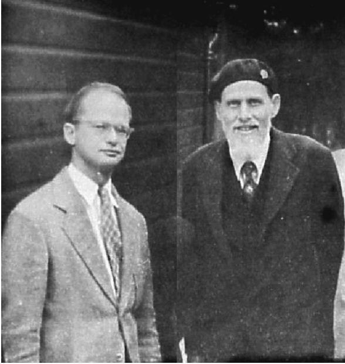
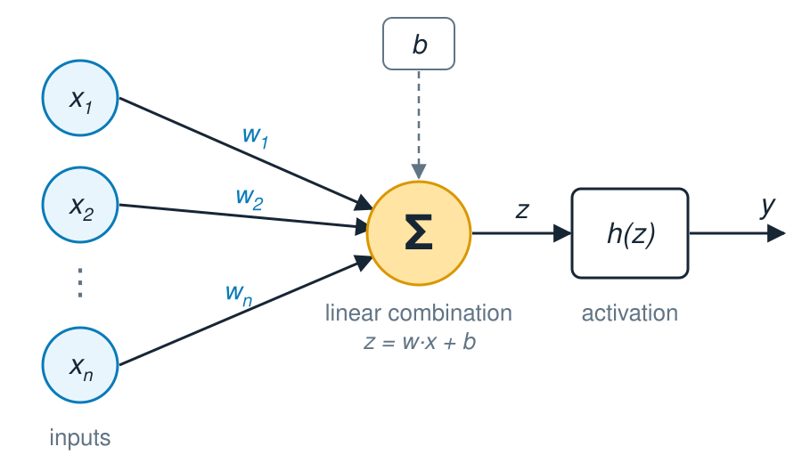
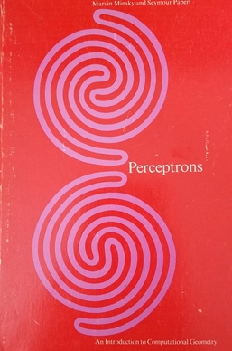
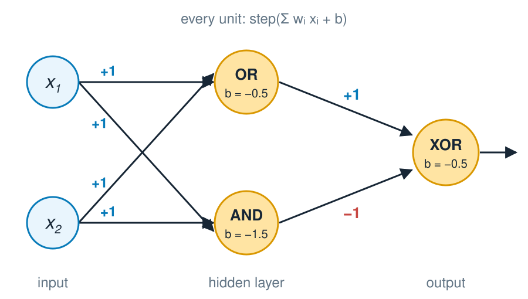
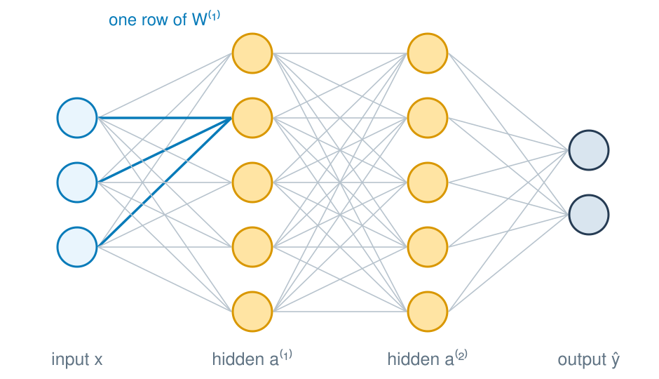
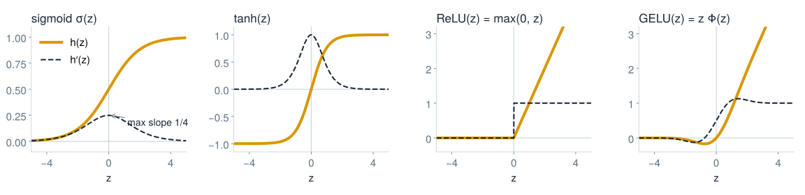
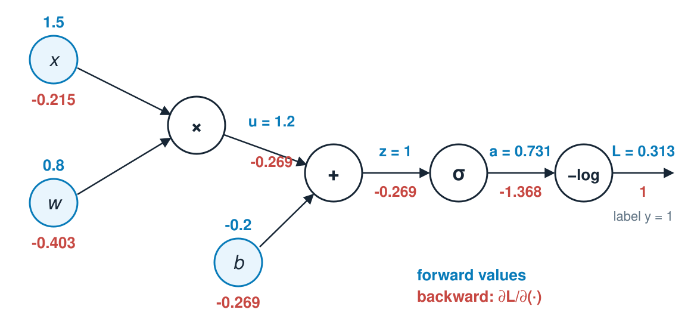
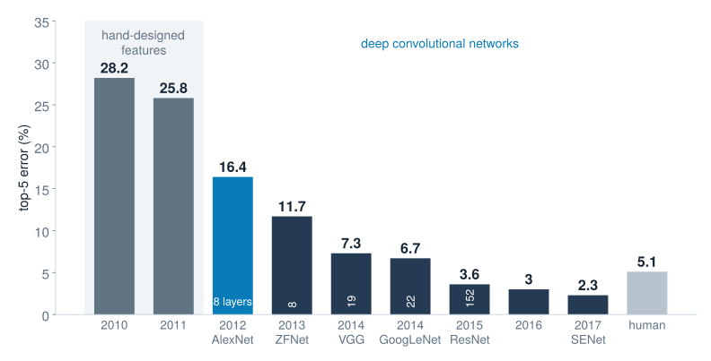

## Neural Networks {#lecture-3a-title .l1b .l1b-title}

::: {.l1b-title-copy}

From one neuron to deep networks

Mikhail Mikhasenko · Lecture 3A
:::

::: {.notes}
Lecture 3A covers what a neural network computes and how it is trained. Lecture 3B applies the same machinery to images with convolutional networks. Native reconstruction of the imported Lecture 3 deck: the history, perceptron, XOR, activation, universal-approximation, gradient-descent and optimizer material, with the screenshots replaced by editable diagrams and five interactive widgets.
:::

## Where we are {#recap .l1b}

::: {.l1b-two}
::: {.l1b-copy}

The recipe from Lecture 1B

1. A **model** $f(x;\theta)$ with parameters $\theta$
2. A **loss** $L(\theta)$ that measures mistakes on training data
3. An **optimizer** that lowers $L(\theta)$

Trees (2A, 2B): piecewise-constant models grown by greedy cuts.
:::
::: {.l1b-copy}

Today

**Neural networks** are smooth functions with many parameters, fitted by following the gradient of the loss.

- What does a network compute?
- Why do we need hidden layers and nonlinearities?
- How do we compute gradients efficiently, and which way do we step?
:::
:::

::: {.notes}
Connect to the loss functions of Lecture 1B (MSE, binary cross-entropy) and to gradient boosting in 2B, which already used gradients of the loss, but in function space. Here the gradient is taken with respect to the network weights.
:::

## Origins {#origins .l1b}

::: {.l1b-two .media-right}
::: {.l1b-copy .timeline}
**1943** McCulloch & Pitts: a binary-threshold **neuron model**

**1949** Hebb: connections that fire together strengthen

**1958** Rosenblatt: the **perceptron** learns weights from labelled examples (Mark I Perceptron: 20 × 20 photocell images)

**1969** Minsky & Papert, *Perceptrons*: the limits of one layer
:::
::: {.source-media}
{alt="Warren McCulloch and Walter Pitts, Chicago 1949"}

Warren McCulloch and Walter Pitts, Chicago 1949
:::
:::

::: {.notes}
The McCulloch–Pitts neuron (1943) sums binary inputs and fires if a threshold is exceeded; it had no learning rule. Hebb (1949) proposed a biological learning principle. Farley and Clark (1954) simulated a Hebbian network on an early computer. Rosenblatt's perceptron (1958) added a learning rule and was built in hardware as the Mark I Perceptron with a 20×20 photocell retina. Photo from the original lecture (source: semanticscholar.org).
:::

## The artificial neuron {#neuron .l1b}

::: {.l1b-two .media-right}
::: {.l1b-copy}
$$y=h\!\left(\sum_{i=1}^{n}w_i x_i+b\right)=h(\mathbf w\cdot\mathbf x+b)$$

- **weights** $w_i$: how strongly each input counts
- **bias** $b$: shifts the threshold
- **activation** $h$: a fixed nonlinear function

An affine map followed by a nonlinearity. The perceptron uses a step: $h(z)=1$ if $z\ge 0$, else $0$.
:::
::: {.source-media .diagram}
{alt="Inputs x1 to xn, multiplied by weights w1 to wn, summed with bias b into z, passed through the activation h to give the output y"}
:::
:::

::: {.notes}
"Affine" = linear map plus a shift: a rotation and scaling of the input space followed by a translation. The biological analogy is loose; the model is a weighted vote followed by a threshold. Everything later in the lecture is built from this unit.
:::

## One neuron, one line {#neuron-geometry .l1b}

::: {.l1b-two}
::: {.l1b-copy}

Geometry

The boundary $\mathbf w\cdot\mathbf x+b=0$ is a straight line (a hyperplane in $n$ dimensions).

- $\mathbf w$ is **normal** to the line and points towards $z>0$.
- $b$ moves the line: its distance from the origin is $|b|/\lVert\mathbf w\rVert$.
- For a sigmoid, larger $\lVert\mathbf w\rVert$ makes the transition sharper.
:::
::: {.l1b-copy}

Perceptron learning rule

For each example, with prediction $\hat y\in\{0,1\}$:

$$\mathbf w\leftarrow\mathbf w+\eta\,(y-\hat y)\,\mathbf x,\qquad b\leftarrow b+\eta\,(y-\hat y)$$

Correct predictions change nothing; a mistake tilts the line towards the misclassified point.

If a separating line **exists**, the rule finds one in a finite number of steps.
:::
:::

::: {.notes}
The convergence statement is Novikoff's theorem (1962) and requires linear separability. With a sigmoid output and cross-entropy loss, gradient descent gives the update w ← w − η(σ(z) − y)x, which is the same form with a soft error. This is logistic regression; the widget uses it when the activation is set to sigmoid.
:::

## One neuron draws one line {#widget-neuron .addition}

::: {.widget data-src="widgets/neuron.html" data-poster="widgets/neuron-poster.png" data-alt="Interactive single neuron: weights, bias, and the resulting decision line on AND, OR, NAND and XOR"}
:::

::: {.notes}
Widget 1. Ask the audience for weights that implement AND (e.g. w = (1, 1), b = −1.5) and OR (b = −0.5). Show that the right panel places each input on the activation curve at its z value. Then select XOR and press Train with the step activation: the perceptron rule cycles forever. With the sigmoid, gradient descent settles on a compromise that is right on at most three of the four points.
:::

## The XOR problem and the first AI winter {#ai-winter .l1b}

::: {.l1b-two .media-right}
::: {.l1b-copy}
**1969:** Minsky and Papert prove that a single-layer perceptron cannot compute some simple functions, for example XOR.

| $x_1$ | $x_2$ | XOR |
|:---:|:---:|:---:|
| 0 | 0 | 0 |
| 0 | 1 | 1 |
| 1 | 0 | 1 |
| 1 | 1 | 0 |

No single line separates the ones from the zeros. Funding and interest in neural networks declined through the 1970s.
:::
::: {.source-media .cover}
{alt="Cover of Perceptrons by Marvin Minsky and Seymour Papert"}
:::
:::

::: {.notes}
The book analysed what single-layer perceptrons with local receptive fields can and cannot compute. Multilayer networks could represent XOR, but there was no practical way to train them. That training method, backpropagation, is the second half of this lecture. The book's influence on funding is debated; the "AI winter" also had other causes.
:::

## One hidden layer solves XOR {#xor-solution .l1b}

::: {.l1b-two .media-left}
::: {.source-media .diagram}
{alt="A 2-2-1 network: hidden units OR and AND, output computes OR and not AND"}
:::
::: {.l1b-copy}
| $x_1$ | $x_2$ | OR | AND | OR − AND |
|:---:|:---:|:---:|:---:|:---:|
| 0 | 0 | 0 | 0 | **0** |
| 0 | 1 | 1 | 0 | **1** |
| 1 | 0 | 1 | 0 | **1** |
| 1 | 1 | 1 | 1 | **0** |

The hidden units compute **new features**. In the (OR, AND) plane, XOR is separable by one line.
:::
:::

::: {.notes}
Every unit is a step neuron. Hidden: OR fires if x1 + x2 − 0.5 ≥ 0, AND fires if x1 + x2 − 1.5 ≥ 0. Output fires if OR − AND − 0.5 ≥ 0. The input (1,1) maps to (OR, AND) = (1,1), which lands on the same side as (0,0). This is the key idea of deep learning in its smallest form: learned intermediate representations make the final problem easy. The original lecture prompt: implement a 2-2-1 dense network for XOR.
:::

## Multilayer perceptron {#mlp .l1b}

::: {.l1b-two .media-right}
::: {.l1b-copy}
Stack layers of neurons. With $\mathbf a^{(0)}=\mathbf x$:

$$\mathbf a^{(l)}=h\!\left(W^{(l)}\mathbf a^{(l-1)}+\mathbf b^{(l)}\right),\qquad l=1,\dots,L$$

$W^{(l)}$ has shape $n_l\times n_{l-1}$: each **row** holds the weights of one unit.

**Dense** (fully connected): every unit sees every unit of the previous layer.

Example, MNIST 784–800–10: $784\cdot800+800+800\cdot10+10=636\,010$ parameters.
:::
::: {.source-media .diagram}
{alt="A network with 3 inputs, two hidden layers of 5 units and 2 outputs; the weights into one hidden unit are highlighted"}
:::
:::

::: {.notes}
Terminology: "multilayer perceptron" (MLP), "feed-forward network" and "dense network" are used interchangeably. The same dense block appears in the last layers of AlexNet (Lecture 3B) and in every transformer block of a large language model. The 784-800-10 network is the one in the MNIST results table of Lecture 3B (1.6% error without distortions).
:::

## Why the nonlinearity? {#why-nonlinear .l1b}

::: {.equation-focus}
Without $h$, two layers collapse into one:

$$W^{(2)}\!\left(W^{(1)}\mathbf x+\mathbf b^{(1)}\right)+\mathbf b^{(2)}
=\underbrace{W^{(2)}W^{(1)}}_{W}\mathbf x+\underbrace{W^{(2)}\mathbf b^{(1)}+\mathbf b^{(2)}}_{\mathbf b}$$

Any depth of linear layers is still **one linear map**: one line, no XOR.

The activation bends the space between layers. Composing many simple bends builds complicated functions.
:::

::: {.notes}
Demonstrate later in the playground widget: switch the activation to "linear" and the XOR data set stays at chance level regardless of depth and width.
:::

## Activation functions {#activations .l1b}

::: {.act-figure}
{alt="Sigmoid, tanh, ReLU and GELU with their derivatives"}
:::

::: {.act-notes}

**Sigmoid, tanh** saturate: $\sigma'(z)\le\tfrac14$. Ten layers can shrink a gradient by $4^{-10}\approx10^{-6}$ (**vanishing gradient**). Still used for outputs and gates.

**ReLU** $\max(0,z)$: cheap, slope 1 for $z>0$. Units stuck at $z<0$ stop learning ("dying ReLU"); leaky ReLU keeps a small slope.

**GELU** $z\,\Phi(z)$, $\Phi$ = Gaussian CDF: a smooth ReLU, standard in transformers (BERT, GPT-2).

:::

::: {.notes}
Step functions have zero derivative almost everywhere, so they cannot be trained with gradients: forget them for hidden layers. ReLU appears in Fukushima (1969); it was popularised by Nair & Hinton (2010), Glorot, Bordes & Bengio (2011) and AlexNet (2012). GELU: Hendrycks & Gimpel (2016), with the common approximation GELU(z) ≈ ½z[1 + tanh(√(2/π)(z + 0.044715 z³))]. The original lecture's cartoon overview of twelve activation functions (sefiks.com) is replaced by these computed curves.
:::

## Universal approximation {#uat .l1b}

::: {.l1b-two}
::: {.l1b-copy}
**1989, Cybenko:** one hidden layer is enough. For a sigmoidal $\sigma$, any continuous $f$ on a bounded domain and any $\varepsilon>0$ there exist $N$ and parameters with

$$g(\mathbf x)=\sum_{j=1}^{N}v_j\,\sigma\!\left(\mathbf w_j^{\top}\mathbf x+b_j\right),\qquad
|g(\mathbf x)-f(\mathbf x)|<\varepsilon .$$

Hornik (1991), Leshno et al. (1993): any non-polynomial activation works, including ReLU.
:::
::: {.l1b-copy}

What it does not say

- how large $N$ must be (it can grow exponentially with dimension)
- how to **find** the weights
- how well $g$ generalizes beyond the training data

In practice, **deep** networks reach the same accuracy with far fewer units than one wide layer.
:::
:::

::: {.notes}
The "visual proof" that was drawn on the board in the original lecture is the next widget: each sigmoid unit with a large weight is a smooth step; a sum of steps is a staircase that can follow any continuous function. In two or more dimensions, pairs of steps form bumps and towers. Expressivity is not the bottleneck; optimization and generalization are.
:::

## Universal approximation: the visual proof {#widget-uat .addition}

::: {.widget data-src="widgets/uat.html" data-poster="widgets/uat-poster.png" data-alt="Interactive staircase approximation of a function by sigmoid steps or ReLU kinks"}
:::

::: {.notes}
Widget 2. Start with 6 sigmoid units on the smooth wave, then increase to 30. Lower the steepness: steps blend into a smooth curve. Switch to ReLU: each unit adds a kink and the network becomes a piecewise-linear interpolation. The jump target needs very steep sigmoids near the discontinuity; the theorem covers continuous functions only. The weights here are written down directly; training would have to discover them.
:::

## Your turn: build a shape from ReLUs {#widget-relu-shapes .l1b}

::: {.l1b-two .relu-shapes}
::: {.l1b-copy}
Four hidden ReLU units, no output bias:

$$y=\sum_{j=1}^{4}v_j\,\mathrm{relu}(w_j x+b_j)$$

Each unit adds one **kink** at $x=-b_j/w_j$, where the slope changes by $v_j w_j$.

Task

1. A **triangle**: $0$ outside $[-1,1]$, peak $1$ at $x=0$
2. A **trapezium**: flat top $1$ on $[-1,1]$, down to $0$ at $\pm2$

Sliders: $w_{1\ldots4}$, $b_{1\ldots4}$, $v_j=w_{4+j}$. Live Julia (Flux + Plots) via Pluto.

:::
::: {.widget data-src="http://localhost:1243/edit?id=3a0a7000-0000-4000-8000-00000000a7a1&isolated_cell_id=6a0ba0ea-6c59-41ae-b706-cca9ba4d7c32&isolated_cell_id=edaeea1e-fc79-4ed6-b29b-06184decba2b" data-poster="widgets/relu-shapes-poster.png" data-requires="make start-julia-server DECK=Lecture_3A" data-alt="Pluto notebook cells: twelve weight sliders of a 1-4-1 ReLU network and the plot of its output"}
:::
:::

::: {.notes}
Live Pluto cells from scripts/lecture-3B-UAT.jl; start the server before the lecture with `make -C slides start-julia-server DECK=Lecture_3A` (port 1243, about a minute to load Flux). After clicking a slider, click on the slide text to get the arrow keys back.

Triangle: relu(x+1) − 2 relu(x) + relu(x−1), i.e. w = (1, 1, 1, 0), b = (1, 0, −1, 0), v = (1, −2, 1, 0). Slope changes +1, −2, +1 sum to zero, so the function is flat again to the right.

Trapezium: relu(x+2) − relu(x+1) − relu(x−1) + relu(x−2), i.e. w = (1, 1, 1, 1), b = (2, 1, −1, −2), v = (1, −1, −1, 1): a rising and a falling step. Sums of such bumps approximate any continuous function, the ReLU version of the staircase on the previous slide.
:::

## Output layers and losses {#outputs .l1b}

| Task | Output unit | Loss |
|---|---|---|
| Regression | identity: $\hat y=z$ | squared error $\tfrac12(\hat y-y)^2$ |
| Binary classification | sigmoid $\hat p=\sigma(z)$ | cross-entropy $-y\log\hat p-(1-y)\log(1-\hat p)$ |
| $K$ classes | softmax $\displaystyle p_k=\frac{e^{z_k}}{\sum_{j}e^{z_j}}$ | cross-entropy $-\log p_{y}$ |
| Positive quantity | softplus $\log(1+e^{z})$ | e.g. Gaussian negative log-likelihood |

For sigmoid or softmax with cross-entropy, the gradient at the output is simply $\partial L/\partial z_k=p_k-\mathbb 1[k=y]$.

::: {.notes}
Softmax maps any real vector to probabilities that sum to one; adding the same constant to all z_k changes nothing, which implementations use for numerical stability (subtract max z). For K = 2 it reduces to a sigmoid of z1 − z2. The simple output gradient is why these pairings are standard. Cross-entropy was derived in Lecture 1B. Softplus is a smooth way to keep an output positive, for example a predicted width or rate.
:::

## Gradient descent {#gradient-descent .l1b}

::: {.l1b-two}
::: {.l1b-copy}
The loss averages over $N$ training examples:

$$L(\theta)=\frac1N\sum_{i=1}^{N}\ell\big(f(x_i;\theta),\,y_i\big)$$

Step against the gradient:

$$\theta_{n+1}=\theta_n-\eta\,\nabla_{\theta}L(\theta_n)$$

$\eta$ is the **learning rate**.
:::
::: {.l1b-copy}
Like walking downhill in the dark with a flashlight: you only see the slope at your feet.

Near a minimum with curvature $\lambda$ the error is multiplied by $1-\eta\lambda$ at every step:

- $\eta\lambda<1$: smooth approach
- $1<\eta\lambda<2$: zig-zag, still converges
- $\eta\lambda>2$: diverges
:::
:::

::: {.notes}
For many parameters, the largest curvature (largest Hessian eigenvalue) sets the maximum stable learning rate, while the smallest curvature sets how slowly the flattest direction converges. Their ratio, the condition number, explains the zig-zag in narrow valleys that the optimizer widget shows. The original lecture used the learning-rate figure from Raschka's Python Machine Learning book; it is replaced by the next widget.
:::

## Choosing the learning rate {#widget-lr .addition}

::: {.widget data-src="widgets/lr.html" data-poster="widgets/lr-poster.png" data-alt="Interactive gradient descent on a one-dimensional loss with adjustable learning rate"}
:::

::: {.notes}
Widget 3. On the quadratic, the curvature is 1, so η = 0.3 approaches smoothly, η = 1.5 zig-zags and η = 2.2 diverges. The right panel shows linear convergence (a straight line on the log scale) with rate |1 − η|. On the two-minima loss, starting at w0 = 2.8 lands in the local minimum; a large learning rate can jump over the barrier, by luck rather than design.
:::

## Backpropagation: the chain rule on a graph {#backprop-graph .l1b}

::: {.backprop-figure}
{alt="Computational graph of a sigmoid neuron with cross-entropy loss, with forward values and backward gradients"}
:::

::: {.backprop-eq}
$$\frac{\partial L}{\partial w}=
\underbrace{-\frac1a}_{\partial L/\partial a}\cdot
\underbrace{a(1-a)}_{\partial a/\partial z}\cdot
\underbrace{1}_{\partial z/\partial u}\cdot
\underbrace{x}_{\partial u/\partial w}
=(a-y)\,x=-0.403$$

**Forward:** compute and store every intermediate value. **Backward:** multiply local derivatives from the loss towards the inputs.
:::

::: {.notes}
Numbers: x = 1.5, w = 0.8, b = −0.2, label y = 1. Forward: u = 1.2, z = 1.0, a = σ(1) = 0.731, L = −log a = 0.313. Backward: ∂L/∂a = −1.368, ∂L/∂z = a − y = −0.269, ∂L/∂w = −0.403, ∂L/∂b = −0.269, ∂L/∂x = −0.215. With η = 0.5 the update is w ← 0.8 + 0.2 = 1.0, which raises a towards the label. Frameworks (PyTorch, JAX, Flux) build this graph automatically: automatic differentiation.
:::

## Backpropagation through layers {#backprop-layers .l1b}

::: {.l1b-two .wide-left}
::: {.l1b-copy}
Define the error signal $\boldsymbol\delta^{(l)}=\partial L/\partial\mathbf z^{(l)}$, where $\mathbf z^{(l)}=W^{(l)}\mathbf a^{(l-1)}+\mathbf b^{(l)}$:

$$\boldsymbol\delta^{(L)}=\hat{\mathbf p}-\mathbf y,\qquad
\boldsymbol\delta^{(l)}=\left(W^{(l+1)\top}\boldsymbol\delta^{(l+1)}\right)\odot h'\!\left(\mathbf z^{(l)}\right)$$

$$\frac{\partial L}{\partial W^{(l)}}=\boldsymbol\delta^{(l)}\,\mathbf a^{(l-1)\top},\qquad
\frac{\partial L}{\partial\mathbf b^{(l)}}=\boldsymbol\delta^{(l)}$$

One backward pass costs about as much as one forward pass, whether the network has ten parameters or ten billion.
:::
::: {.l1b-copy .history-small}
**1970** Linnainmaa: reverse-mode automatic differentiation

**1974** Werbos: applied to neural networks

**1986** Rumelhart, Hinton & Williams: rediscovered and popularized

{.medal alt="Nobel Prize medal"}

**2024 Nobel Prize in Physics**, Hopfield & Hinton: *"for foundational discoveries and inventions that enable machine learning with artificial neural networks"*
:::
:::

::: {.notes}
The factor h′(z) appears once per layer on the way back. With sigmoids, each factor is at most 1/4, which is the vanishing-gradient problem of the activation-function slide. The cost argument is what made training large networks possible: a finite-difference gradient would need one extra forward pass per parameter.
:::

## Mini-batches: stochastic gradient descent {#sgd .l1b}

::: {.l1b-two}
::: {.l1b-copy}
With $N=10^6$ examples, the exact gradient is expensive. Estimate it on a random **batch** $B$ of $m$ examples ($m\approx 32$–$512$):

$$\mathbf g=\frac1m\sum_{i\in B}\nabla_\theta\,\ell_i,\qquad \mathbb E[\mathbf g]=\nabla_\theta L$$

The loss being minimized changes a little every step. One pass over all data is an **epoch**.
:::
::: {.l1b-copy}
With a batch dimension the input is a **matrix** $X$ of shape $m\times d$:

$$Z^{(1)}=X\,W^{(1)\top}+\mathbf 1\,\mathbf b^{(1)\top}$$

Every layer is one matrix multiplication, which GPUs execute very fast.

Gradient noise shrinks like $1/\sqrt m$, and a little noise can help escape saddle points and sharp minima.
:::
:::

::: {.notes}
Stochastic gradient descent (SGD) originally meant m = 1; today "SGD" usually means mini-batch SGD. The gradient-noise slider in the optimizer widget mimics this: every optimizer receives the same random perturbation added to the true gradient.
:::

## Momentum {#momentum .l1b}

::: {.l1b-two}
::: {.l1b-copy}
Keep the inertia of the motion:

$$\mathbf v_n=\beta\,\mathbf v_{n-1}+\mathbf g_n,\qquad \theta_{n+1}=\theta_n-\eta\,\mathbf v_n$$

Unrolled, $\mathbf v_n=\sum_{k\ge0}\beta^k\,\mathbf g_{n-k}$: an **exponentially decaying** memory of past gradients, about $1/(1-\beta)=10$ steps for $\beta=0.9$.
:::
::: {.l1b-copy}
- Consistent directions add up: up to $1/(1-\beta)$ times faster.
- Oscillating directions cancel: less zig-zag.
- Speed can carry the parameters through small bumps and plateaus.

Polyak's "heavy ball" (1964).
:::
:::

::: {.notes}
Correction relative to the original slide: momentum is not the sum of the current gradient and β times the previous gradient; it is an exponentially weighted sum of all past gradients, as written here. Frameworks differ in whether the learning rate multiplies g inside v or outside; the dynamics are equivalent up to a rescaling of η.
:::

## Adaptive step sizes: AdaGrad and RMSProp {#adaptive .l1b}

::: {.l1b-two}
::: {.l1b-copy}
Give every parameter its own step size. Per coordinate:

$$s_n=\begin{cases}s_{n-1}+g_n^2 & \text{AdaGrad}\\[2pt] \beta_2\,s_{n-1}+(1-\beta_2)\,g_n^2 & \text{RMSProp}\end{cases}$$

$$\theta_{n+1}=\theta_n-\eta\,\frac{g_n}{\sqrt{s_n}+\varepsilon}$$
:::
::: {.l1b-copy}
- Steep directions get small steps; flat ones get relatively large steps.
- Rarely updated parameters (sparse features) catch up instead of being left behind.
- AdaGrad's $s_n$ only grows, so its steps shrink towards zero. RMSProp forgets old gradients.
:::
:::

::: {.notes}
AdaGrad: Duchi, Hazan & Singer (2011). RMSProp: Hinton, Coursera lecture 6e (2012), unpublished. The original slide titled "Adagrad" showed the RMSProp formula with an exponential average; both are given here. The division is elementwise and ε ≈ 1e−8 prevents division by zero.
:::

## Adam: adaptive moment estimation {#adam .l1b}

::: {.l1b-two .wide-left}
::: {.l1b-copy}
$$\mathbf m_n=\beta_1\mathbf m_{n-1}+(1-\beta_1)\,\mathbf g_n,\qquad
\mathbf s_n=\beta_2\mathbf s_{n-1}+(1-\beta_2)\,\mathbf g_n^2$$

$$\hat{\mathbf m}_n=\frac{\mathbf m_n}{1-\beta_1^n},\qquad
\hat{\mathbf s}_n=\frac{\mathbf s_n}{1-\beta_2^n},\qquad
\theta_{n+1}=\theta_n-\eta\,\frac{\hat{\mathbf m}_n}{\sqrt{\hat{\mathbf s}_n}+\varepsilon}$$

Defaults: $\eta=10^{-3}$, $\beta_1=0.9$, $\beta_2=0.999$, $\varepsilon=10^{-8}$.
:::
::: {.l1b-copy}
**Momentum** (first moment $\mathbf m$): speed along consistent directions

**RMSProp** (second moment $\mathbf s$): per-parameter step sizes

**Bias correction**: $\mathbf m$ and $\mathbf s$ start at zero

The default choice for most networks today, often as AdamW with decoupled weight decay.
:::
:::

::: {.notes}
Kingma & Ba, "Adam: A Method for Stochastic Optimization", arXiv:1412.6980 (2014). Correction relative to the original slide: the default β2 is 0.999, not 0.99, and the first moment is an average of the current and past gradients evaluated at the visited points. AdamW: Loshchilov & Hutter (2017).
:::

## Optimizers on a loss surface {#widget-optimizers .addition}

::: {.widget data-src="widgets/optimizers.html" data-poster="widgets/optimizers-poster.png" data-alt="Interactive comparison of gradient descent, momentum, RMSProp and Adam on three two-dimensional loss surfaces"}
:::

::: {.notes}
Widget 4. Narrow valley (curvatures 0.02 and 5): GD with η = 0.35 zig-zags across the steep direction and crawls along the flat one; momentum and the adaptive methods reach the minimum. Banana: the minimum is at (1, 1); raise η for GD until it becomes unstable. Two basins: at η = 0.5 momentum overshoots the shallow basin and ends in the deep one, at η = 0.6 it does not. Add gradient noise to see minibatch-like jitter. GD and momentum share η; RMSProp and Adam share α, because their steps have different units.
:::

## Initialization {#initialization .l1b}

::: {.l1b-two}
::: {.l1b-copy}

Break the symmetry

If all weights start equal, all units in a layer compute the same function and receive the same gradient, forever. Start with $\mathbf b=0$ and **random** $W$.

Choose the scale

For $z=\sum_{i=1}^{n_{\mathrm{in}}}w_i a_i$ with independent terms, $\operatorname{Var}z=n_{\mathrm{in}}\operatorname{Var}w\,\operatorname{Var}a$. Keep the variance of signals and gradients constant from layer to layer.
:::
::: {.l1b-copy}
**Tanh, sigmoid: Glorot (Xavier), 2010**

$$\operatorname{Var}w=\frac{2}{n_{\mathrm{in}}+n_{\mathrm{out}}},\quad w\sim U\!\left(\pm\sqrt{\tfrac{6}{n_{\mathrm{in}}+n_{\mathrm{out}}}}\right)$$

**ReLU: He (Kaiming), 2015**

$$w\sim\mathcal N\!\left(0,\ \frac{2}{n_{\mathrm{in}}}\right)$$

ReLU zeroes half the signal, hence the factor 2.
:::
:::

::: {.notes}
Glorot & Bengio, "Understanding the difficulty of training deep feedforward neural networks", AISTATS 2010 (proceedings.mlr.press/v9/glorot10a). He et al., arXiv:1502.01852. The older heuristic U(−1/√n, 1/√n) from the original slide has variance 1/(3n), which shrinks signals layer by layer. The playground widget initializes with variance 1/n_in (tanh, sigmoid) or 2/n_in (ReLU).
:::

## Overfitting and regularization {#regularization .l1b}

::: {.l1b-two}
::: {.l1b-copy}
A large network can memorize the training data, noise included (bias and variance, Lecture 2A).

- **Validation set and early stopping**: stop when the validation loss rises.
- **L2 / weight decay**: minimize $L+\tfrac{\lambda}{2}\lVert\theta\rVert^2$; penalizes large weights (1990s).
- **More data, data augmentation**: shifted, flipped, cropped copies (Lecture 3B).
:::
::: {.l1b-copy}
- **Dropout** (2012): during training, set each hidden unit to zero with probability $p$. Like averaging many thinned networks.
- **Batch normalization** (2015): normalize each unit over the batch, then learn a scale and a shift. Mainly stabilizes and speeds up training.
- **Ensembles**: average independently trained networks.
:::
:::

::: {.notes}
Dropout: Hinton et al., arXiv:1207.0580 (2012); Srivastava et al., JMLR 2014. At test time all units are kept; with "inverted dropout" the surviving activations are scaled by 1/(1−p) during training so no rescaling is needed later. Batch normalization: Ioffe & Szegedy (2015). The playground widget offers an L2 penalty and a test-set view to discuss overfitting with noisy data and a large network.
:::

## Train a small network {#widget-playground .addition}

::: {.widget data-src="widgets/playground.html" data-poster="widgets/playground-poster.png" data-alt="Interactive network trainer with unit activation maps, decision regions, and train and test loss"}
:::

::: {.notes}
Widget 5, a local version of playground.tensorflow.org. Training uses mini-batches of 10 and Adam, with the backpropagation equations of the previous slides written out in JavaScript. Suggested sequence: circle with 1 layer of 4 units; XOR with the linear activation (fails at any depth) and then ReLU; spiral with 1×2 (fails), then 3×8 (succeeds). Raise the noise to 0.4 with 3×8 units and compare train and test loss; add L2 = 1e-3.
:::

## The deep-learning renaissance {#renaissance .l1b}

::: {.l1b-two .media-right}
::: {.l1b-copy .timeline}
**2009** Training on GPUs

**2010** Glorot & Bengio: why deep networks were hard to train, better initialization

**2011–12** ReLU and dropout

**2012** AlexNet wins ImageNet by a wide margin

**2015** Deep networks dominate vision, speech and language benchmarks

Next lecture: **how convolutional networks see**.
:::
::: {.source-media}
{alt="ImageNet challenge top-5 error of the winning entries, 2010 to 2017, compared with a human estimate"}
:::
:::

::: {.notes}
Error rates are the ILSVRC classification winners' top-5 errors as tabulated in Stanford CS231n (2010: 28.2%, 2011: 25.8%, 2012 AlexNet: 16.4%, 2013 ZFNet: 11.7%, 2014 VGG: 7.3% and GoogLeNet: 6.7%, 2015 ResNet: 3.6%, 2016: 3.0%, 2017 SENet: 2.3%; human estimate 5.1%, Russakovsky et al.). LeCun, Bengio & Hinton, "Deep learning", Nature 521 (2015). Further reading: A. Karpathy, "A Recipe for Training Neural Networks" (2019); Goodfellow, Bengio & Courville, Deep Learning, chapters 6–8.
:::

## End {.section-title}

::: {.subtitle}
Thank you for the attention
:::
