## Convolutional Neural Networks {#lecture-3b-title .l1b .l1b-title}

::: {.l1b-title-copy}
<div class="l1b-subhead">How AlexNet learned to see</div>

Mikhail Mikhasenko · Lecture 3B
:::

::: {.notes}
Lecture 3B applies the networks of Lecture 3A to images. The storyline follows chapter 5 of "The Welch Labs Illustrated Guide to AI" (AlexNet): a kernel is a similarity template, layer-1 kernels are edge and colour detectors, activation maps are stacked and processed again, deeper layers respond to corners and eventually faces, and the last layers form an embedding space. All AlexNet figures are recomputed here from the pretrained torchvision weights by scripts/make_figures.py; the marimo notebook reproduces them live.
:::

## From numbers to pictures {#images .l1b}

::: {.l1b-two .media-right}
::: {.l1b-copy}
A colour image is a **tensor** of pixel intensities: height × width × 3 channels (red, green, blue).

AlexNet reads a 224 × 224 × 3 tensor, **150 528 numbers**, and returns 1000 probabilities, one per ImageNet class.

Inside there is nothing but the neurons of Lecture 3A: weighted sums, ReLUs, and a softmax at the end.

The new idea is **how the weights are arranged**.
:::
::: {.io-example}
{alt="Close-up photo of a tabby cat"}

<div class="io-arrow">224 × 224 × 3 → AlexNet →</div>

| class | probability |
|---|---:|
| Egyptian cat | 0.80 |
| tiger cat | 0.13 |
| tabby | 0.07 |
:::
:::

::: {.notes}
Test image: "chelsea" from scikit-image (CC0). Probabilities from the torchvision AlexNet after resizing the short side to 256 and centre-cropping 224. The three most likely classes are all cats; ImageNet distinguishes several cat breeds.
:::

## MNIST: the classic benchmark {#mnist .l1b}

::: {.l1b-two .media-right}
::: {.l1b-copy}
- 28 × 28 pixels, grey scale from 0 (black) to 255 (white)
- 60 000 training and 10 000 test images
- 10 classes: the digits 0–9
- Collected by LeCun, Cortes and Burges (1998) from US census and school handwriting

Small enough for a laptop, hard enough to separate methods.
:::
::: {.source-media}
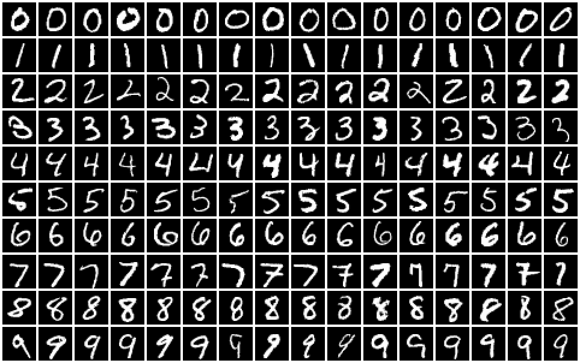{alt="A grid of handwritten digits, twenty examples of each class"}
:::
:::

::: {.notes}
The first 16 test images of each digit, drawn from the MNIST test set by scripts/make_figures.py. Original page: yann.lecun.com/exdb/mnist (web.archive.org copy). A classifier that ignores the image and always answers the same digit is right about 10% of the time.
:::

## MNIST: error rates {#mnist-scores .l1b}

| Model | Details | Test error |
|---|---|---:|
| Linear classifier | pairwise, deskewed inputs | 7.6 % |
| Random forest | fast unified random forests | 2.8 % |
| Boosted stumps | on Haar features | 0.87 % |
| Support-vector machine | degree-9 polynomial, jittered | 0.56 % |
| Neural network | 784–800–10, no distortions | 1.6 % |
| Deep neural network | 784–2500–2000–1500–1000–500–10, elastic distortions | 0.35 % |
| **Convolutional network** | committee of 35 CNNs | **0.23 %** |
| **Convolutional network** | ensemble of 3 CNNs, augmentation | **0.09 %** |

Dense networks need hand-made distortions to compete. Convolutional networks build in what images are like.

::: {.notes}
Selected rows of the table in the Wikipedia article "MNIST database" (the original lecture showed a screenshot of it); see the references there. Distortions and augmentation create shifted, rotated or elastically deformed training copies, which teaches a dense network the invariances that a CNN has by construction.
:::

## Why not a dense network? {#why-not-dense .l1b}

::: {.l1b-two}
::: {.l1b-copy}
<div class="l1b-subhead">Too many weights</div>

One dense layer from a 224 × 224 × 3 image to 4096 units:

$$150\,528\times4096\approx6.2\times10^{8}\ \text{weights}$$

<div class="l1b-subhead">Wrong assumptions</div>

A dense unit treats pixel 17 and pixel 17 000 as unrelated inputs. Shift the cat by a few pixels and every input changes.
:::
::: {.l1b-copy}
<div class="l1b-subhead">What we know about images</div>

**Locality:** nearby pixels belong together; an edge is a local pattern.

**Translation:** a pattern means the same thing anywhere in the image.

So: use **small** detectors, and apply the **same** detector at every position.
:::
:::

::: {.notes}
These two assumptions are the "inductive bias" of convolutional networks. They reduce the number of parameters enormously and make the output of a layer shift together with the input (translation equivariance). Pooling then adds some tolerance to small shifts.
:::

## A kernel is a template {#kernel-template .l1b}

::: {.kernel-copy}
Slide a small grid of weights, the **kernel**, over the image. At each position take the **dot product** of kernel and patch:

$$s=\sum_i w_i\,x_i=\lVert\mathbf w\rVert\,\lVert\mathbf x\rVert\cos\theta$$

Large when the patch **looks like** the kernel: a similarity score.
:::

::: {.kernel-figure}
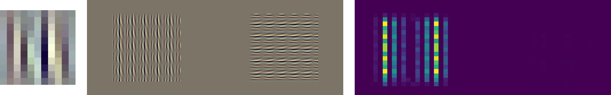{alt="AlexNet first-layer kernel 9, a grey image containing its stripe pattern upright and rotated by 90 degrees, and the resulting activation map"}
:::

::: {.kernel-caption}
AlexNet kernel 9 (left) slid over an image that contains its own pattern, upright and rotated by 90°. Activation map (right): peak 9.0 on the upright copy, 0.0 on the rotated copy.
:::

::: {.notes}
This reproduces the experiment in the Welch Labs guide (figure 5.8), where the author holds a printout of a first-layer kernel in front of the camera and the corresponding activation map lights up; rotating the paper by 90° weakens it. Here the patch is written in normalized input space as a tiled copy of the kernel, which maximizes the dot product for a given contrast. The map shown is conv1 followed by ReLU, 55 × 55, aligned with the input band.
:::

## Convolution {#convolution .l1b}

::: {.l1b-two}
::: {.l1b-copy}
For one kernel $W$ of size $K\times K$, bias $b$, stride $S$ and padding $P$:

$$a_{ij}=h\!\left(b+\sum_{u=0}^{K-1}\sum_{v=0}^{K-1}W_{uv}\;x_{iS+u-P,\;jS+v-P}\right)$$

Output size for an $N\times N$ input:

$$N'=\left\lfloor\frac{N+2P-K}{S}\right\rfloor+1$$
:::
::: {.l1b-copy}
- **Local:** each output looks at a $K\times K$ patch.
- **Shared:** the same $K^2+1$ numbers are used at every position.
- **Stride** $S$ skips positions; **padding** $P$ adds a border of zeros.

AlexNet conv1: $\lfloor(224+4-11)/4\rfloor+1=55$.

Deep-learning "convolution" does not flip the kernel; mathematicians call it cross-correlation.
:::
:::

::: {.notes}
With a flipped kernel the operation would be a true convolution; since the kernel is learned, the flip makes no difference. Padding "same" with K = 3 means P = 1 and keeps the size for stride 1. The next widget lets you change K's weights, the stride and the padding.
:::

## Sliding a kernel over an image {#widget-conv .addition}

::: {.widget data-src="widgets/conv.html" data-poster="widgets/conv-poster.png" data-alt="Interactive convolution: drawable input, editable 3 by 3 kernel, element-wise products and the resulting activation map"}
:::

::: {.notes}
Widget 1. Press Slide to animate the dot products. Compare the vertical and horizontal edge kernels on the digit 7 and on the square. Blur averages; sharpen enhances differences; identity reproduces the image. Switch on ReLU: only one side of each edge survives. Stride 2 halves the map; padding 1 keeps 28 × 28. Draw your own shapes (shift-drag erases). The classic Sobel kernels here were designed by hand; in a CNN these numbers are learned.
:::

## Channels: stack and repeat {#channels .l1b}

::: {.l1b-two .media-left}
::: {.source-media .diagram}
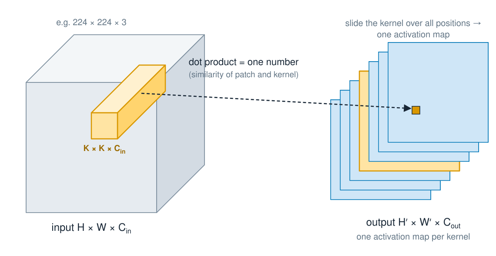{alt="An input tensor with a kernel spanning its full depth; each kernel produces one activation map; the maps stack into the output tensor"}
:::
::: {.l1b-copy}
A kernel always spans **all input channels**: $K\times K\times C_{\mathrm{in}}$ weights.

$C_{\mathrm{out}}$ kernels give $C_{\mathrm{out}}$ activation maps. Stacked, they form a new tensor $H'\times W'\times C_{\mathrm{out}}$.

The next layer processes it exactly like an image, only with $C_{\mathrm{out}}$ "colours".

Parameters: $K^2\,C_{\mathrm{in}}\,C_{\mathrm{out}}+C_{\mathrm{out}}$.
:::
:::

::: {.notes}
AlexNet conv1 has 64 kernels of 11 × 11 × 3 and produces 64 maps of 55 × 55. conv2 then uses 192 kernels of 5 × 5 × 64. This is "stack and repeat" in the Welch Labs guide (figure 5.9): after the first layer the same operation is simply applied again with different learned weights.
:::

## Counting parameters {#params .l1b}

| | Weights | Share of AlexNet |
|---|---:|---:|
| conv1: 64 kernels of 11 × 11 × 3, plus biases | 23 296 | |
| a **dense** layer with the same 55 × 55 × 64 outputs | $2.9\times10^{10}$ | |
| all 5 convolutional layers | 2.5 M | 4 % of weights, 92 % of computation |
| the 3 dense layers | 58.6 M | 96 % of weights, 8 % of computation |

Weight sharing cuts conv1 by a factor of a million. The convolutional layers are cheap to store but expensive to run: every weight is used at thousands of positions.

::: {.notes}
Numbers for the torchvision AlexNet (61.1 M parameters in total). Computation counted as multiply–accumulate operations for one 224 × 224 image: 0.66 billion in the convolutional layers, 0.06 billion in the dense layers. The dense alternative to conv1 would connect 150 528 inputs to 193 600 outputs.
:::

## Pooling {#pooling .l1b}

::: {.l1b-two}
::: {.l1b-copy}
**Max pooling** keeps the largest value in each window:

<div class="pool-demo">
<table class="pool-grid"><tr><td class="p1">1</td><td class="p1">3</td><td class="p2">2</td><td class="p2">0</td></tr><tr><td class="p1">4</td><td class="p1">2</td><td class="p2">1</td><td class="p2">5</td></tr><tr><td class="p3">0</td><td class="p3">1</td><td class="p4">3</td><td class="p4">2</td></tr><tr><td class="p3">2</td><td class="p3">6</td><td class="p4">1</td><td class="p4">0</td></tr></table>
<span class="pool-arrow">→</span>
<table class="pool-grid"><tr><td class="p1">4</td><td class="p2">5</td></tr><tr><td class="p3">6</td><td class="p4">3</td></tr></table>
</div>

2 × 2 window, stride 2: a quarter of the values survive.
:::
::: {.l1b-copy}
- **Smaller maps**: less computation in later layers.
- **Tolerance to small shifts**: the maximum barely moves.
- **Larger receptive fields**: later kernels see more of the image.

No weights to learn. AlexNet uses overlapping 3 × 3 windows with stride 2.
:::
:::

::: {.notes}
Average pooling takes the mean instead. Modern networks often replace pooling by convolutions with stride 2, and end with global average pooling over the whole map. The next widget combines conv → ReLU → max-pool → conv.
:::

## Stack and repeat: from edges to corners {#widget-stack .addition}

::: {.widget data-src="widgets/stack.html" data-poster="widgets/stack-poster.png" data-alt="Interactive two-layer CNN: edge kernels, max pooling, and corner kernels that combine two edge maps"}
:::

::: {.notes}
Widget 2. The four layer-1 kernels detect top, bottom, left and right edges of a dark shape. After ReLU and 2 × 2 max pooling, the four maps are stacked. Each layer-2 kernel has 3 × 3 × 4 weights: for the top-left corner it adds the top-edge map to the right of the centre and the left-edge map below it; the bias −1.2 means one edge alone is not enough. Hover a corner map to see its 8 × 8 receptive field. On the square, each corner type fires exactly once; on the triangle, only the two base corners fire strongly. These weights are hand-set; AlexNet's conv2 learned such detectors from data (next slides).
:::

## A convolutional network {#cnn-anatomy .l1b}

::: {.l1b-two}
::: {.l1b-copy}
<div class="l1b-subhead">Blocks</div>

$\big[\,\text{conv}\to\text{ReLU}\to\text{pool}\,\big]\times n\ \to$ flatten $\to$ dense layers $\to$ softmax

Features first, then a classifier: the dense end is the MLP of Lecture 3A.

<div class="l1b-subhead">LeNet-5 (LeCun et al., 1998)</div>

32 × 32 digit → 6 maps 28 × 28 → pool → 16 maps 10 × 10 → pool → 120 → 84 → 10. About 60 000 parameters; read bank cheques in the 1990s.
:::
::: {.l1b-copy}
<div class="l1b-subhead">Receptive fields grow</div>

| AlexNet layer | pixels seen by one unit |
|---|---:|
| conv1 | 11 × 11 |
| conv2 | 51 × 51 |
| conv3 | 99 × 99 |
| conv5 | 163 × 163 |

Deep units see large parts of the 224 × 224 image.
:::
:::

::: {.notes}
Receptive field recursion: r_l = r_(l−1) + (K_l − 1) · j_(l−1), where j is the product of all previous strides. AlexNet: conv1 11 (j = 4), pool 19 (j = 8), conv2 51, pool 67 (j = 16), conv3 99, conv4 131, conv5 163, pool 195. The effective receptive field, where the unit is actually sensitive, is smaller and concentrated in the centre.
:::

## Train a network, then draw for it {#widget-mnist-live .l1b}

::: {.mnist-live}
::: {.widget data-src="http://localhost:1243/edit?id=3b0a7000-0000-4000-8000-0000000d4a01&isolated_cell_id=4fbdcb67-a78b-4426-910c-830f39cc1cb3&isolated_cell_id=4262e0ff-4e84-4190-83ac-a7fe0024a1f5" data-poster="widgets/mnist-train-poster.png" data-requires="make start-julia-server DECK=Lecture_3B" data-alt="Pluto cells: model choice, a Train one epoch button, and the test accuracy after each epoch"}
:::
::: {.widget data-src="http://localhost:1243/edit?id=3b0a7000-0000-4000-8000-0000000d4a01&isolated_cell_id=351a5dea-2b79-4b53-beac-154503b52c34&isolated_cell_id=d629e83e-b1cf-46cd-a045-e25dbf0b6462" data-poster="widgets/mnist-draw-poster.png" data-requires="make start-julia-server DECK=Lecture_3B" data-alt="Pluto cells: a drawing pad and the network's probabilities for the drawn digit"}
:::
:::

::: {.mnist-caption}
Live Julia (Flux) in Pluto: 60 000 training images, one epoch per click, on this laptop's CPU.
:::

::: {.notes}
Live cells of pluto/mnist-draw.jl; start the server before the lecture with `make -C slides start-julia-server DECK=Lecture_3B` (about a minute to load Flux). Both panels are views of the same notebook, so training on the left changes the predictions on the right.

Suggested sequence: draw a digit with the untrained dense network (random guess, about 10 %). Train one epoch (about 0.3 s after the first, compiling, epoch): about 94 %. Draw again; ask the audience for hard digits (a 4 with an open top, a 7 with a bar, a 1 with a foot). Then switch to the CNN (2 × conv 3 × 3 + pool, about 5 000 parameters instead of 100 000) and train two epochs (about 3 s each): about 97 %.

The pad crops the drawing, scales it into 20 × 20 and centres it by its centre of mass in 28 × 28, as the MNIST digits were prepared. After clicking into a panel, click the slide title to get the arrow keys back.
:::

## Shift the digits {#widget-mnist-shift .l1b}

::: {.l1b-two .mnist-shift}
::: {.l1b-copy}
MNIST digits are centred. Move every test image a few pixels to the right and measure again.

| shift | 0 px | 2 px | 3 px |
|---|---:|---:|---:|
| dense 784–128–10 | 95 % | 71 % | 49 % |
| boosted trees (JLBoost) | 90 % | 69 % | 51 % |
| **CNN** | **97 %** | **92 %** | **78 %** |

Trees and dense networks see each pixel as a fixed input. The CNN applies the same kernels everywhere and pools.
:::
::: {.widget data-src="http://localhost:1243/edit?id=3b0a7000-0000-4000-8000-0000000d4a01&isolated_cell_id=4fbdcb67-a78b-4426-910c-830f39cc1cb3&isolated_cell_id=f8dd5fdd-7e21-4478-acbd-9b7cf57047b2" data-poster="widgets/mnist-shift-poster.png" data-requires="make start-julia-server DECK=Lecture_3B" data-alt="Pluto cells: model choice, training button, and test accuracy against the shift of the test digits for each trained model"}
:::
:::

::: {.notes}
Live: the curve of every model trained on the previous slide is kept, so train the dense network and the CNN and both appear. The table was measured offline on 2 000 test images, networks trained for 3 epochs; the trees are ten one-versus-rest JLBoost boosters (10 000 images, 20 rounds, depth 4, 92 % unshifted), see pluto/mnist-trees.jl and pluto/README.md. This is the "shift the cat" argument of the "Why not a dense network?" slide, measured. Pooling gives only limited invariance, so the CNN also degrades for larger shifts; data augmentation (shifted training copies) fixes the rest.
:::

## ImageNet {#imagenet .l1b}

::: {.l1b-two .media-right}
::: {.l1b-copy}
**ILSVRC 2010–2017**: 1.2 million training images, 1000 classes. Score: **top-5 error**, the fraction of images whose true class is not among the five best guesses.

Before 2012: hand-designed features (SIFT, Fisher vectors) and linear classifiers.

**2012, AlexNet** (Krizhevsky, Sutskever, Hinton): 16.4 %, against 26.2 % for the runner-up.

After 2012 every winner was a deep convolutional network.
:::
::: {.source-media}
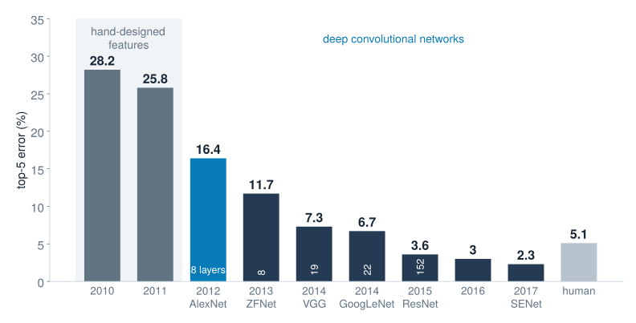{alt="Top-5 error of ILSVRC winners from 28.2 percent in 2010 to 2.3 percent in 2017, compared with a human estimate of 5.1 percent"}
:::
:::

::: {.notes}
Numbers as in Stanford CS231n. AlexNet's paper reports 15.3% for its best entry, which also used extra pre-training data; 16.4% averages five CNNs trained on ILSVRC data only. The runner-up in 2012 (26.2%) used hand-designed features. The human estimate of 5.1% (Russakovsky et al. 2015) comes from one trained annotator. The original lecture also showed the error rates of all entries per year.
:::

## AlexNet {#alexnet .l1b}

::: {.alexnet-figure}
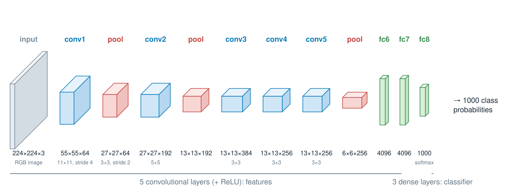{alt="AlexNet as a sequence of tensors: input 224 by 224 by 3, five convolutional layers with three pooling steps, and three dense layers ending in 1000 classes"}
:::

::: {.alexnet-legend}
(CONV → RN → MP)² → CONV³ → MP → (FC → DO)² → Linear → softmax

CONV: convolution + ReLU · RN: local response normalization · MP: max pooling · FC: dense + ReLU · DO: dropout
:::

::: {.notes}
Shapes are those of the torchvision AlexNet used for all figures and the notebook (64, 192, 384, 256, 256 kernels; no response normalization). The 2012 original had 96, 256, 384, 384, 256 kernels, split across two GPUs that only exchanged data in some layers, and local response normalization (RN) after conv1 and conv2. The prisms show the data tensors flowing through the network, not the operations.
:::

## What made AlexNet work {#alexnet-ingredients .l1b}

::: {.l1b-two}
::: {.l1b-copy}
- **ReLU** activations: several times faster training than tanh
- **Dropout** (p = 0.5) in the two big dense layers
- **Data augmentation**: random 224 × 224 crops of 256 × 256 images, horizontal flips, colour shifts
- SGD with momentum 0.9, weight decay 0.0005, batch 128
:::
::: {.l1b-copy}
- **Two GTX 580 GPUs** (3 GB each), five to six days of training
- 60 million parameters, 650 000 neurons
- ImageNet: the first labelled image set large enough to feed such a model

The algorithms were from the 1980s. The **scale of data and compute** was new.
:::
:::

::: {.notes}
Krizhevsky, Sutskever & Hinton, "ImageNet Classification with Deep Convolutional Neural Networks", NeurIPS 2012. They report that a four-layer CNN with ReLUs reached 25% training error on CIFAR-10 six times faster than the same network with tanh. Ilya Sutskever later co-founded OpenAI. Dropout, momentum and weight decay are the tools of Lecture 3A.
:::

## Layer 1: what did AlexNet learn? {#conv1-kernels .l1b}

::: {.l1b-two .media-left}
::: {.source-media .square-figure}
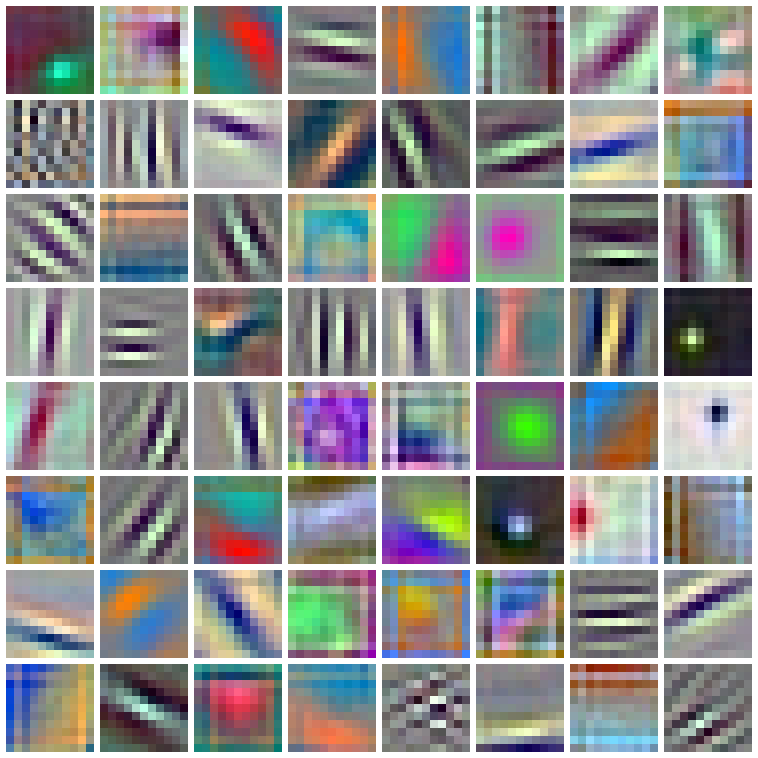{alt="The 64 learned 11 by 11 by 3 kernels of AlexNet's first layer shown as small colour images"}
:::
::: {.l1b-copy}
Each first-layer kernel has depth 3, like the image, so it **is** a tiny RGB picture.

- **edge detectors** at many angles and frequencies
- **colour blobs** and colour-opponent edges

Every kernel started as random numbers. These patterns were learned from labelled photos alone.
:::
:::

::: {.notes}
The 64 kernels of the torchvision AlexNet, each rescaled to its own minimum and maximum. Similar Gabor-like filters are found in the primary visual cortex of mammals. In the original two-GPU AlexNet one GPU specialized in black-and-white edge detectors and the other in colour blobs (Welch Labs guide, footnote to figure 5.7).
:::

## Activation maps {#conv1-maps .l1b}

::: {.l1b-two .media-left}
::: {.source-media .maps-figure}
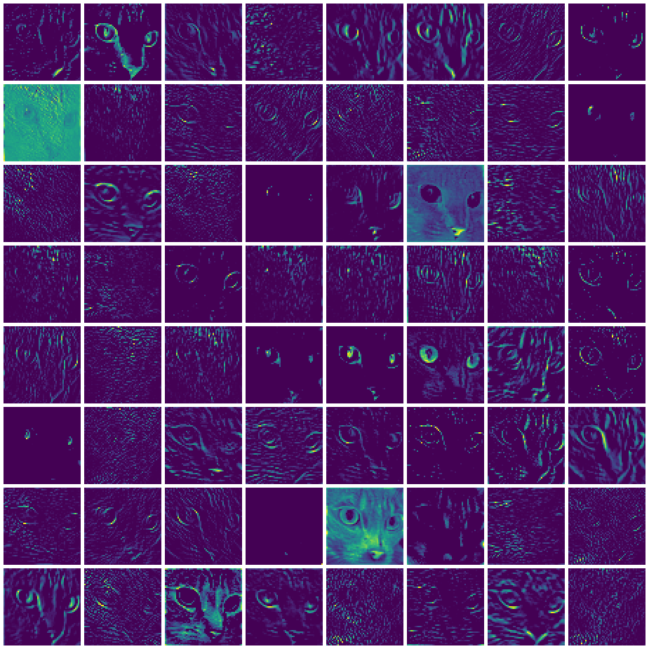{alt="Sixty-four 55 by 55 activation maps of AlexNet's first layer for a photo of a cat"}
:::
::: {.l1b-copy}
{.inline-input alt="Input photo of a cat"}

Sliding each of the 64 kernels over the photo gives 64 **activation maps** (55 × 55 after ReLU).

A map is bright where the image looks like its kernel: whiskers, eye outlines, fur texture, the pink nose.
:::
:::

::: {.notes}
Maps are shown with the viridis colour scale, each normalized to its own maximum. Several maps respond mainly to colour (for example the nose or the green eyes), others to edges at particular orientations.
:::

## Layer 2: combining edges {#conv2 .l1b}

::: {.conv2-grid}
::: {.source-media}
{alt="Input: a white square on a dark background"}

input: a sheet of paper
:::
::: {.source-media}
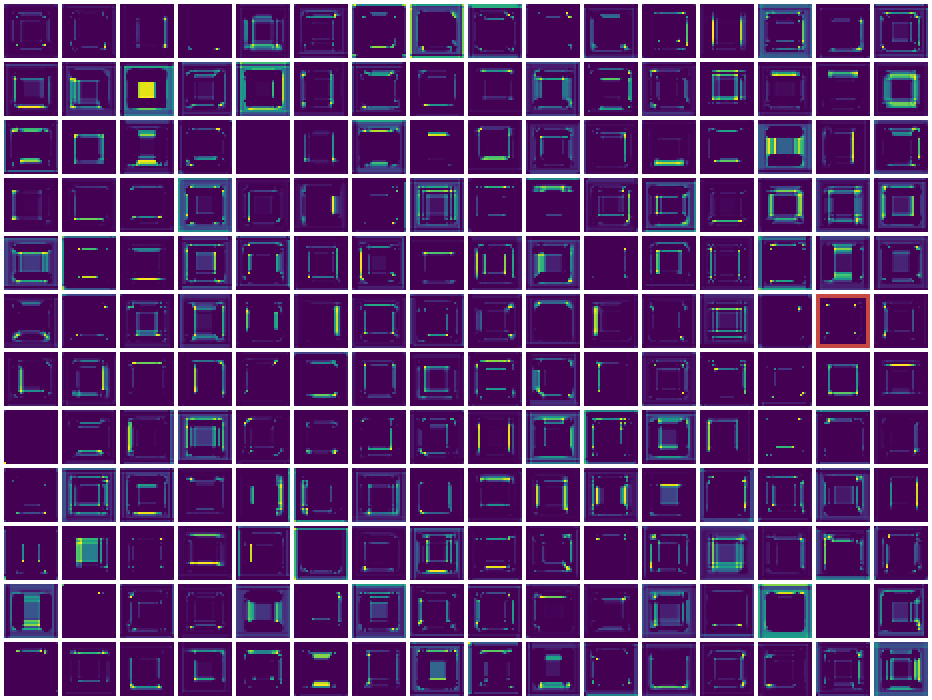{alt="All 192 activation maps of AlexNet's second layer for the white square; channel 94 is outlined"}

all 192 conv2 maps
:::
::: {.source-media}
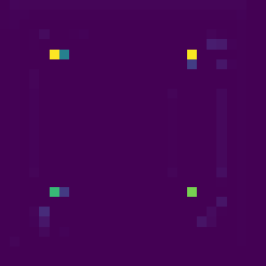{alt="Channel 94 of conv2: bright spots at the corners of the square"}

channel 94: corners
:::
:::

Layer-2 kernels are 5 × 5 × 64: we cannot draw them, but we can watch what they respond to. Most maps trace edges of the square; channel 94 fires almost only at its **corners**.

::: {.notes}
Reproduces the "corner detector" observation of the Welch Labs guide (figure 5.10; their feature map 104 was found on a photo of a sheet of paper). Here the input is a synthetic white square and channel 94 of the torchvision conv2 lights up at three corners and part of the right edge. Compare with the hand-built corner detector of widget 2.
:::

## Layer 5: a face detector nobody asked for {#conv5-faces .l1b}

::: {.face-figure}
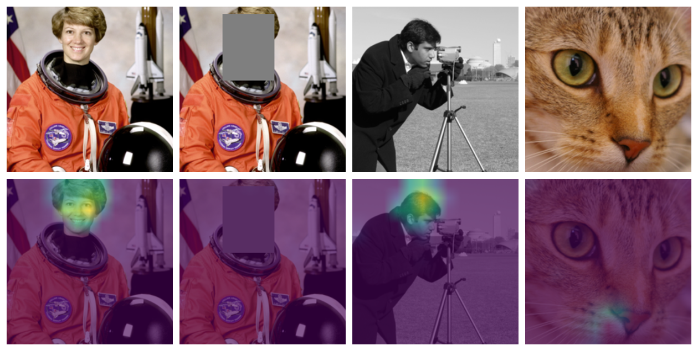{alt="Conv5 channel 174 overlaid on four images: strong on the astronaut's face, silent when the face is covered, strong on the cameraman's face, weak on a cat"}
:::

::: {.face-caption}
conv5, channel 174 · peak activation **14.5** on the astronaut's face, **0.8** with the face covered, **14.5** on the cameraman, 5.8 on the cat's nose. ImageNet has **no** "face" or "person" class.
:::

::: {.notes}
Maps are 13 × 13, upsampled and overlaid on the input, with one shared colour scale. The Welch Labs guide found such a unit (their activation map 186) with a webcam; with these test images the face unit of the torchvision AlexNet is channel 174. A plausible explanation: many ImageNet classes are photographed together with people (dumbbells, microphones, seat belts), so a face detector is a useful intermediate concept.
:::

## What does a unit want to see? {#feature-vis .l1b}

::: {.vis-figure}
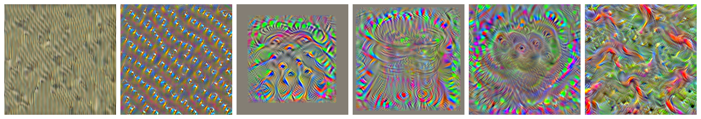{alt="Synthetic images that maximize six AlexNet units, from vertical stripes in conv1 to goldfish-like shapes for the goldfish class"}
:::

::: {.vis-labels}
<span>conv1 · 9<br>stripes</span><span>conv2 · 94<br>corners</span><span>conv3 · 150</span><span>conv4 · 60</span><span>conv5 · 174<br>eyes, nose</span><span>fc8 · goldfish</span>
:::

Start from noise and **change the image** by gradient ascent until one unit is as active as possible; the weights stay fixed. Deeper units prefer textures, patterns, object parts.

::: {.notes}
Feature visualization: Erhan et al. (2009), Olah, Mordvintsev & Schubert, "Feature Visualization", Distill (2017). Regularizers here are random shifts of the image and a small blur every eight steps; better methods use Fourier parametrization and transformations and produce cleaner images, as in the Welch Labs guide's figure 5.14 (InceptionV1). Activation atlases (Carter et al., Distill 2019) combine such images with a 2D map of the embedding space.
:::

## What AlexNet says, and why {#predictions .l1b}

::: {.l1b-two}
::: {.l1b-copy}
| image | top prediction |
|---|---|
| {.thumb} | espresso 0.97 |
| {.thumb} | tripod 0.72 |
| {.thumb} | mosque 0.63 |
| {.thumb} | dumbbell 0.27 |

There is no "rocket" or "astronaut" class. A classifier always picks one of its labels.
:::
::: {.source-media}
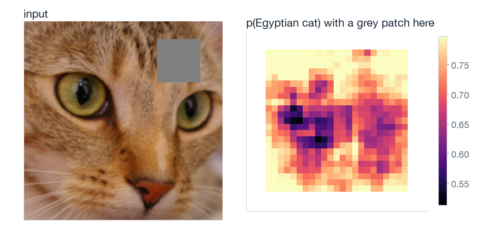{alt="Cat photo with a grey patch, and a map of the Egyptian-cat probability for every patch position"}

**Occlusion:** grey out a patch, record p(Egyptian cat). Covering the eyes hurts most (0.80 → 0.51).
:::
:::

::: {.notes}
Occlusion sensitivity: Zeiler & Fergus (2014). A 48 × 48 grey patch is moved with stride 8; each pixel of the map is one forward pass (23 × 23 = 529 passes). The notebook runs this for any image and patch size.
:::

## The embedding space {#embedding .l1b}

::: {.embedding-figure}
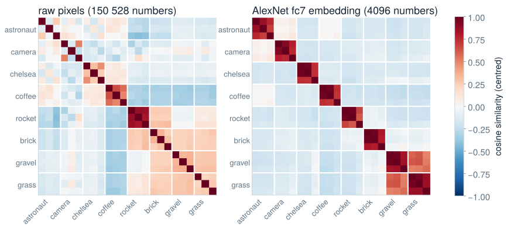{alt="Cosine-similarity matrices of 24 images, original, flipped and cropped copies of eight photos, in raw pixels and in AlexNet's fc7 embedding"}
:::

Stop before the classifier: every image becomes a point in a **4096-dimensional** space (fc7). Flipped and cropped copies of the same photo: similarity **0.34** in pixels, **0.83** in the embedding.

::: {.notes}
Cosine similarity after subtracting the mean vector of the 24 images. The AlexNet paper showed that nearest neighbours of a test image in this space show the same kind of object, although their pixels are very different. Word embeddings in language models behave the same way (the classic example: king − man + woman ≈ queen). Embeddings are the bridge from AlexNet to modern language models, where every token is mapped to such a vector.
:::

## AlexNet under the hood: marimo notebook {#notebook .l1b}

::: {.l1b-two}
::: {.l1b-copy}
`AlexNet_under_the_hood.py` loads the pretrained network and lets you

1. classify the samples or **your own photo**
2. browse the 64 layer-1 kernels and their maps
3. open the activation maps of any layer and channel
4. run the occlusion experiment
5. visualize what a unit wants to see
6. place your image in the embedding space
:::
::: {.l1b-copy}
From the `Lecture_3B` folder:

```bash
python3.12 -m venv .venv
.venv/bin/python -m pip install -r requirements.txt
.venv/bin/marimo edit AlexNet_under_the_hood.py
```

Runs on a laptop CPU; the first start downloads the weights (~240 MB).

[Static export of the notebook](notebooks/exports/AlexNet_under_the_hood.html)
:::
:::

::: {.notes}
Suggested live demo: upload a selfie, look at conv5 channel 174, then cover your face with your hand. Try the printed-kernel experiment of the Welch Labs guide with a phone photo. The static export shows the default outputs; interactive controls need the running notebook. The same figures for the slides come from scripts/make_figures.py.
:::

## After AlexNet: deeper {#deeper .l1b}

::: {.l1b-two}
::: {.l1b-copy}
**VGG** (2014): only 3 × 3 kernels, 16–19 layers. Two 3 × 3 layers see 5 × 5 with fewer weights.

**GoogLeNet** (2014): 22 layers of parallel "inception" branches.

**ResNet** (2015): 152 layers, 3.6 % top-5 error. Each block learns a correction to its input:
$$\mathbf y=\mathbf x+F(\mathbf x)$$
:::
::: {.l1b-copy}
The skip connection gives gradients a direct path back through many layers: the vanishing-gradient problem of Lecture 3A, solved by architecture.

Since 2020, **vision transformers** cut images into patches and treat them like words, using the same blocks as language models. Their "Add & Norm" is ResNet's skip connection.
:::
:::

::: {.notes}
Simonyan & Zisserman (2014), Szegedy et al. (2014), He et al., "Deep Residual Learning", arXiv:1512.03385. Dosovitskiy et al., "An Image is Worth 16x16 Words" (2020). Batch normalization (Lecture 3A) made these depths trainable too. The original lecture's VGG-16 diagram is replaced by this summary.
:::

## Scale {#scale .l1b}

| | LeNet-5 | AlexNet | GPT-3 |
|---|---|---|---|
| Year | 1998 | 2012 | 2020 |
| Data | MNIST: 60 000 images, 10 classes | ImageNet: 1.2 M images, 1000 classes | ~300 billion tokens of text |
| Compute | one CPU | two gaming GPUs | thousands of data-centre GPUs |
| Parameters | ~60 000 | ~60 million | 175 billion |
| Layers | 5 | 8 | 96 |
| Key parts | convolutions, tanh | convolutions, ReLU, dropout | transformer blocks with dense layers |

The same building blocks, scaled up by factors of a thousand at every step.

::: {.notes}
After the comparison figure in chapter 5 of the Welch Labs guide. GPT-3 numbers from Brown et al. (2020): 175 B parameters, 96 layers, trained on about 300 B tokens. Hinton's group in 2012 had roughly ten thousand times the compute LeCun had fifteen years earlier. Scale of data and compute, more than new algorithms, drove the 2012 breakthrough; whether scale alone continues to work is an open question.
:::

## End {.section-title}

::: {.subtitle}
Thank you for the attention
:::
