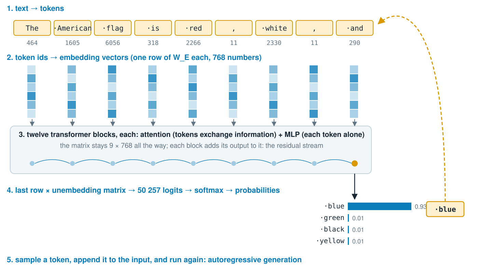
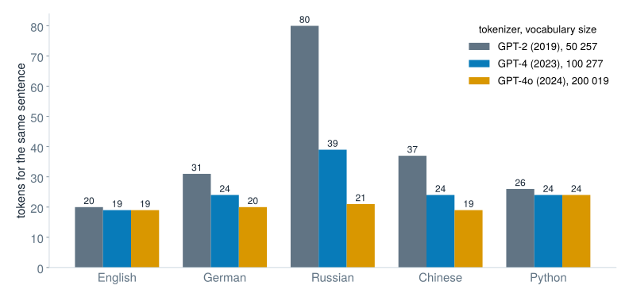
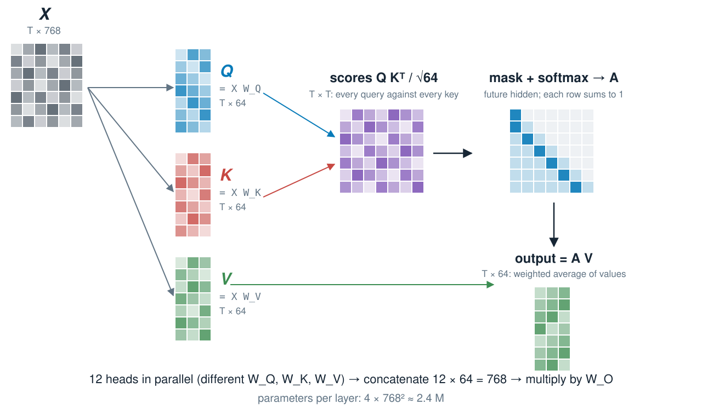
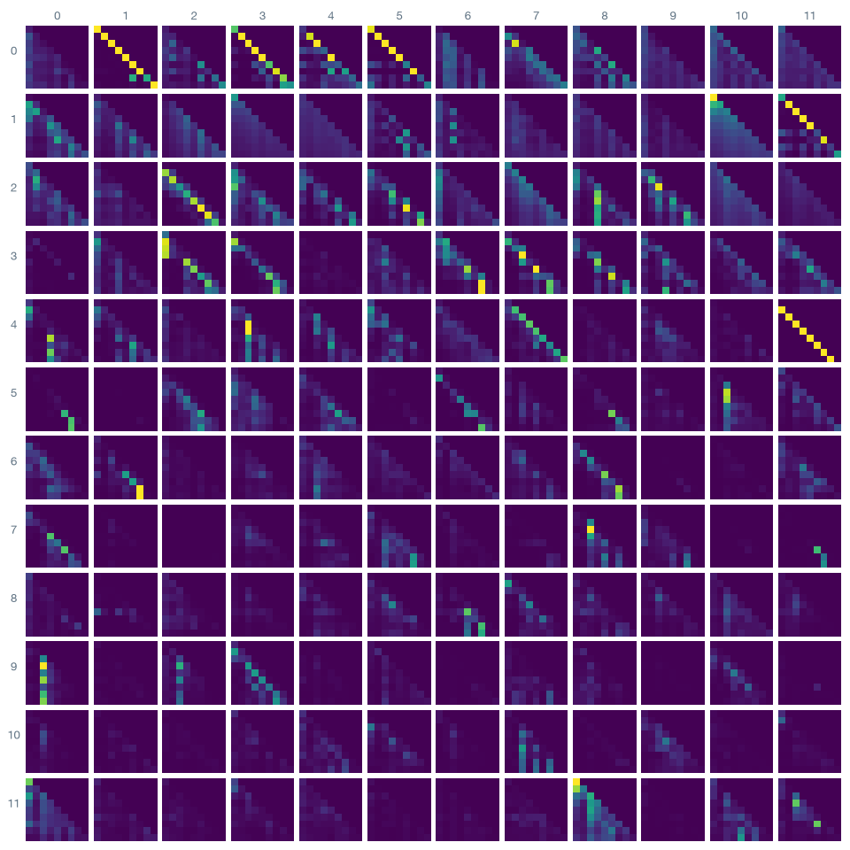
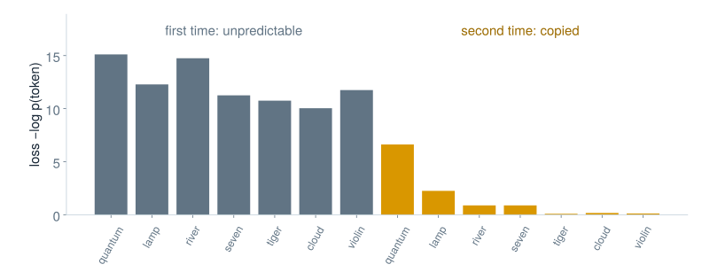
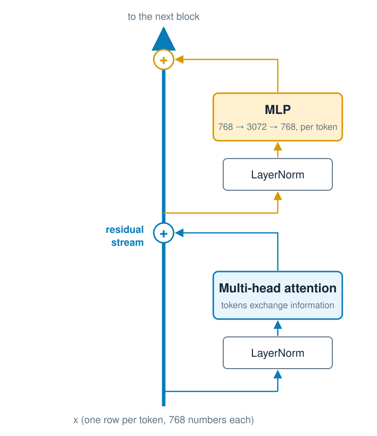
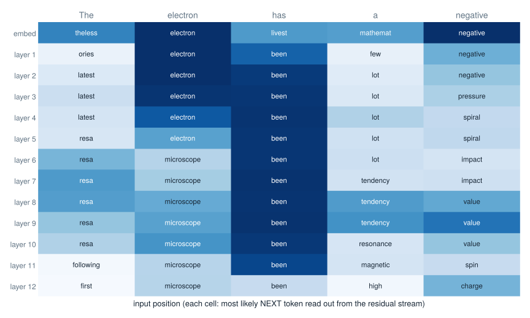
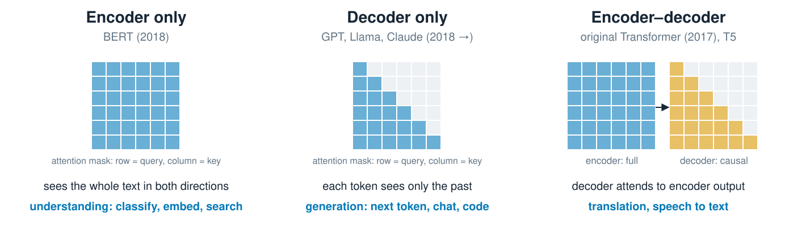
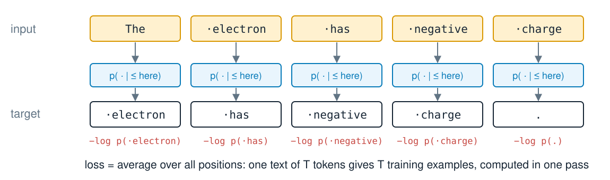
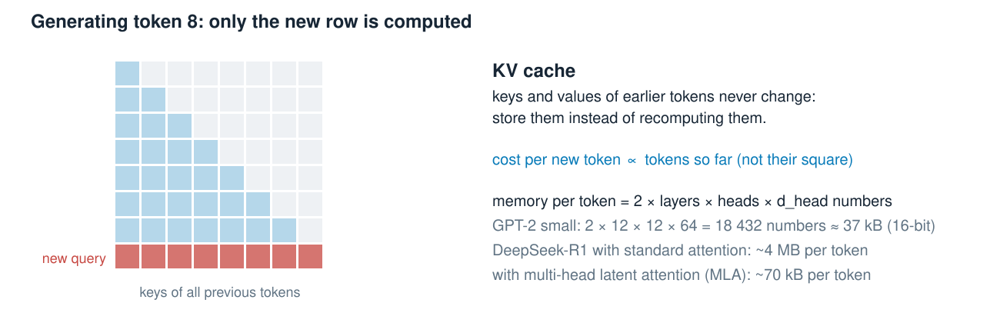

## Transformers {#lecture-4a-title .l1b .l1b-title}

::: {.l1b-title-copy}
<div class="l1b-subhead">How language models work</div>

Mikhail Mikhasenko · Lecture 4A
:::

::: {.notes}
Lecture 4A explains the transformer: tokens, embeddings, attention, the decoder block, training and sampling. Lecture 4B uses these models as chat assistants and agents. All numbers are computed with GPT-2 small (124 M parameters, open weights) by scripts/make_data.py; the marimo notebook GPT2_under_the_hood.py reproduces them live. The storyline borrows from chapters 2, 3, 5, 7 and 8 of the Welch Labs Illustrated Guide to AI and from the generative-models part of the previous Lecture 4.
:::

## Generative models {#generative .l1b}

::: {.l1b-two .media-right}
::: {.l1b-copy}
A **classifier** learns $p(y\mid x)$: which label for this input?

A **generative model** learns the distribution of the data itself, $p(x)$, and can **sample** new examples from it.

With a condition, it samples $p(x\mid\text{prompt})$:

- an image given a description
- a text given the start of a text

Language models are generative models of text.
:::
::: {.source-media}
{alt="Generated painting of a crocodile drinking tea in an armchair, watching a turtle through the window"}

“A painted picture of a crocodile in the house drinking tea and waiting for a turtle to visit”
:::
:::

::: {.notes}
From the previous Lecture 4 (generative models). Image generated by an image model from the quoted prompt; it is a sample from p(image | prompt). Autoencoders and normalizing flows, the other generative models of the old lecture, are not covered here.
:::

## A language model predicts the next token {#next-token .l1b}

::: {.l1b-two}
::: {.l1b-copy}
Split text into tokens $x_1,\dots,x_T$. By the chain rule of probability,

$$p(x_1,\dots,x_T)=\prod_{t=1}^{T}p\left(x_t\mid x_1,\dots,x_{t-1}\right).$$

So one task is enough: **given the text so far, give a probability for every possible next token.**

Generate by sampling a token, appending it, and repeating.
:::
::: {.l1b-copy}
GPT-2 (124 M parameters, 2019):

| text so far | next token |
|---|---|
| The American flag is red, white, and | **blue** 0.93 |
| When Mary and John went to the store, John gave a drink to | **Mary** 0.68 |
| The capital of France is | the 0.08, now 0.05, … **Paris** 0.03 |

Llama 3.2 (1.2 B, 2024) gives Paris 0.39.
:::
:::

::: {.notes}
GPT-2 numbers from scripts/make_data.py (with a start token for the first two). The Llama 3.2 1B value is from chapter 2 of the Welch Labs guide. The small model is not wrong to prefer "the": "The capital of France is the city of Paris" is a fine continuation; the probability is spread over many good continuations.
:::

## The whole machine on one slide {#pipeline .l1b}

::: {.pipeline-figure}
{alt="Text is split into tokens, tokens become embedding vectors, twelve transformer blocks update them, the last vector is turned into probabilities over the vocabulary, and the sampled token is appended to the input"}
:::

::: {.notes}
This is the map for the rest of the lecture: tokenization, embedding, attention and MLP blocks on the residual stream, unembedding and sampling. Token ids are the real GPT-2 ids. Chat models such as ChatGPT or Claude work the same way, with more layers, wider vectors and further training (Lecture 4B).
:::

## Why tokens? {#why-tokens .l1b}

| Unit | Vocabulary | Length of a text | Problem |
|---|---|---|---|
| characters | ~100 (bytes: 256) | long: one step per letter | the model must learn spelling before meaning |
| words | millions | short | new words, typos, names and other languages are unknown |
| **subword tokens** | 50 k – 200 k | ~4 characters per token in English | a compromise, learned from data |

Frequent words become single tokens (`·the`, `·electron`); rare words are split into pieces (`·Bo` `ch` `um`).

::: {.notes}
Lengths: the English sentence used on a later slide has 88 characters and 20 GPT-2 tokens. Cost and context limits of language models are counted in tokens, which is why the tokenizer matters in practice (Lecture 4B).
:::

## Byte-pair encoding {#bpe .l1b}

::: {.l1b-two}
::: {.l1b-copy}
<div class="l1b-subhead">Training the tokenizer</div>

1. Start with single symbols (GPT-2: the 256 possible bytes).
2. Count all adjacent pairs in a large text.
3. Merge the most frequent pair into a new symbol.
4. Repeat until the vocabulary has the desired size.

GPT-2: 256 bytes + 50 000 merges + 1 end-of-text token = **50 257**.
:::
::: {.l1b-copy}
<div class="l1b-subhead">Using it</div>

Split new text into bytes, then apply the learned merges in the order they were learned.

Starting from bytes, nothing is ever “unknown”: any text, any language, any emoji can be encoded.

The tokenizer is trained **once, before** the network, and is not changed by gradient descent.
:::
:::

::: {.notes}
Gage (1994) invented BPE for compression; Sennrich, Haddow & Birch (2016) used it for machine translation; GPT-2 (Radford et al. 2019) made it byte-level. The widget uses characters instead of bytes, so it can show unknown symbols. SentencePiece and WordPiece are close relatives.
:::

## Byte-pair encoding, merge by merge {#widget-bpe .addition}

::: {.widget data-src="widgets/bpe.html" data-poster="widgets/bpe-poster.png" data-alt="Interactive byte-pair encoding: learned merges from a training text and the tokenization of new text"}
:::

::: {.notes}
Widget 1. Press Play and watch frequent pieces appear: "·the", "·energy", "·measure". The test sentence contains "x" and "!", which never occur in the training text: they stay unknown, the reason real tokenizers start from bytes. Switch the training text to German or Python and compare the merges. Chars per token in the stats bar measures compression.
:::

## Real tokenizers {#real-tokenizers .l1b}

::: {.l1b-two .media-left}
::: {.source-media}
{alt="Number of tokens for the same sentence in English, German, Russian, Chinese and Python for three OpenAI tokenizers"}
:::
::: {.l1b-copy}
| text | GPT-2 tokens |
|---|---|
| `strawberry` | `st` `raw` `berry` |
| `·Bochum` | `·Bo` `ch` `um` |
| `·Energieerhaltungssatz` | 9 pieces |
| `·12345678` | `·123` `45` `678` |
| `·SolidGoldMagikarp` | 1 token |

The model never sees letters: counting the r’s in *strawberry* is hard.
:::
:::

::: {.notes}
Same sentence in each language (the physics sentence of the BPE widget). GPT-2's tokenizer was trained mostly on English web text, so Russian costs four times as many tokens as English; the 200 k vocabulary of GPT-4o is much fairer. SolidGoldMagikarp was a Reddit username frequent in the tokenizer's training data but nearly absent from the model's, which made it a "glitch token" (Rumbelow & Watkins 2023). Numbers are split irregularly, one reason arithmetic is hard for language models.
:::

## Embedding: a token becomes a vector {#embedding .l1b}

::: {.l1b-two}
::: {.l1b-copy}
Each token id $i$ selects one row of the **embedding matrix** $W_E$:

$$\mathbf e_i=W_E^{\top}\,\mathbf 1_i\in\mathbb R^{d},\qquad W_E\in\mathbb R^{V\times d}.$$

A one-hot vector times a matrix: a lookup table, trained by backpropagation like any other weight.

GPT-2: $V=50\,257$, $d=768$, so $W_E$ has **38.6 M** of the 124 M parameters.
:::
::: {.l1b-copy}
Training moves tokens that are used in similar contexts to similar vectors:

- nearest to `Monday`: Tuesday, Thursday, Wednesday, Friday
- nearest to `electron`: electrons, photon, neutron
- `king − man + woman` ≈ `queen`
- `Paris − France + Germany` ≈ `Berlin`

The same idea as AlexNet’s fc7 embedding in Lecture 3B.
:::
:::

::: {.notes}
Neighbours by cosine similarity over all 50 257 GPT-2 input embeddings (scripts/make_data.py). Word analogies were made famous by word2vec (Mikolov et al. 2013); GPT-2's input embeddings show them too. GPT-2 reuses W_E, transposed, as its unembedding matrix at the output (weight tying).
:::

## Token embeddings of GPT-2 {#widget-embed .addition}

::: {.widget data-src="widgets/embed.html" data-poster="widgets/embed-poster.png" data-alt="Two-dimensional map of GPT-2 word embeddings with nearest neighbours and vector arithmetic"}
:::

::: {.notes}
Widget 2. 151 single-token words from eleven groups, projected to 2D with t-SNE (distances in the map are only roughly meaningful). Analogies are computed with the full 768-dimensional vectors among these 151 words; the neighbour list uses all 50 257 tokens. king − man + woman gives queen (0.71), Tokyo − Japan + Italy gives Rome. "swam" is not a single GPT-2 token, so walked − walk + swim cannot give it: tokenization limits even the embedding space.
:::

## Where is each token? {#position .l1b}

::: {.l1b-two}
::: {.l1b-copy}
Attention (next slides) compares tokens by content only. Shuffle the input and each token gets the same result: “dog bites man” = “man bites dog”.

So add information about the **position** $t=1,2,\dots$ to each token vector:

$$\mathbf x_t=\mathbf e_{\text{token}(t)}+\mathbf p_t\ \in\mathbb R^{d}$$

- $\mathbf e_{\text{token}(t)}$: embedding of the token at position $t$ (a row of $W_E$)
- $\mathbf p_t$: position vector, same size $d$
- $m$: index of a coordinate pair, $m=0,\dots,d/2-1$
:::
::: {.l1b-copy}
| model | position encoding |
|---|---|
| Transformer (2017) | fixed: $p_{t,2m}=\sin\omega_m t,\ p_{t,2m+1}=\cos\omega_m t$ |
| GPT-2 (2019) | learned $\mathbf p_t$ per position, up to 1024 |
| Llama, most since 2023 | RoPE (rotary), below |

**RoPE.** Attention compares a *query* $\mathbf q$ and a *key* $\mathbf k$ (next slides) by the dot product $\mathbf q\cdot\mathbf k$. Instead of adding $\mathbf p_t$, rotate each coordinate pair $(q_{2m},q_{2m+1})$ by the angle $\omega_m t$:

$$\begin{pmatrix}q_{2m}\\q_{2m+1}\end{pmatrix}\to\begin{pmatrix}\cos\omega_m t&-\sin\omega_m t\\\sin\omega_m t&\cos\omega_m t\end{pmatrix}\begin{pmatrix}q_{2m}\\q_{2m+1}\end{pmatrix}$$

with $\omega_m=10000^{-2m/d}$, and the same for $\mathbf k$. Rotations keep lengths, so the score changes only through the angle $\omega_m(t-t')$: it depends on the **distance** between the two tokens.
:::
:::

::: {.notes}
Without position information a transformer layer is permutation-equivariant: permuting the inputs permutes the outputs. With a causal mask a decoder can still infer some position information, but explicit encodings work much better. RoPE: Su et al., RoFormer (2021). For a query at position t and a key at position t', each pair contributes |q||k| cos(φ + ω_m (t − t')), with φ the angle between the unrotated pairs; the ω_m range from 1 (fast, short distances) to 1/10000 (slow, long distances), like the hands of a clock. GPT-2's learned position table (1024 × 768) is its hard context limit of 1024 tokens.
:::

## Why attention? {#why-attention .l1b}

::: {.l1b-two}
::: {.l1b-copy}
The meaning of a token depends on other tokens, sometimes far away:

- the **bank** of the river / the **bank** raised its rates
- The **electron** was accelerated in the field, and **it** …
- The American **flag** is red, white, and …

Each position must **collect information from the relevant other positions**, whose number and location change from text to text.
:::
::: {.l1b-copy}
A dense layer has one fixed weight per input position: it cannot route information by content.

Recurrent networks (before 2017) passed a single state vector along the text: slow, one step at a time, and forgetful over long distances.

**Attention**: every token asks a question, every token offers an answer, and the weights are computed from the data.
:::
:::

::: {.notes}
Bahdanau, Cho & Bengio (2014) introduced attention to help recurrent translation models. Vaswani et al., "Attention Is All You Need" (2017), dropped recurrence entirely, which made training parallel over positions and let models scale.
:::

## Query, key, value {#qkv .l1b}

::: {.l1b-two}
::: {.l1b-copy}
From each token vector $\mathbf x_i$ compute three vectors with learned matrices:

$$\mathbf q_i=W_Q\mathbf x_i,\qquad \mathbf k_i=W_K\mathbf x_i,\qquad \mathbf v_i=W_V\mathbf x_i$$

- **query**: what am I looking for?
- **key**: what do I contain?
- **value**: what do I pass on if selected?

Similarity is the dot product $\mathbf q_i\cdot\mathbf k_j$, the same similarity score as a CNN kernel on an image patch.
:::
::: {.l1b-copy}
The output for token $i$ is a weighted average of values:

$$\mathbf o_i=\sum_j a_{ij}\,\mathbf v_j,\qquad a_{ij}=\frac{e^{\mathbf q_i\cdot\mathbf k_j/\sqrt{d_k}}}{\sum_{j'} e^{\mathbf q_i\cdot\mathbf k_{j'}/\sqrt{d_k}}}$$

Weights $a_{ij}\ge 0$, $\sum_j a_{ij}=1$: a softmax over all tokens.

GPT-2: $\mathbf x\in\mathbb R^{768}$, $\mathbf q,\mathbf k,\mathbf v\in\mathbb R^{64}$ per head.
:::
:::

::: {.notes}
The database analogy (query, key, value) is only an analogy: the model learns whatever projections reduce the loss. A useful view from the Welch Labs guide (chapter 8): attention is a neural network layer whose weights a_ij are computed from the data itself. Bias terms are omitted in all formulas.
:::

## Scaled dot-product attention {#attention-math .l1b}

::: {.attn-figure}
{alt="The input matrix X is multiplied by three weight matrices to give Q, K and V; Q times K transposed gives a T by T score matrix, which is masked, passed through softmax, and multiplied by V"}
:::

::: {.attn-eq}
$$\operatorname{Attention}(Q,K,V)=\operatorname{softmax}\!\left(\frac{QK^{\top}}{\sqrt{d_k}}+M\right)V,\qquad M_{ij}=\begin{cases}0 & j\le i\\ -\infty & j>i\end{cases}$$

Dividing by $\sqrt{d_k}$: for random vectors $\operatorname{Var}(\mathbf q\cdot\mathbf k)=d_k$, and large scores would saturate the softmax.
:::

::: {.notes}
All tokens are processed at once with matrix products, ideal for GPUs. The causal mask M makes the model a decoder: token i may only use tokens 1 to i. The T × T score matrix is why the cost of attention grows with the square of the text length. With unit-variance components, the dot product of two independent d_k-dimensional vectors has variance d_k; dividing by its standard deviation keeps the softmax in a range where gradients flow.
:::

## Attention by hand: which bank? {#widget-attention .addition}

::: {.widget data-src="widgets/attention.html" data-poster="widgets/attention-poster.png" data-alt="Interactive hand-built attention: queries, keys and values for the word bank in different sentences"}
:::

::: {.notes}
Widget 3. The weights are hand-set with two key features (topic word, function word) and two value features (river, money). In "the bank of the river was muddy" the query of "bank" selects "river" and "muddy" and its output moves to the river side; in the loan sentence it moves to the money side. Query strength plays the role of 1/√d_k or a temperature: at zero every token gets equal weight. With the causal mask on, "bank" cannot see "river", which comes later; only later tokens can combine both. A real model learns W_Q, W_K, W_V; the next widgets show what GPT-2 learned.
:::

## Multi-head attention {#multihead .l1b}

::: {.l1b-two}
::: {.l1b-copy}
One attention pattern can express one kind of relation. So run $h$ heads in parallel, each with its own $W_Q^{(k)},W_K^{(k)},W_V^{(k)}$ of size $d\times d/h$:

$$\operatorname{MHA}(X)=\big[\,\mathbf o^{(1)}\,\cdots\,\mathbf o^{(h)}\,\big]\,W_O$$

Heads specialize: previous word, subject of the verb, matching bracket, earlier copy of the current word…
:::
::: {.l1b-copy}
| | GPT-2 small | GPT-3 | DeepSeek-R1 |
|---|---:|---:|---:|
| layers | 12 | 96 | 61 |
| heads per layer | 12 | 96 | 128 |
| width $d$ | 768 | 12 288 | 7 168 |
| attention patterns | 144 | 9 216 | 7 808 |

Parameters per attention layer: $4d^2$ (plus biases).
:::
:::

::: {.notes}
Implementations compute all heads with one matrix product and reshape. The head dimension is usually d/h (64 for GPT-2 small). DeepSeek numbers from chapter 8 of the Welch Labs guide; its attention is multi-head latent attention, with a different parameter count. For GPT-2 small, 4 × 768² = 2.36 M per layer, 28.3 M in all 12 layers.
:::

## What GPT-2’s heads look at {#gpt2-heads .l1b}

::: {.l1b-two .media-left}
::: {.source-media .grid-figure}
{alt="The 144 attention patterns of GPT-2 small for the text The American flag is red, white, and"}
:::
::: {.l1b-copy}
All 144 attention patterns of GPT-2 for “The American flag is red, white, and” (rows: layers 0–11, columns: heads 0–11).

Some roles are known:

- **L4 H11**: the previous token
- **L5 H5, L6 H9**: induction heads (next slide)
- **L9 H9, L9 H6**: move a name to the output (“John gave a drink to … **Mary**”)

Most heads have no simple description.
:::
:::

::: {.notes}
Recomputed version of figure 8.1 of the Welch Labs guide. The start token is omitted from the thumbnails; many heads put most of their attention on it, a "no-op" default (attention sink). Name-mover heads: Wang et al., "Interpretability in the Wild" (2022), where 10.7 is a negative name mover. Induction and previous-token heads: Elhage et al. (2021), Olsson et al. (2022).
:::

## Inside GPT-2: 144 attention heads {#widget-heads .addition}

::: {.widget data-src="widgets/heads.html" data-poster="widgets/heads-poster.png" data-alt="Interactive explorer of the real attention patterns of all 144 GPT-2 heads for four texts"}
:::

::: {.notes}
Widget 4. Start with the repeated random words and layer 5, head 5: in the second half each word attends to the word that followed its first occurrence, and the last word "violin" attends to "quantum" (0.73), so GPT-2 predicts "quantum". Then layer 4, head 11 (previous token). On the Mary and John sentence, the last token "to" attends to "Mary" in heads 9.9, 9.6 and 10.7.
:::

## Induction heads: learning inside the prompt {#induction .l1b}

::: {.l1b-two .media-right}
::: {.l1b-copy}
A two-head circuit:

1. a **previous-token head** writes into each token “the word before me was A”;
2. an **induction head** at the current token B searches for earlier tokens whose previous word was B, and copies what followed.

Pattern: … A B … A → predict B.

Random words shown twice: GPT-2’s loss falls from **11.8** to **0.73** nats per token.
:::
::: {.source-media}
{alt="Per-token loss of GPT-2 on seven random words repeated twice: high the first time, near zero the second time"}
:::
:::

::: {.notes}
Elhage et al., "A Mathematical Framework for Transformer Circuits" (2021); Olsson et al., "In-context Learning and Induction Heads" (2022). Induction heads need two layers, which is why one-layer attention-only models cannot do this. They form abruptly during training and coincide with a jump in in-context learning. The loss values are averages over the first and second copy, excluding the first word.
:::

## The transformer block {#block .l1b}

::: {.l1b-two .media-left}
::: {.source-media .diagram}
{alt="A transformer block: layer norm and multi-head attention added to the residual stream, then layer norm and an MLP added to the residual stream"}
:::
::: {.l1b-copy}
**Attention**: tokens exchange information.

**MLP**: each token processed on its own, $768\to3072\to768$ with GELU. Two thirds of the block’s weights; much of the model’s factual knowledge seems to live here.

**LayerNorm** (LN): rescale each token vector to mean 0 and spread 1 before it enters attention or the MLP (next slide).

**Residual connections**: each block *adds* to $\mathbf x$, as in ResNet (Lecture 3B):
$$\mathbf x\leftarrow\mathbf x+\operatorname{Attn}(\operatorname{LN}(\mathbf x)),\quad \mathbf x\leftarrow\mathbf x+\operatorname{MLP}(\operatorname{LN}(\mathbf x))$$

GPT-2 small stacks 12 blocks, GPT-3 96.
:::
:::

::: {.notes}
This is the pre-LN arrangement of GPT-2 and later models; the 2017 Transformer normalized after the addition. Llama replaces LayerNorm by RMSNorm and GELU by SwiGLU. Knowledge in MLP layers: Geva et al. (2021), Meng et al. (2022). The block maps a T × 768 matrix to a T × 768 matrix, so blocks can be stacked.
:::

## LayerNorm {#layernorm .l1b}

::: {.l1b-two}
::: {.l1b-copy}
Take **one token vector** $\mathbf x=(x_1,\dots,x_d)$, $d=768$. Compute its mean and spread over the $d$ features:

$$\mu=\frac1d\sum_{j=1}^{d}x_j,\qquad \sigma=\sqrt{\frac1d\sum_{j=1}^{d}(x_j-\mu)^2}$$

Standardize, then scale and shift each feature $j$:

$$\operatorname{LN}(\mathbf x)_j=\gamma_j\,\frac{x_j-\mu}{\sigma}+\beta_j$$

- $\boldsymbol\gamma,\boldsymbol\beta\in\mathbb R^{d}$: learned, like weights and biases
- each token alone: rows of the $T\times d$ matrix do not mix
- batch normalization (Lecture 3A) averages one unit over the *batch*; LayerNorm averages one token over its *features*
:::
::: {.l1b-copy}
**Why?** Every block *adds* to the residual stream, so its scale grows. GPT-2, last token of “The American flag is red, white, and”:

| entering | $\mu$ | $\sigma$ | largest $\lvert x_j\rvert$ |
|---|---:|---:|---:|
| block 1 | 0.00 | 0.17 | 1.2 |
| block 2 | 0.01 | 1.96 | 26 |
| block 7 | −0.02 | 2.73 | 30 |
| block 12 | 0.16 | 7.59 | 98 |

After LN: $\mu=0$, $\sigma=1$ at every depth. Attention and the MLP always see inputs of the same size; the stream itself keeps growing.

GPT-2 has 25 LayerNorms (2 per block + 1 before the unembedding): $25\times2\times768=38\,400$ parameters.
:::
:::

::: {.notes}
Numbers from GPT-2 small (Hugging Face checkpoint): hidden states of the last token before blocks 1, 2, 7 and 12, and ln_1 of that block applied to them. Feature 447 carries most of the large values in the middle layers, a known "massive activation" of GPT-2. In practice σ is computed as sqrt(variance + ε) with ε = 1e-5 to avoid division by zero. The learned γ of ln_1 in block 7 ranges from 0.06 to 0.78, so the model re-weights features after normalizing. Ba, Kiros & Hinton, "Layer Normalization" (2016). RMSNorm (Llama) skips the mean subtraction and β: x_j / sqrt(mean(x²)) · γ_j.
:::

## The residual stream: watching a prediction form {#logit-lens .l1b}

::: {.l1b-two .media-left}
::: {.source-media}
{alt="Logit lens for The electron has a negative: the most likely next token read out after each layer, with charge appearing only at the last layer"}
:::
::: {.l1b-copy}
Each block adds a little to a running vector per token: the **residual stream**.

**Logit lens**: read the stream out early with the final unembedding.

After “negative”, GPT-2’s guess moves from *pressure* to *impact*, *value*, *spin* and finally **charge** (0.47) in the last layer.
:::
:::

::: {.notes}
nostalgebraist, "interpreting GPT: the logit lens" (2020). Each cell applies the final layer norm and the unembedding to the residual stream after that layer and shows the most likely next token; colour is its probability. The Welch Labs guide (chapters 3 and 7) shows the same stream for Llama and Gemma, where the last row is pushed step by step towards the embedding of the next token.
:::

## Encoders and decoders {#families .l1b}

::: {.families-figure}
{alt="Three transformer families: encoder only with full attention, decoder only with causal attention, and encoder-decoder with cross-attention"}
:::

The 2017 Transformer translated: an **encoder** read the German sentence, a **decoder** wrote the English one and looked at the encoder through cross-attention. GPT kept only the decoder, and one objective, next-token prediction, turned out to cover almost every task.

::: {.notes}
BERT (Devlin et al. 2018) is trained to fill in masked words and is used for classification and text embeddings (search). T5 (Raffel et al. 2019) and Whisper (speech recognition, 2022) are encoder–decoders. Today's chat models (GPT-4, Claude, Llama, DeepSeek) are decoder-only.
:::

## Training: predict every next token {#training .l1b}

::: {.training-figure}
{alt="The input tokens shifted by one position are the targets; each position contributes a cross-entropy term"}
:::

::: {.l1b-two .training-copy}
::: {.l1b-copy}
$$L(\theta)=-\frac1T\sum_{t=1}^{T}\log p_\theta\!\left(x_{t+1}\mid x_{\le t}\right)$$

The causal mask lets one forward pass train all $T$ predictions at once: no labels needed, the text is its own target.
:::
::: {.l1b-copy}
| | training text |
|---|---|
| GPT-2 (2019) | ~40 GB of web text, ~10 B tokens |
| GPT-3 (2020) | ~300 B tokens |
| Llama 3 (2024) | ~15 T tokens |
:::
:::

::: {.notes}
Cross-entropy is the loss of Lecture 1B; the optimizer is Adam(W) from Lecture 3A. This stage is pre-training. It produces a model that continues text; turning it into a helpful assistant (instruction tuning, reinforcement learning from human feedback) is the topic of Lecture 4B. Token counts: Radford et al. 2019 (WebText, 40 GB), Brown et al. 2020, Meta Llama 3 report (2024).
:::

## From logits to text {#sampling .l1b}

::: {.l1b-two}
::: {.l1b-copy}
Unembedding: logits $\mathbf z=W_U\mathbf h_T\in\mathbb R^{50\,257}$, then

$$p_i=\frac{e^{z_i/T}}{\sum_j e^{z_j/T}}$$

- $T\to0$: always the most likely token (greedy)
- $T=1$: the model’s distribution
- **top-$k$**: keep the $k$ most likely tokens
- **top-$p$**: keep the smallest set with total probability $\ge p$
:::
::: {.l1b-copy .gens}
GPT-2, “The capital of France is …”

**T = 0:** the capital of the French Republic, and the capital of the French Republic is the capital of the French Republic…

**T = 0.7:** still the biggest producer of oil and gas. (Reuters)…

**T = 1.5:** Barville ,"A vice801 noted."Mr Wallace wanted ahead standpoint…
:::
:::

::: {.notes}
Greedy decoding tends to loop; high temperature reaches the long tail of unlikely tokens and derails. Top-p (nucleus) sampling: Holtzman et al., "The Curious Case of Neural Text Degeneration" (2019). Continuations generated with fixed seeds by scripts/make_data.py; a different seed gives a different text.
:::

## Choosing the next token {#widget-sampler .addition}

::: {.widget data-src="widgets/sampler.html" data-poster="widgets/sampler-poster.png" data-alt="Interactive next-token distribution of GPT-2 with temperature, top-k and top-p"}
:::

::: {.notes}
Widget 5. Real GPT-2 logits for six prompts. The top 200 tokens are stored exactly; the remaining ~50 000 as a histogram, so the normalization is exact at every temperature. Lower T sharpens the distribution; raise it and "all other tokens" takes over. Top-p = 0.9 removes the long tail. The continuation below the plot is a real GPT-2 sample at the nearest precomputed temperature.
:::

## Counting parameters {#parameters .l1b}

::: {.l1b-two}
::: {.l1b-copy}
| GPT-2 small | parameters |
|---|---:|
| token embedding 50 257 × 768 | 38.6 M |
| position embedding 1024 × 768 | 0.8 M |
| attention, 12 × ($4d^2$ + biases) | 28.3 M |
| MLP, 12 × ($8d^2$ + biases) | 56.7 M |
| layer norms | 0.04 M |
| **total** | **124.4 M** |
:::
::: {.l1b-copy}
Per block: $4d^2+8d^2=12d^2$. For a deep model

$$N\approx12\,L\,d^2.$$

GPT-3: $12\times96\times12\,288^2\approx174\ \text{B}$, reported 175 B.

Generating one token costs about $2N$ floating-point operations: 250 M for GPT-2, 350 G for GPT-3.
:::
:::

::: {.notes}
The breakdown adds up exactly to the 124 439 808 parameters of the Hugging Face GPT-2 checkpoint (checked by an assertion in scripts/make_data.py). The unembedding shares its weights with the token embedding. The 2N rule counts one multiply and one add per weight and ignores the attention scores, which matter for very long texts.
:::

## The cost of long texts: the KV cache {#kv-cache .l1b}

::: {.kv-figure}
{alt="When a new token is generated only the last row of the attention pattern is new; keys and values of earlier tokens are stored in a cache"}
:::

The full attention pattern has $T^2$ entries: a 100 000-token context compares every pair of words of a book. When generating, earlier keys and values do not change, so they are cached. The cache, not the weights, often limits how many users and how long a context a server can handle; DeepSeek’s multi-head latent attention compresses it 57-fold.

::: {.notes}
Chapter 8 of the Welch Labs guide explains KV caching and DeepSeek's multi-head latent attention (Liu et al. 2024) in detail. Per token and layer, standard attention stores keys and values for every head (2 × 128 × 128 numbers for R1); MLA stores one shared latent vector of 576 numbers. The notebook times generation with and without the cache.
:::

## GPT-2 under the hood: marimo notebook {#notebook .l1b}

::: {.l1b-two}
::: {.l1b-copy}
`GPT2_under_the_hood.py`:

1. tokenize any text with three tokenizers
2. next-token probabilities and generation
3. attention pattern of any layer and head
4. the logit lens for your prompt
5. embedding neighbours and analogies
6. timing with and without the KV cache
7. **a tiny GPT written from scratch**, trained on the text of this course
:::
::: {.l1b-copy}
From the `Lecture_4A` folder:

```bash
python3.12 -m venv .venv
.venv/bin/python -m pip install -r requirements.txt
.venv/bin/marimo edit GPT2_under_the_hood.py
```

CPU only; the first start downloads GPT-2 (~550 MB). The tiny GPT (0.8 M parameters) trains in about a minute.

[Static export of the notebook](notebooks/exports/GPT2_under_the_hood.html)
:::
:::

::: {.notes}
The tiny GPT is about 40 lines: embedding, causal self-attention, block, unembedding, generate. It overfits the small course text after roughly 700 steps, visible as a rising validation loss, which connects to Lecture 3A. Exercise 6 removes the causal mask: the training loss collapses because the model can read the answer, and generation fails.
:::

## Beyond text {#beyond-text .l1b}

::: {.l1b-two}
::: {.l1b-copy}
Anything that can be cut into tokens:

- **images**: 16 × 16 pixel patches (Vision Transformer, 2020)
- **audio**: short frames of a spectrogram (Whisper, 2022)
- **proteins**: amino acids (AlphaFold 2, ESM)
- **particle physics**: particles or detector hits in an event (jet tagging, tracking)

Shared embedding spaces connect them: CLIP maps images and captions to the same vectors.
:::
::: {.l1b-copy .timeline}
**2017** Transformer: attention is all you need

**2018** GPT, BERT

**2019** GPT-2: 1.5 B parameters

**2020** GPT-3: 175 B; scaling laws; ViT

**2022** ChatGPT

**2024–25** reasoning models, open weights (Llama, DeepSeek-R1)
:::
:::

::: {.notes}
ViT: Dosovitskiy et al. (2020). CLIP: Radford et al. (2021), the shared text–image latent space of the previous Lecture 4 slide. Transformers in particle physics: e.g. Particle Transformer for jet tagging (Qu, Li & Qu 2022). Scaling laws: Kaplan et al. (2020), chapter 6 of the Welch Labs guide.
:::

## Summary {#summary .l1b}

::: {.l1b-two}
::: {.l1b-copy}
1. **Tokenizer**: text → integers (BPE, trained once)
2. **Embedding**: integers → vectors, plus position
3. **Attention**: tokens read from each other, $\operatorname{softmax}(QK^\top/\sqrt{d_k})V$, causal in a decoder
4. **MLP**: each token processed alone
5. Blocks **add** to the residual stream, $L$ times
6. **Unembedding** + softmax → next-token probabilities
7. **Sampling** with temperature, repeat
:::
::: {.l1b-copy}
Trained on one task, next-token prediction, with the cross-entropy, backpropagation and Adam of the previous lectures.

**Lecture 4B**: from a text predictor to a chat assistant and an agent: context windows, latency, “thinking”, tools and harnesses.
:::
:::

::: {.notes}
Suggested further material: 3Blue1Brown, "Neural networks" chapters 5–7 (transformers, attention, MLPs); Andrej Karpathy, "Let's build GPT: from scratch, in code"; Jay Alammar, "The Illustrated Transformer"; the interactive Transformer Explainer (poloclub.github.io/transformer-explainer), shown in the previous Lecture 4.
:::

## End {.section-title}

::: {.subtitle}
Thank you for the attention
:::
